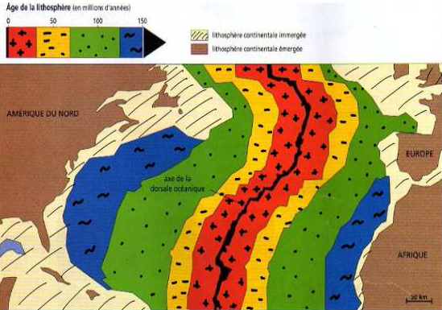

# Activité : Les conséquences de la divergence

!!! note "Compétences"

    Trouver et exploiter des informations 

!!! warning "Consignes"

    1. Décrire comment sont réparties les roches des fonds océaniques en fonction de leur âge.
    2. À l’aide documents, expliquer cette répartition.
    
??? bug "Critères de réussite"
    - 

**Document 1 : âge des fonds océaniques (océan Atlantique)**

**Document 2 : Le volcanisme des dorsales**

Une grande part de l’activité volcanique terrestre provient des dorsales.C’est un volcanisme effusif. Les volcans des dorsales émettent une lave fluide à une température comprise entre 1 000 °C et 1 200 °C. En se refroidissant, la lave forme des grosses boules de roche (du basalte) qui s’empilent les unes sur les autres. Ces roches sont appelées des pillow-lavas (lave en coussins). Ce magma, en refroidissant, est à l’origine de la partie superficielle de la lithosphère océanique.

**Document 3 : Schéma fonctionnement d’une dorsale océanique**

Les mouvements de divergence entraînent une remontée de magma à l’axe de la dorsale.

