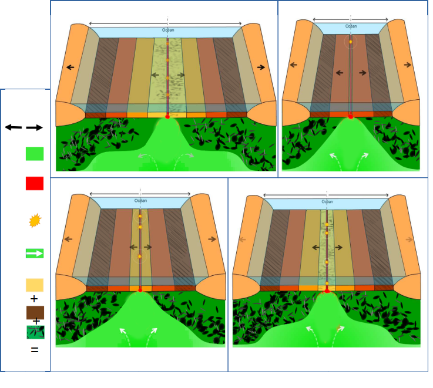

# Activité : Les conséquences de la divergence

!!! note "Compétences"

    - Trouver et exploiter des informations 
    - Utiliser des outils mathématiques

!!! warning "Consignes"

    1. Découper et remettre dans l'ordre les schémas du document 4.
    2. Légender  à l’aide des mots en gras et donner un titre
    3. Décrire comment sont réparties les roches des fonds océaniques en fonction de leur âge.
    4. À l’aide documents, expliquer cette répartition.
    5. Calculer la vitesse d'ouverture de l'océan altlantique (en km/Ma)
    
??? bug "Critères de réussite"

    - Avoir décrit l'âge de la lithosphère océanique en partant du continent américain vers la dorsale
    - Avoir décrit l'âge de la lithosphère océanique en partant du continent africain vers la dorsale.
    - expliquer la répartion des roches
      - comment se forme les roches
      - où se forme les roches
      - que deviennent les roches les plus vieilles
    - calculer la vitesse d'ouverture
      - formule vitesse
      - calcul de proportionnalité pour retrouver la distance

**Document 1 : âge des fonds océaniques (océan Atlantique)**

Des forages permettent de connaitre l'âge des plus **anciens basaltes** et des plus **jeunes basaltes**

**Document 2 : Le volcanisme des dorsales**

Une grande part de l’activité volcanique terrestre provient des dorsales. C’est un volcanisme effusif. Les volcans des dorsales émettent une lave fluide à une température comprise entre 1 000 °C et 1 200 °C. En se refroidissant, la **lave** forme des grosses boules de roche, du basalte, qui s’empilent les unes sur les autres. Ces roches sont appelées des pillow-lavas (lave en coussins). Ce magma, en refroidissant, est à l’origine de la partie superficielle de la **lithosphère océanique** qui est composée de la croûte et du **manteau lithosphérique**.

**Document 3 Le fonctionnement d’une dorsale océanique**

Les mouvements de **divergence** entraînent une **remontée de roches mantelliques chaudes** dans l'**asthénosphère**. L'accumulation de chaleur provoque la **fusion de roches de la lithosphère** et une remontée de magma à l’axe de la **dorsale océanique**.

**Document 4 ...................................**

