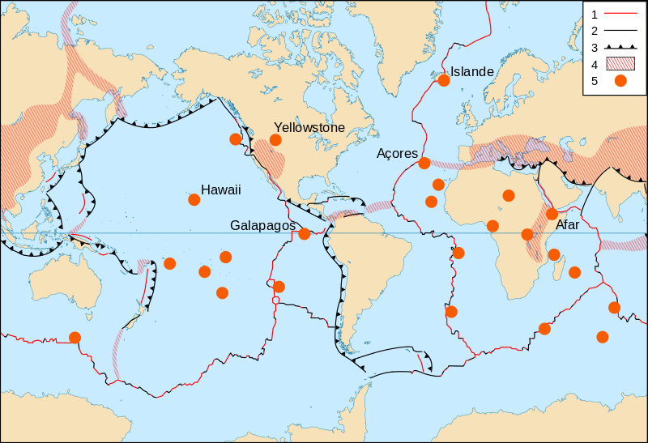

# Activité : Le moteur du mouvement des plaques lithosphériques

!!! note "Compétences"

    - trouver et utiliser des informations (3,4,5),
    - Interpréter et exploiter des résultats (1,2,6) 
    - Mettre en œuvre un protocole. 

!!! warning "Consignes"

    1. Compléter le tableau du document 2, avec les mots suivants :(1 point)
    Source de chaleur, Rien, Roches de la lithosphère et Roches de l’asthénosphère, pour comparer le modèle et la réalité. 
    2. Réaliser le protocole et décrire ce qui se passe dans le modèle pendant les deux phases d’observations. (0,5 point)
    5. Expliquer comment la température peut être responsable des mouvements de matière verticalement. (1 point)
    6. Comparer le poids des deux éponges dans le document 4, que peut on conclure de la masse volumique de ces deux époonges
    7. Expliquer pourquoila lithosphère océanique va plonger dans le document 5  (1 point)
    8. Expliquer le mouvement des stations GPS vers la droite dans le document 5 (1 point)
    9. Proposer deux critiques qui peuvent être faites sur le modèle par rapport à la réalité. (0,5 point)

    
??? bug "Critères de réussite"
    - 

**Document 1 : Protocole d’un modèle montrant les mouvements à l’intérieur de la Terre**

**Attention pour faire cette manipulation, les cheveux longs doivent être attachés, les manches retroussées et la table dégagée.**

1.  Verser 20 ml d’huile colorée dans un bécher.
2.  Verser 55 ml d’huile non colorée, attention les deux huiles ne doivent pas se mélanger, il faut donc verser très délicatement l’huile en la faisant couler le long de la surface du bécher
3.  Poser le bécher sur le support
4.  Observer pendant 30 secondes
5.  Allumer la bougie en dessous.
6.  Observer durant quelques minutes

**Document 2 : Présentation du modèle.**

<table>
<colgroup>
<col style="width: 200px">

<col style="width: 400px">
</colgroup>
<tbody>
<tr class="odd">
<td>Élément du modèle</td>
<td>Élément dans la réalité</td>
</tr>
<tr class="even">
<td>Bécher</td>
<td></td>
</tr>
<tr class="odd">
<td>Huile colorée</td>
<td></td>
</tr>
<tr class="even">
<td>Huile non colorée</td>
<td></td>
</tr>
<tr class="odd">
<td>Bougie</td>
<td></td>
</tr>
</tbody>
</table>

**Document 3 La masse volumique et la densité.**

La masse volumique est le rapport de la masse d'un corps sur le volume de solvant.
	
La densité d d'un corps liquide ou solide, par rapport à l'eau, est égale au quotient de la masse volumique de ce corps par la masse volumique d'un même volume d'eau. 

La masse volumique d’un objet permet de savoir s’il coule ou s’il flotte dans un fluide. Un échantillon dont la masse volumique est supérieure à celle du fluide coule. Un échantillon dont la masse volumique est inférieure à celle du fluide flotte. 

La masse volumique et donc la densité peut varier en fonction de différents paramètres, par exemple la température ou l'hydratation.

**Document 4 masse d'une éponge**

Les deux éponges gardent le même volume, 850 cm³.

**Document 5 schéma d'une zone de subduction**

??? note-prof "docs supplémentaires"

    **Document 7 : Carte du flux géothermique mondiale.**

    Cette carte montre la quantité d’énergie libérée sous forme de chaleur au niveau de la surface de la Terre.

    {: style=width:300px;"}

    **Document 8 : Carte des limites des plaques tectoniques.**

    
    Légende :

    **1 et 2 :** Limite de plaque divergente (dorsale) ;
    **3 :** Limite de plaque de subduction ;

[https://www.youtube.com/watch?v=HmBHKeemZVY&ab_channel=etheriel66](https://www.youtube.com/watch?v=HmBHKeemZVY&ab_channel=etheriel66)

??? note-prof "Correction de l’activité "

    Consigne 1 : Compléter le tableau du document 2, avec les mots
    suivants : Source de chaleur, Rien, Roches de la lithosphère et Roches
    de l’asthénosphère, pour comparer le modèle et la réalité. (0,5 point)

    |                   |                           |
    |-------------------|---------------------------|
    | Élément du modèle | Élément dans la réalité   |
    | Bécher            | rien                      |
    | Huile colorée     | Roches de l’asthénosphère |
    | Huile non colorée | Roches de la lithosphère  |
    | Bougie            | Source de chaleur         |

    Consigne 2 : Réaliser le protocole et décrire ce qui se passe dans le
    modèle pendant les phases d’observations. (1 point)

    Avant d’allumer la bougie, rien ne se passe, les huiles ne bougent pas
    et les papiers non plus.

    Après avoir allumé la bougie, l’huile colorée commence par monter dans
    l’huile non colorée, puis ensuite, cette huile colorée commence a
    redescendre. Les papiers à la surface de l’huile commence à se déplacer.

    Consigne 3 : Expliquer comment la température peut être responsable des
    mouvements de matière. (1 point)

    La source de chaleur réchauffe l’huile colorée. La densité de l’huile
    colorée va donc diminuer ce qui va entraîner, une remontée de l’huile
    vers la surface. L’huile colorée à la surface va se refroidir, la
    densité va donc diminuer, et l’huile colorée va redescendre dans le
    bécher.

    Les mouvements sont donc dus au changement de température qui entraîne
    des changements de densité.

    Consigne 4 : Expliquer comment la radioactivité est à l’origine des
    mouvements des plaques. (1 point)

    La radioactivité libère de l’énergie qui réchauffe les roches à
    l’intérieur de la Terre. 
    
    Consigne 5 : Indiquer sur le document 6, par des flèches les mouvements
    verticaux au niveau de la dorsale atlantique et de la zone de
    subduction. (0,5 point)

    

    Consigne 6 : Proposer deux critiques qui peuvent être faites sur le modèle par rapport à la réalité. (1 point)

    1.  Dans le modèle on utilise de l’huile pour modéliser les roches de
        l’intérieur de la Terre, mais les roches sont solides alors que
        l’huile est liquide.

    2.  Dans le modèle la source de chaleur est uniquement en bas, alors que
        dans la réalité la radioactivité est partout.

    3.  Dans le modèle, les mouvements se déroulent en quelques minutes
        alors que dans la réalité, ils se déroulent sur des milliers
        d’années.
