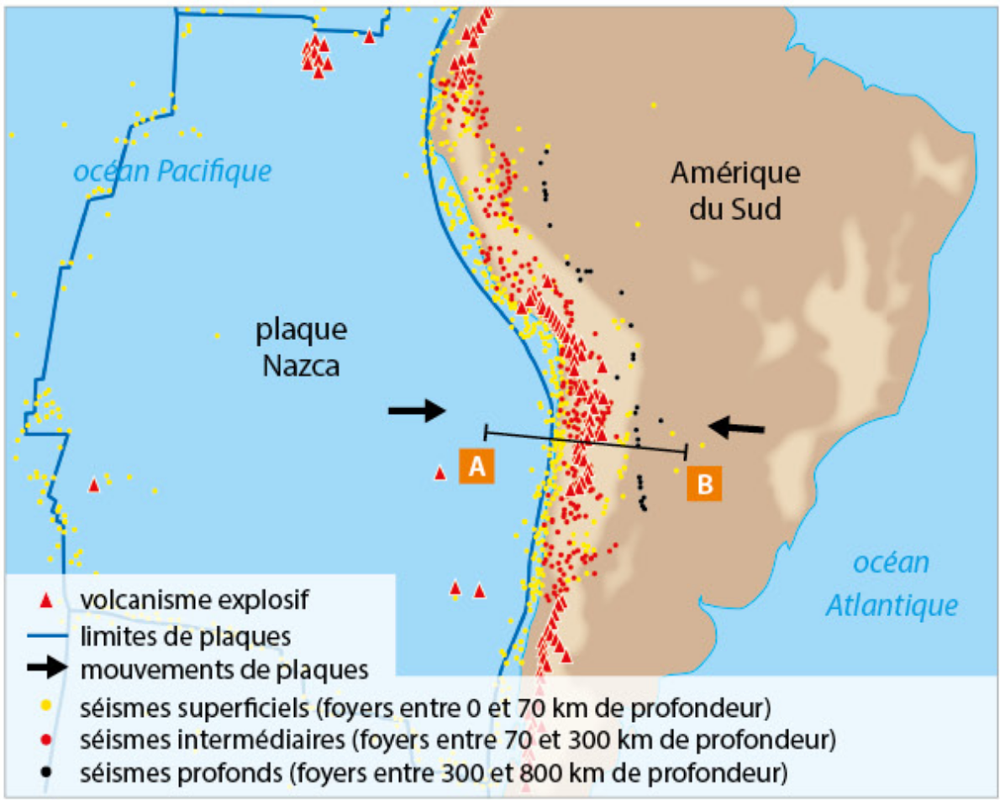

# Activité : Les conséquences de la convergence, la subduction.

!!! note "Compétences"

    Trouver et exploiter des informations 

!!! warning "Consignes"

    1. Décrire comment varie la profondeur des séismes de A vers B sur le document 2 
    2. Représenter sur le graphique du document 2, la lithosphère en vous aidant des informations du document 3
    3. en utilisant les informations du document 3, expliquer pourquoi il est étonnant d’avoir des foyers sismiques à cette profondeur / 
    4. en utilisant les informations des documents 1, 2 et 3, expliquer ce qui se passe au niveau de cette zone.
    
??? bug "Critères de réussite"
    - 

**Document 1 : Mouvement de convergence entre la plaque Nazca et la plaque sud-américaine.**

{: style="width:600px;"}

**Document 2 : Graphique de la répartition des séismes en fonction de leur profondeur.**

{: style="width:600px;"}

**Document 3 : Séismes et lithosphère.**

Les séismes se produisent dans la lithosphère qui est la couche la plus cassante. L'asthénosphère est plus ductile, les roches ne peuvent pas casser et donc les séismes ne peuvent pas y avoir d’origine.

La lithosphère est une couche qui fait environ 150 km d’épaisseur pour la lithosphère continentale et 100 km d’épaisseur pour la lithosphère océanique.