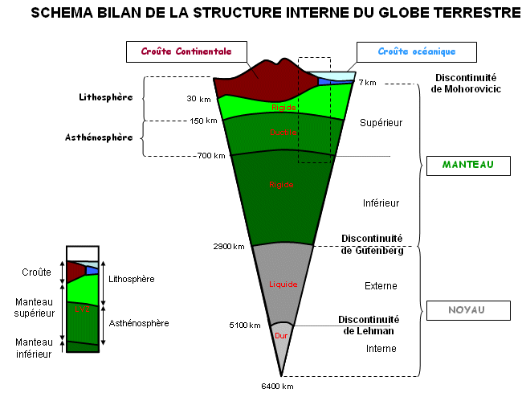
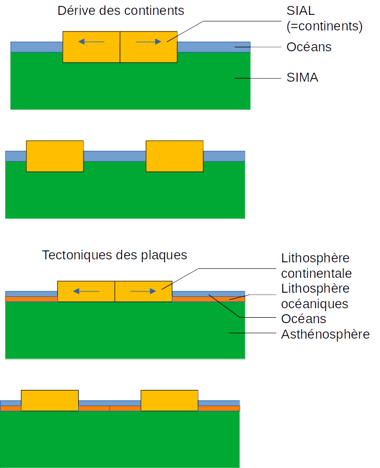

# Séquence : La tectonique des plaques

!!! note-prof
    si besoin d'infos

!!! question "Problématique"
    Qu'est-ce que la tectonique des plaques ?
    Qu'est-ce qu'une plaque ?

    

## Séance 1 : Répartition des séismes et des volcans

!!! question "Problématique"
    Comment sont répartis les séismes et les volcans à la surface de la Terre ?

[Activité Répartition des séismes et des volcans](../repartSeismesVolcans)

??? abstract "Bilan"

    La surface rocheuse de la Terre est nommée lithosphère. Cette lithosphère est rigide et découpée en plaques appelées plaques lithosphériques (ou plaques tectoniques).
    
    La majorité des volcans et des séismes se situent aux limites des plaques lithosphériques. 
    
    La lithosphère se situe sur l’asthénosphère, milieu contenant des roches moins rigides que celles de la lithosphère. 
    
    Les roches de la lithosphère et de l’asthénosphère sont solides.

??? abstract "Infos Supplémentaires"

    
    
    

    La planète Terre est composée de différentes couches, la majorité est solide, il n’y a pas de magma sous nos pieds.

## Séance 2 : Les mouvements à la surface de la Terre

!!! question "Problématique"
    Quels types de mouvements se produisent à la surface de la Terre ?

[Activité Les mouvements à la surface de la Terre](../mvtsSurfaceTerre)

??? abstract "Bilan"

    Ces plaques sont en mouvements les unes par rapport aux autres :

    - Elles s’écartent dans les zones en divergence

    - Elles se rapprochent dans les zones en convergence

    - Elles peuvent aussi coulisser l’une par rapport à l’autre (décrochement)

## Séance 3 : Histoire des sciences et tectoniques des plaques

!!! question "Problématique"
    Comment les scientifiques ont mis en évidence la tectonique des plaques ?

[Activité Histoire de la construction d’une théorie de la tectonique des plaques](../histoireTectonique)

??? abstract "Bilan"
    La théorie de la tectonique des plaques a été émise à la fin des années 1960 grâce à de meilleures connaissances de la surface de la Terre. Cette théorie est issue de la théorie de la dérive des continents élaborée par Wegener au début du 20e siècle.
    Cette théorie explique que les plaques lithosphériques sont en mouvements les unes par rapport aux autres (pas seulement les continents) et que les volcans et les séismes sont dus aux déplacements de ces plaques lithosphériques.

    Définition : Une théorie est un ensemble de lois scientifiques, de principes et de règles visant à décrire et à expliquer un ensemble de faits. Une théorie se construit autour de faits, des observations, des résultats expérimentaux. Une théorie scientifique a un statut provisoire et correspond à la vérité scientifique du moment.

    
