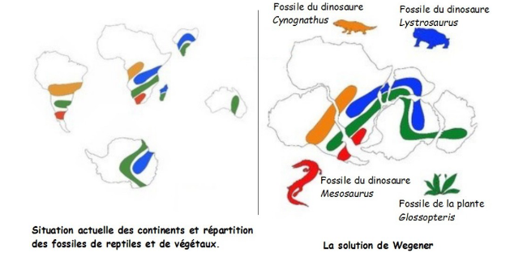

# Activité : Histoire de la construction d’une théorie de la tectonique des plaques

!!! note "Compétences"

    Interpréter 

!!! warning "Consignes"

    1. Faire une frise en indiquant les différentes observations et arguments scientifiques qui ont mené la théorie de la tectonique des plaques. (date + événement) (2,5 points)

    2. À partir des documents, explique quels ont été les arguments de Wegener pour proposer la théorie de la dérive des continents. (1 point)

    3. Explique pourquoi au début du XXe siècle, la théorie de Wegener a été rejetée par la majorité de la communauté scientifique (0,5 point)

    4. Explique en quelques mots, en quoi la théorie de la tectonique des plaques actuelle est différente de celle de la dérive des continents de Wegener. (1 point)
    
??? bug "Critères de réussite"
    - 

**Document 1 La théorie de la tectonique de plaques.**

Une théorie est un ensemble de lois scientifiques, de principes et de règles visant à décrire et à expliquer un ensemble de faits. Une théorie se construit autour de faits, des observations, des résultats expérimentaux. Une théorie scientifique a un statut provisoire et correspond à la vérité scientifique du moment.

Entre 1967 et 1968, la théorie de la tectonique des plaques révolutionne l’explication des reliefs terrestres. Selon cette théorie (Xavier Le Pichon, en France), la surface de la Terre est composée de plaques épaisses d’une centaine de kilomètres qui se déplacent horizontalement sur une enveloppe de roche du manteau
ductile.

Les plaques recouvrent toutes la surface de la Terre, les parties avec des continents sont les plaques continentales et celles avec des océans sont les plaques océaniques. Toutes ces plaques se déplacent.

**Document 2  Les modèles fixistes**

{:style="width:500px; float:left;"  }

Avant le XXe siècle, la majorité des scientifiques pensent qu’il existe uniquement des mouvements verticaux à la surface de la Terre. Les continents ne se déplaçaient pas.

Pour expliquer la formation des reliefs terrestres, les géologues comparent la Terre à une pomme. Selon leur théorie, au cours des temps géologiques la Terre, comme la pomme, a eu sa surface qui s’est ridée et des reliefs sont apparus.

**Document 3 La théorie de la dérive des continents par Wegener.**
Le météorologue allemand Alfred Wegener a émis l’idée que les continents terrestres bougeaient. Wegener propose que les continents reposent sur une couche plus dense. Et une force permettrait aux continents de se déplacer sur la couche plus dense, comme un glaçon sur l’eau. Il propose que les continents étaient autrefois tous réunis en un seul super continent, la Pangée, il y a environ 225 millions d’années. Puis la Pangée s’est disloquée pour former les continents actuels. Il publie sa théorie en 1915. Sa théorie sera rejetée par une grande partie de la communauté scientifique, car aucun mécanisme connu ne permet d’expliquer ce qui a permis aux continents de se déplacer.

{:style="width:600px;"}

**Document 4 Des fossiles utilisés par Wegener**

Wegener a émis son hypothèse parce qu’il avait constaté que les côtes de l’Afrique de l’Ouest et celles de l’Est de l’Amérique du Sud ressemblaient à des pièces de casse-tête qui se seraient détachées et éloignées l’une de l’autre. De plus, en examinant, les fossiles de roches et d’animaux et les roches de ces deux continents, il a remarqué de nombreuses similitudes qu’il n’arrive pas à expliquer si les deux continents ont toujours été aussi éloignés.

**Document 5 Dorsales et expansion des fonds océaniques**

Suite à l’amélioration du sonar pendant la seconde guerre mondiale, les navires océanographiques réalisent une cartographie précise des fonds océaniques. En 1952, Mary Tharp et Bruce C. Heezen, ont réalisé une carte des fonds marins. Sur ces cartes apparaît une chaîne de montagnes sous-marines : la dorsale ou ride médio-atlantique.

Grâce à l’étude des dorsales, Harry Hess, en 1962, a pu voir que les océans sont en expansion, c’est-à-dire qu’ils s’agrandissent grâce au plancher océanique qui lui même s’agrandit : il y avait une fabrication de lithosphère. On constate qu’on a le même âge du plancher océanique de chaque côté de la dorsale et il est de plus en plus vieux lorsqu’on s’éloigne de la dorsale : c’est la preuve que de la lithosphère se fabrique de chaque côté de la dorsale et que ça s’écarte au fur et à mesure.

**Document 6 La chaleur interne de la Terre**

On a découvert que l’intérieur de la Terre est fait de roches qui libèrent de l’énergie, sous forme d’énergie thermique (=chaleur), qui chauffe les roches à l’intérieur de la Terre. Cette chaleur se dissipe à la surface. En 1956, on a pu mettre en évidence que cette énergie thermique est responsable de la mise e mouvement des plaques.

**Document 7 Répartition des séismes**

En 1954, Beno Gutenberg et Charles Francis Richter, deux sismologues réalisent la carte mondiale de la répartition des séismes et montrent que leur répartition n’est pas aléatoire. Ce qui va montrer avec la répartition des volcans qu’on a une lithosphère découpée en plaques lithosphériques.

**Document 8 Disparition de la lithosphère**

De la lithosphère se fabrique au niveau des dorsales. Cependant, le volume de la Terre est constant. Cela veut dire que la lithosphère, qui est fabriquée à un endroit, va disparaître à un autre endroit de la Terre. En 1967, deux scientifiques déduisent que la lithosphère, au niveau des fosses, s’enfonce profondément dans l’asthénosphère où elle va être « recyclée » au cours du temps.

**Document 9 La mesure de la mobilité horizontale de la surface de terrestre par satellite.**

Dans les années 1980, un système de géodésie spatiale (la science qui mesure et représente la surface terrestre) a été mis en place. Il utilise un réseau permanent d’une soixante de balises réparties sur tout le globe. Ces balises émettent de signaux vers des satellites, ce qui permet de les géolocaliser avec une précision de l’ordre du centimètre. 
Ce système a permis de déterminer le déplacement des plaques lithosphériques à la surface de la Terre. On a, par exemple, établi à partir des enregistrements effectués par des balises situées en Islande, de part et d’autre de la dorsale atlantique un éloignement des plaques de 2 cm par an.

Vitesse en cm/an

??? note-prof
    