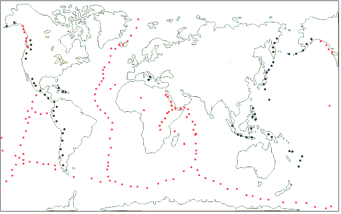

# Activité : Importance du tri des déchets

!!! note "Compétences"

    Trouver et utiliser des informations 
 

!!! warning "Consignes"

    1. En utilisant les documents 1 et 3, représentez par des flèches les mouvements des plaques tectoniques les unes par rapport aux autres, au niveau A, B et C, sur le document 3.
    2. À partir de tous les documents, compléter le tableau du document 5.
    
??? bug "Critères de réussite"
    - 

**Document 1 : carte de répartition des séismes**

Légende :

— points gris : séismes en zone d’écartement.
— points noirs : séismes en zone de rapprochement.

**Document 2 : carte de répartition des volcans**

Légende :

— points gris : volcanisme effusif.
— points noirs : volcanisme explosif.

**Document 3 : carte des limites de plaques tectoniques**

Légende :

{:style="height:50px;"} : Zone d’écartement de deux plaques

{:style="height:50px;"}: Zone de rapprochements de deux plaques

**Document 4 Carte des reliefs.**

Les fosses océaniques : Ce sont des zones profondes (de − 4 500 m à
−11 000 m) et étroites (100 à 200 km de large), bordant soit un
continent, soit un ensemble d’arc d’îles. Leur longueur totale est de
37 000 km.

{:style="height:100px;"}

Les chaînes de montagne : Ce sont des reliefs continentaux plus ou moins
escarpés, dont l’altitude dépasse souvent 4 000 m.

{:style="height:100px;"}

Les dorsales océaniques : Ce sont des reliefs des fonds océaniques qui
peuvent atteindre plus de 2 000 m de profondeur avec une longueur totale
de plus de 65 000 km.

{:style="height:100px;"}:

**Document 5 Tableau à compléter**

<table>
<tbody>
<tr class="odd">
<th >Lieu</th>
<th>A</th>
<th>B</th>
<th>C</th>
</tr>
<tr class="even">
<th>Mouvement lithosphérique (divergence ou convergence)</th>
<td style="width: 200px;"></td>
<td style="width: 200px;"></td>
<td style="width: 200px;"></td>

</tr>
<tr class="odd">
<th>Type volcanisme (au moins deux volcans)</th>
<td></td>
<td></td>
<td></td>
</tr>
<tr class="even">
<th>Présence de séisme (oui ou non)</th>
<td></td>
<td></td>
<td></td>
</tr>
<tr class="odd">
<th>Type de relief</th>
<td></td>
<td></td>
<td></td>
</tr>
</tbody>
</table>

??? note-prof

    **Document 5 : Tableau à compléter**

    <table>
    <tbody>
    <tr class="odd">
    <td>Lieu</td>
    <td>A</td>
    <td>B</td>
    <td>C</td>
    </tr>
    <tr class="even">
    <td>Mouvement lithosphérique (divergence ou convergence)</td>
    <td>
divergence
</td>
    <td>convergence</td>
    <td>convergence</td>
    </tr>
    <tr class="odd">
    <td>Type volcanisme</td>
    <td>Effusif</td>
    <td>Explosif</td>
    <td>aucun</td>
    </tr>
    <tr class="even">
    <td>
Présence de séisme

    
(oui ou non)
</td>
    <td>
Oui
</td>
    <td>Oui</td>
    <td>oui</td>
    </tr>
    <tr class="odd">
    <td>Type de relief</td>
    <td>Dorsale</td>
    <td>Fosses océaniques</td>
    <td>Chaîne de montagne</td>
    </tr>
    </tbody>
    </table>

