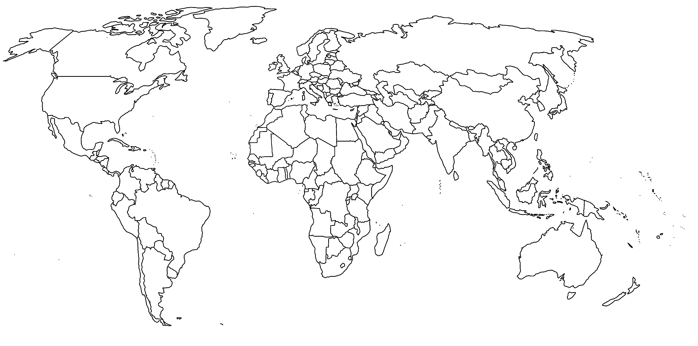

# Activité : Répartition des séismes et des volcans

!!! note "Compétences"

    - Trouver et utiliser des informations
    - Utiliser l'outil numérique

!!! warning "Consignes"

    1. À l’aide du logiciel Tectoglob3D, localiser en tracant des lignes les alignements (au moins 3) de foyers sismiques et de volcans sur la carte du document 1.

    2. Comparer la répartition des volcans et des séismes du document 1 et les contours des plaques lithosphériques que vous pouvez afficher dans le logiciel.

    3. En utilisant les informations du document 2, compléter le  document 3 en indiquant l’épaisseur des différentes couches superficielles.

??? bug "Critères de réussite"
    - 

**Document 1 : Carte du monde**

**Document 2 : Vitesse de propagation des ondes sismiques en fonction de la profondeur terrestre.**

Les séismes sont dus à des ondes qui se déplacent rapidement dans toute la Terre. Une variation brusque de vitesse de ces ondes indique qu’elles traversent un autre milieu, aux propriétés physiques différentes et donc une autre couche.

L’étude des ondes sismiques a permis de mieux connaître l’intérieur de la Terre.

Les variations de vitesses des ondes sismiques en profondeur révèlent l’existence de deux niveaux rocheux :

-   La lithosphère : un niveau de roches rigide qui peut casser par endroit causant les séismes et formant les plaques lithosphériques, à la surface de la Terre. La lithosphère est composée de deux couches : la croûte océanique ou continentale et le manteau lithosphérique ;
-   l’asthénosphère : un niveau de roches ductile, c’est-à-dire qu’elle se déforme sans casser, sur laquelle reposent les plaques lithosphériques.

**Document 3 Un schéma des couches superficielles de la Terre.**

**Document 4 : Fiche Technique de Tectoglob 3D**

Lien du logiciel : [https://www.pedagogie.ac-nice.fr/svt/productions/tectoglob3d/](https://www.pedagogie.ac-nice.fr/svt/productions/tectoglob3d/)

Afficher des données sur le globe ou sur des coupes

Le menu « Données affichées » permet :

— D’afficher des stations GPS sur le globe virtuel (et le graphique associé à chaque station, double-cliquer sur une station en mode « Informations sur un point »)

— D’afficher des foyers sismiques ou des volcans, sur le globe et sur la coupe

— D’afficher des calques de données sur le globe (flux géothermique, limites des plaques tectoniques, etc.) et parfois d’en tirer des profils (via le menu « Action »)

— D’afficher des cartes géologiques (ex. la carte géologique de France au 1M, carte géologique mondiale, âge du plancher océanique, etc.)

