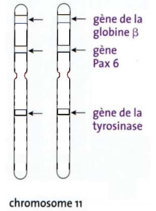

# Séquence : Origine des caractères individuels

!!! note-prof
    si besoin d'infos

!!! question "Problématique"
    

    
### Document d’appel :

## Séance 1 : les caractères sur les chromosomes

!!! question "Problématique"
    Comment l’information est-elle organisée dans les chromosomes ?

[Activité nom activité](../lien vers l'activité)

??? abstract "Bilan"
    Définitions : 

    - ADN : longue molécule qui porte l’information génétique. En se condensant, elle forme les chromosomes.
    - gène : fragment d’ADN qui porte une information héréditaire.
    - transgenèse : modification d’un organisme après l’insertion d’ADN d’un autre organisme.
    
    Chaque chromosome contient de nombreux gènes. 
    Un gène est une portion d’un chromosome qui détermine l’apparition d’un caractère héréditaire ou d’une partie d’un caractère. Lorsque le gène s’exprime, il permet la formation d’une ou plusieurs protéines qui va permettre l’apparition du caractère.
    L’ensemble des gènes d’un être vivant constitue le génome.
    Chaque chromosome est présent en 2 exemplaires (= paire). Chaque chromosome de la paire comporte les mêmes gènes. Donc chaque gène est présent 2 fois dans une cellule.

??? abstract "infos supp"

    
    
    
    
    

## Séance 2 : Nom

!!! question "Problématique"
    Comment expliquer les différences pour un caractère entre individus ?
    
[Activité nom activité](../lien vers l'activité)

??? abstract "Bilan"
    
    Chaque version différente d’un même gène est appelée un allèle. Il détermine une version différente du caractère.

    Chaque personne a donc deux allèles de chaque gène :
    - Qui peuvent être identiques, l’individu est homozygote pour ce gène. 
    - Qui peuvent être différents, l’individu est hétérozygote pour ce gène. 

    Si les deux allèles sont différents :
    - Les deux peuvent s’exprimer, ils sont codominants.
    - Un seul allèle s’exprime, il est dominant et l’autre est récessif.

    Tous les individus ont les mêmes gènes. La diversité humaine est possible grâce à l’existence de ces allèles. Chaque individu est un assemblage d’allèles différents. Cette diversité est appelée biodiversité allélique.
    L’ensemble des allèles d’un individu est appelé génotype.

