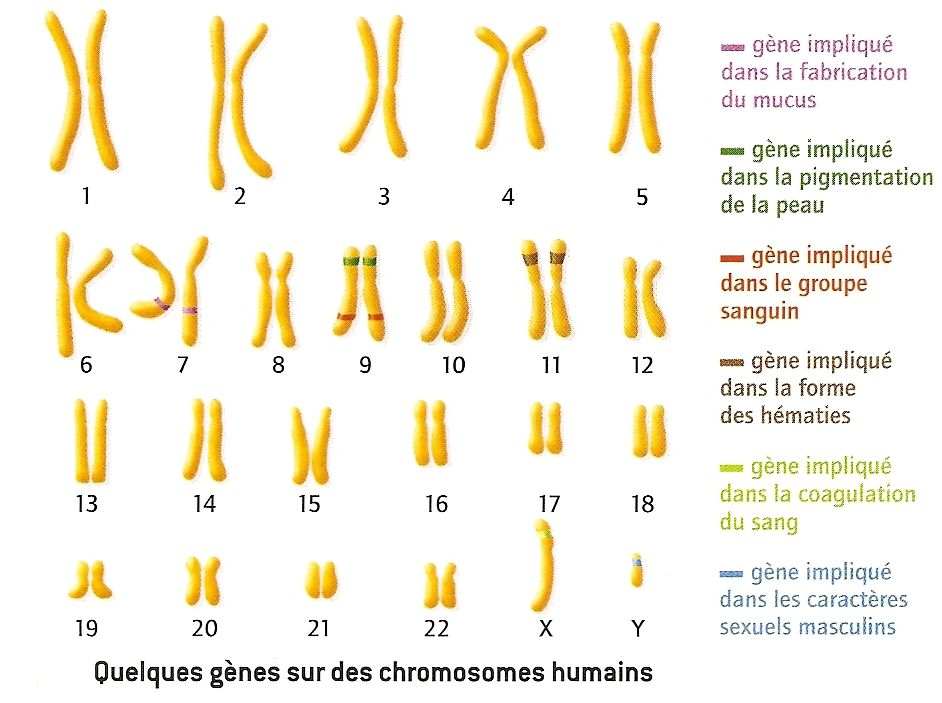
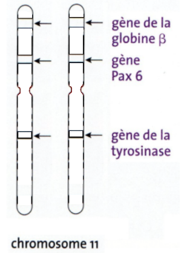
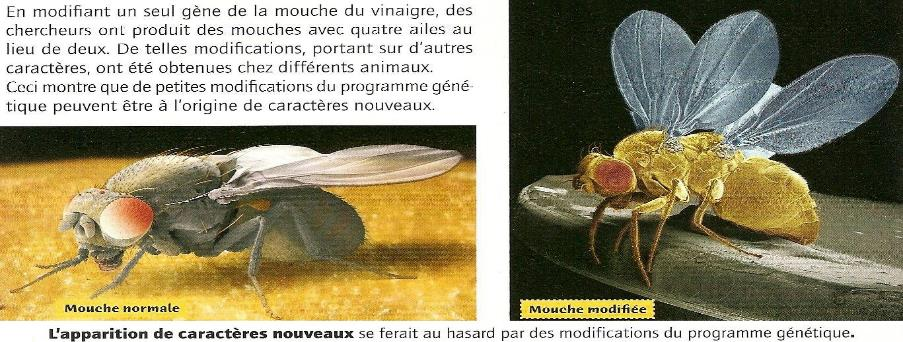
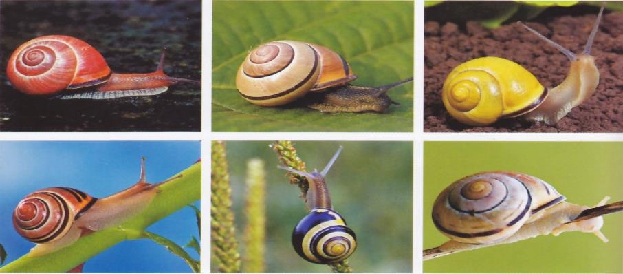
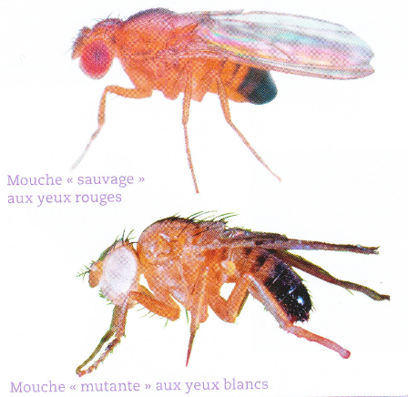

# Séquence : La génétique

!!! note-prof
    si besoin d'infos

!!! question Problématique
    

    
### Document d’appel :

## Séance 1 : les caractères sur les chromosomes

!!! question Problématique
    Comment l’information est-elle organisée dans les chromosomes ?

[Activité Les gènes](../genes)

??? abstract Bilan
    Définitions : 

    - ADN : longue molécule qui porte l’information génétique. En se condensant, elle forme les chromosomes.
    - gène : fragment d’ADN qui porte une information héréditaire.
    - transgenèse : modification d’un organisme après l’insertion d’ADN d’un autre organisme.
    
    Chaque chromosome contient de nombreux gènes. 
    Un gène est une portion d’un chromosome qui détermine l’apparition d’un caractère héréditaire ou d’une partie d’un caractère. Lorsque le gène s’exprime, il permet la formation d’une ou plusieurs protéines qui va permettre l’apparition du caractère.
    L’ensemble des gènes d’un être vivant constitue le génome.
    Chaque chromosome est présent en 2 exemplaires (= paire). Chaque chromosome de la paire comporte les mêmes gènes. Donc chaque gène est présent 2 fois dans une cellule.

??? abstract "infos supplémentaires"

    
    

## Séance 2 : Différentes versions d'un gène

!!! question Problématique
    Comment expliquer les différences pour un caractère entre individus ?
    

??? abstract Bilan
    
    Chaque version différente d’un même gène est appelée un allèle. Il détermine une version différente du caractère.

    Chaque personne a donc deux allèles de chaque gène :

    - Qui peuvent être identiques, l’individu est homozygote pour ce gène. 
    - Qui peuvent être différents, l’individu est hétérozygote pour ce gène. 

    Si les deux allèles sont différents :
    
    - Les deux peuvent s’exprimer, ils sont codominants.
    - Un seul allèle s’exprime, il est dominant et l’autre est récessif.

    Tous les individus ont les mêmes gènes. La diversité humaine est possible grâce à l’existence de ces allèles. Chaque individu est un assemblage d’allèles différents. Cette diversité est appelée biodiversité allélique.
    L’ensemble des allèles d’un individu est appelé génotype.

[Activité Exercices sur les allèles](../alleles)

[Activité Les groupes sanguins](../grpSang)

## Séance 3 : Des nouveaux allèles

**Document 1 Apparition d’un nouveau caractère.**

Dans des élevages de drosophiles aux yeux rouges, on peut voir apparaître des individus « mutants » aux yeux blancs.

!!! question Problématique
    Comment expliquer l’apparition de nouveaux allèles ?

[Activité Les nouveaux allèles](../mutations)

??? abstract Bilan

    L’apparition de nouveaux caractères, et donc de nouveaux allèles, au cours des générations se fait grâce à des modifications de l’information génétique. Ces modifications se nomment mutations. Elles peuvent arriver naturellement ou être provoquées par des agents mutagènes (UV, virus …) Ces mutations se font au hasard et donc le nouveau caractère peut être bénéfique, sans conséquence ou létal.
    Les mutations ne peuvent être transmises à la descendance uniquement lorsqu’elles se font dans les cellules reproductrices.

    Définitions.

    - Mutation : Modification de l’information génétique portée par l’ADN, à l’origine de nouveaux allèles.
    - Cellule somatique : Cellule ne donnant pas de cellules reproductrices
    - Cellule germinale : Cellule donnant des cellules reproductrices.