# Activité : Les allèles

!!! note "Compétences"

    - Schématiser
    - Trouver et utiliser des informations

    
??? bug "Critères de réussite"
    - 

## Exercice 1 : L’origine d’une maladie génétique, la drépanocytose.

!!! warning "Consignes"

    1. Représenter les chromosomes 11 et les allèles portés d’une personne malade.
    2. Représenter les chromosomes 11 et les allèles portés par une personne non malade, puis justifier votre réponse.

La drépanocytose est la maladie génétique la plus répandue au monde, elle touche des millions de personnes, en particulier en Afrique. Cette maladie se caractérise par une anomalie des globules rouges du sang. Le pigment rouge des globules, l’hémoglobine, est anormal ce qui entraîne une déformation des globules rouges et des troubles graves de la circulation du sang. Cette maladie est due à un gène, celui de la globine β situé sur la paire de chromosomes 11. Ce gène a deux allèles possibles : 
L’allèle A, qui permet la fabrication de l’hémoglobine normale ;
L’allèle S, qui détermine la production d’une hémoglobine anormale. 
L’allèle A est dominant.

## Exercice 2 : Le daltonisme, un défaut de la vision des couleurs.

!!! warning "Consignes"
    1. Représenter les chromosomes sexuels avec le gène et l’allèle pour un garçon daltonien et pour un garçon ayant une vision normale.
    2. Faire le même travail pour une fille.
    Certaines personnes ont une perception différente des couleurs, elles sont daltoniennes.

L’un des gènes impliqués dans la vision des couleurs est localisé vers l’extrémité du bras long du chromosome X. Ce gène existe sous deux formes : l’allèle N qui permet une vision normale des couleurs et l’allèle anormal d à l’origine du daltonisme. L’allèle N normal est dominant.

## Exercice 3 : Les lapins albinos.

!!! warning "Consignes"
    1. Rappeler les définitions de gènes et d’allèles. 
    2. Combien de fois chaque gène est-il présent dans une cellule ?
    3. Représenter la ou les possibilités de chromosomes 1 pour un lapin ayant des poils colorés.
    4. Représenter la ou les possibilités de chromosomes 1 pour un lapin albinos.

**Document 1 : Le phénotype couleur de poils chez le lapin.**

Le phénotype « couleur de poils » dépend en partie de la quantité de mélanine.
Certains individus ne produisent pas de mélanine : ils sont dits albinos. L’albinisme est une particularité héréditaire qui se trouve chez de nombreux vertébrés.

**Document 2 : Le déterminisme génétique de l’albinisme.**

Chez le lapin, le phénotype « albinos » est dû à l’un des gènes portés par la paire de chromosomes 1 : le gène de « Tyrosinase ». 
Il permet la production de la tyrosinase, une enzyme qui intervient dans la fabrication de la mélanine.
Le génotype du gène « Tyrosinase » présente deux allèles :
    • L’allèle Tyr+ permet la synthèse de mélanine.
    • L’allèle Tyr- ne la permet pas.
L’allèle Tyr- est récessif par rapport à Tyr+.

??? note-prof "Correction"

    Exercice 1
    1. 
    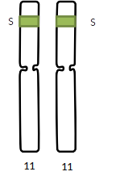

    2.
    Une personne saine doit avoir de l’hémoglobine normale, il lui faut donc l’allèle A. Cet allèle est dominant par rapport à l’allèle S, donc une personne qui a les deux allèles aura de l’hémoglobine normale et sera saine.

    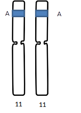
    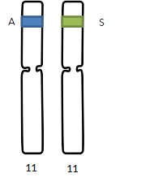

    Exercice 2 
    2. Un garçon n’a qu’un seul chromosome X et donc un seul gène et donc un seul allèle, s’il a un allèle d il sera donc daltonien et s’il a un allèle N il aura une vision normale des couleurs.
   
    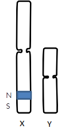

    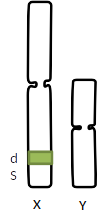

    3. Pour une fille, elle a deux allèles, car deux chromosomes X, N étant dominant sur d, il faudra qu’elle ait deux allèles d pour être daltonienne.

    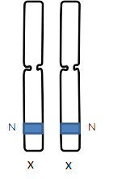

    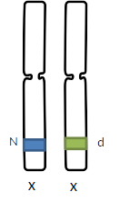

    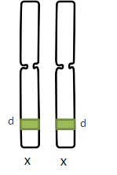

    Exercice 3
    1. Définition de gène : portion d’un chromosome qui détermine un caractère héréditaire
    Définition d’allèle : version d’un gène.

    2. Chaque gène est présent deux fois dans une cellule, car chaque chromosome est présent en deux exemplaires.

    3. Un lapin coloré a de la tyrosinase fonctionnelle, il a donc forcément au moins un allèle Tyr +. L’allèle Tyr + étant dominant, il suffit d’un allèle pour avoir de la tyrosinase fonctionnelle.

    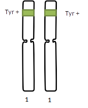
    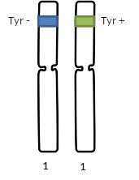

    4. Un lapin albinos n’a pas de tyrosinase fonctionnelle, il a donc forcément au moins un allèle Tyr -. L’allèle Tyr- étant récessif, il faut deux allèles Tyr – pour être albinos.
   
    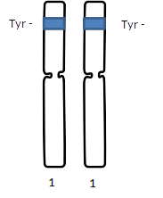