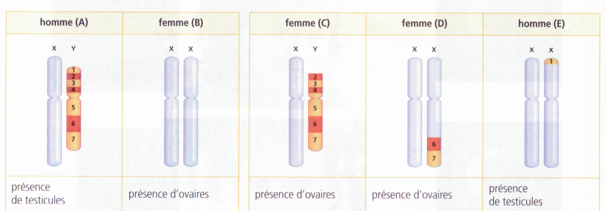
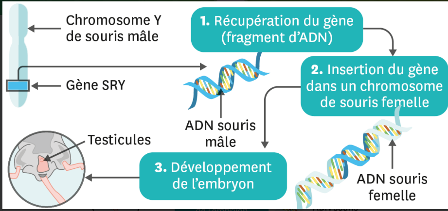
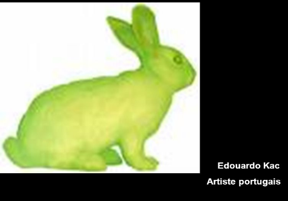
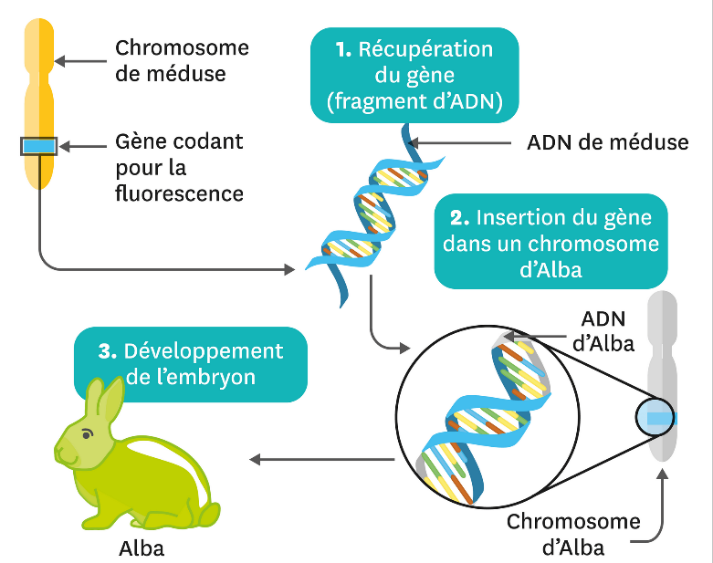

# Activité : Les gènes

!!! note Compétences

    Extraire et mettre en relation des informations 

!!! warning Consignes

    Explique comment les chromosomes peuvent déterminer un grand nombre de caractères, justifier la réponse.
    
??? bug Critères de réussite
    - 

**Document 1 Relation entre un caractère (ici le sexe de l’individu) et une portion de chromosome.**

On sait depuis 1960 que le chromosome Y est impliqué dans la détermination du sexe masculin chez les mammifères. La comparaison des chromosomes sexuels de nombreux individus a permis de localiser sur le chromosome Y une portion qui détermine la mise en place du sexe masculin. Cette portion est appelée gène SRY.

**Document 2 Expérience de transgenèse avec le gène SRY.**

**Document 3 : Le lapin ALBA.**

Aujourd’hui, les scientifiques sont capables de modifier les caractères de certains organismes. La transgenèse permet d’ajouter, d’enlever ou de « simplement » changer un gène. Une lapine, appelée Alba, est ainsi une lapine fluorescente. Pour l’obtenir, les scientifiques ont extrait un gène chez une méduse naturellement fluorescente. Ils ont ensuite introduit ce gène au niveau des chromosomes d’Alba (lorsqu’elle n’était qu’un embryon). Alba est considérée comme œuvre artistique dans le cas du bioart.

**Document 4 : Principe de la transgenèse permettant d’obtenir Alba**

**Document 5 Le projet Génome humain**

En 2001 s’est achevé le séquençage du patrimoine génétique de l’être humain. Environ 21000 gènes ont été ainsi décodés.

| Organisme | Nombre de chromosomes | Nombre de gènes |
|----------------------|-------------------------|-------------------|
| Humain | 46 | 21000 | 
| Mais | 20 | 54606 |
| Mouche du vinaigre | 8 | 13600 |  
| Levure | 32 | 6200 |  
| E. coli | 1 | 4288 |

