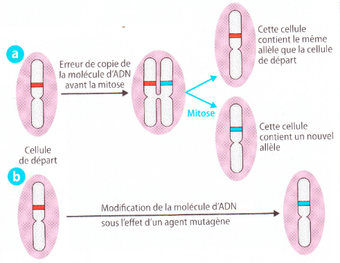
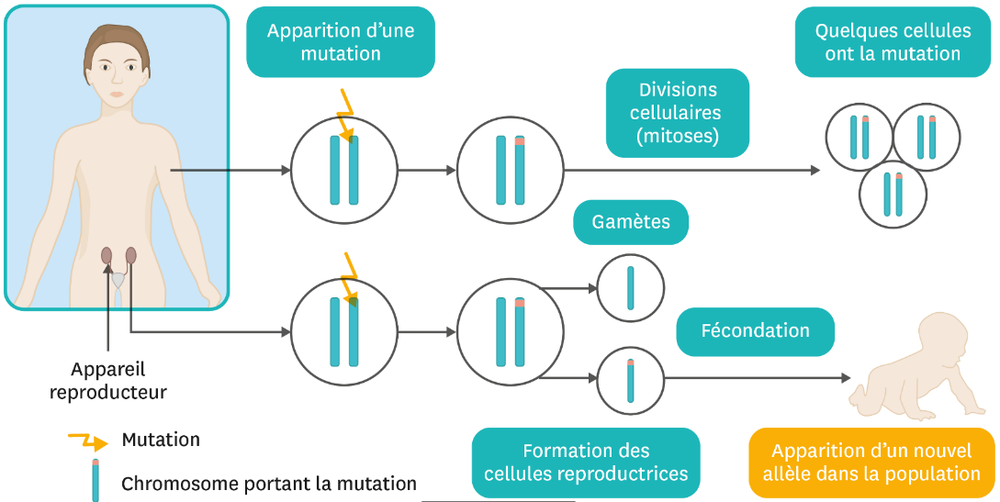
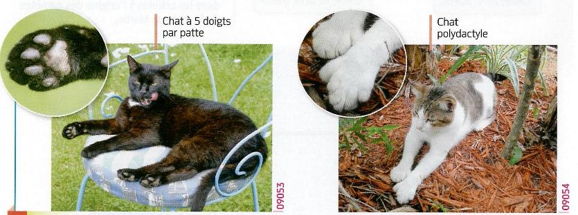

# Activité : L’apparition de nouveaux caractères.

!!! note "Compétences"

    Trouver et exploiter des informations 

!!! warning "Consignes"

    1. Expliquer comment de nouveaux allèles peuvent apparaître
    2. Explique comment ces nouveaux allèles peuvent se transmettre aux descendants.
    3. Explique si ces nouveaux allèles sont bénéfiques, sans effet ou/et néfastes pour l’être vivant.
    
??? bug "Critères de réussite"
    - 

**Document 1 Deux causes possibles de l’apparition de mutations.**

Lors de la multiplication cellulaire, l’ADN est copié. Il arrive que cette copie comporte des erreurs appelées mutations. Cela peut se produire naturellement.

Des agents mutagènes sont des éléments qui peuvent provoquer l’apparition de mutation. Les rayons UV, les rayons X, certaines substances contenues dans le tabac, la radioactivité sont des agents mutagènes.

**Document 2 Devenir d’un nouvel allèle dans une cellule somatique et une cellule germinale.**

À chaque division cellulaire, il y a une chance sur un milliard qu’un gène ait une mutation. Les cellules germinales sont les cellules qui vont former les cellules reproductrices (ou gamètes) les cellules somatiques sont toutes les autres cellules.

**Document 3 Effets des UV sur les cellules.**

Les rayons ultra-violets (UV) du soleil peuvent endommager la peau et être responsables de l’apparition de cancers. Les UV modifient l’ADN des cellules de la peau en provoquant des mutations, les UV sont des agents mutagènes. Dans certains cas, ces mutations vont entrainer une multiplication cellulaire non contrôlée, ce qui va entrainer des multiplications rapides et nombreuses et donc un amas de cellules. Cet amas est appelé tumeur ce qui peut entrainer le développement de cancers.

**Document 4 la polydactylie du chat.**

Le chat possède cinq doigts à ses pattes antérieures, mais seuls quatre doigts reposent sur le sol. Les chats polydactyles possèdent, depuis la naissance, un ou plusieurs doigts supplémentaires. Ces chats se déplacent normalement.
Ce caractère est dû à la mutation d’un gène contrôlant l’organisation de la patte.

**Document 5 La résistance aux insecticides.**

Certains moustiques transmettent des maladies comme le chikungunya ou le Zika. Les insecticides utilisés contre ces insectes les tuent en agissant sur leur système nerveux.
Les moustiques produisent naturellement, mais en petite quantité, une molécule appelée estérase, qui est capable de détruire ces insecticides. L’information génétique pour produire l’estérase est déterminée par deux gènes. Certains moustiques ont une mutation de leur information génétique qui leur permet de produire beaucoup d’estérase, ils sont donc plus résistants aux insecticides.

??? note-prof "Correction :"

    Dans le document, on voit que des changements dans l’ADN peuvent provoquer l’apparition de nouveaux allèles. Ces changements sont appelés des mutations. Ces mutations peuvent se produire naturellement ou sous l’influence d’agents mutagènes.
    Pour que la mutation soit transmise à la descendance, elle doit se produire dans les cellules germinales qui forment les cellules reproductrices.
    Les mutations peuvent être bénéfiques, on le voit dans le document 5 qui explique qu’une mutation a permis à des moustiques de devenir résistants à certains insecticides, ce qui leur permet de mieux survivre.
    Les mutations peuvent aussi être néfastes, elles peuvent provoquer l’apparition de cancers.
    Enfin, elles peuvent être sans effet, comme pour la polydactylie des chats, qui fait que les chats ont plus de doigts, mais cela n’entraîne ni avantage ni désavantage.