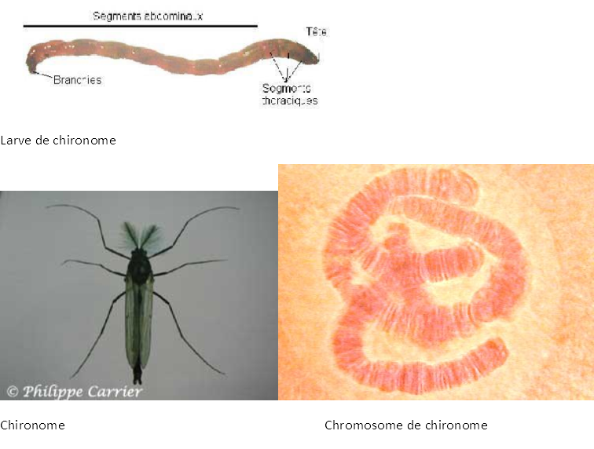

# Activité : Importance du tri des déchets

!!! note "Compétences"

    Interpréter 

!!! warning "Consignes"

    Consigne 1 : 
    
??? bug "Critères de réussite"
    - 

    Activité 4 : Les chromosomes
Consigne 1 : Observer au microscope une lame de chromosomes de chironomes et faire le dessin d’observation.
Consigne 2 : Expliquer le lien entre la molécule d’ADN et les chromosomes.
Compétences travaillées :  Utiliser un microscope, Faire un dessin d’observation et Extraire et mettre en relations des informations

Document 1 : La molécule d’ADN (acide désoxyribonucléique). 

Une technique particulière permet de décondenser (=dérouler) un long filament d’ADN, ce filament est le constituant d’un chromosome. 
Le diamètre du filament d’ADN  2 nm. (nanomètre ou milliardième de mètre).

Document 2 : Relation entre chromosomes et molécules d’ADN.
Une molécule d’ADN se présente sous la forme d’un long filament capable de s’enrouler sur lui-même.

ADN décondensé						ADN condensé

??? note-prof
    Consigne 2 : La molécule d’ADN est un long filament qui peut soit être déroulé et remplir le noyau, soit être condensé et former des chromosomes.