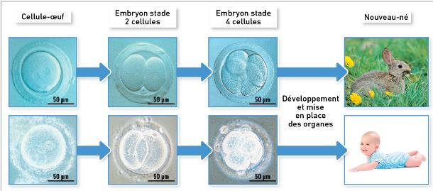

# Activité : Localisation de l’information génétique

!!! note "Compétences"

    Extraire et mettre en relations des informations 

!!! warning "Consignes"

    1. faire un schéma d'une cellule en indiquant les différents éléments de celle-ci. 
    1. Expliquer où se trouve l’information génétique dans un texte argumenté en utilisant l’expérience.
    
??? bug "Critères de réussite"

    Aides :

    - Expliquer à l'aide du doc 1, comment on peut être sûr que l'information génétique est dons la cellule.
    - Indiquer la provenance des différents éléments ayant formé l’embryon de la vache clonée.
    - Comparer le veau cloné aux deux vaches de départ.
    - Où se trouve l’information génétique.

**Document 1 Localisation de l'information génétique**

L’information génétique se transmet de génération en génération et permet le développement de notre corps. 
Une cellule-oeuf d'être humain donnera toujours un individu avec des caractères d'être humain; ene cellule-oeuf de lapin donnera toujours un individu avec des caractères de lapin.

**Document 2 Une expérience de clonage.**

??? note-prof

    Dans l’expérience de clonage, on a créé un embryon avec des éléments provenant de deux vaches. La membrane et le cytoplasme de l’embryon proviennent de la vache rouge. Le noyau provient d’un embryon de veau noir et blanc.
    Le veau obtenu avec cet embryon est noir et blanc comme la vache qui a donné le noyau donc l’information génétique se trouve dans le noyau.
