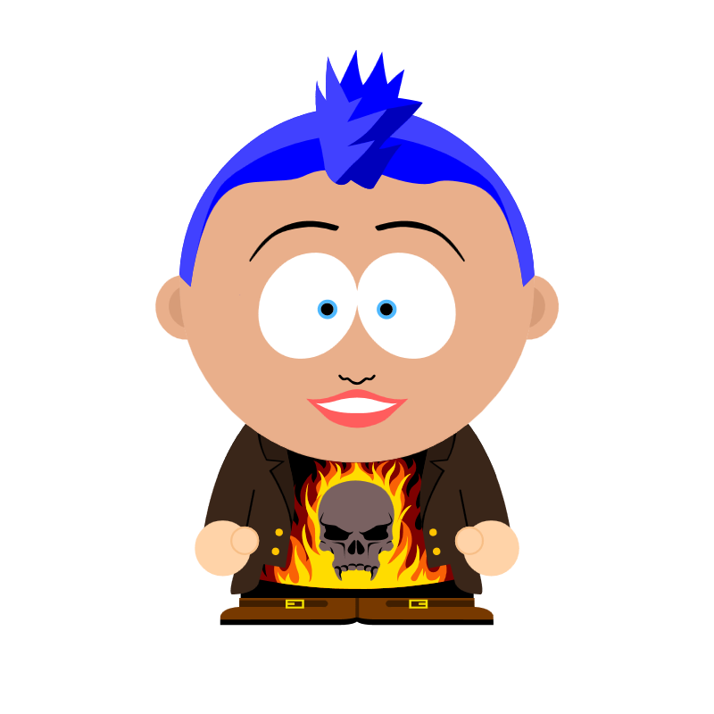
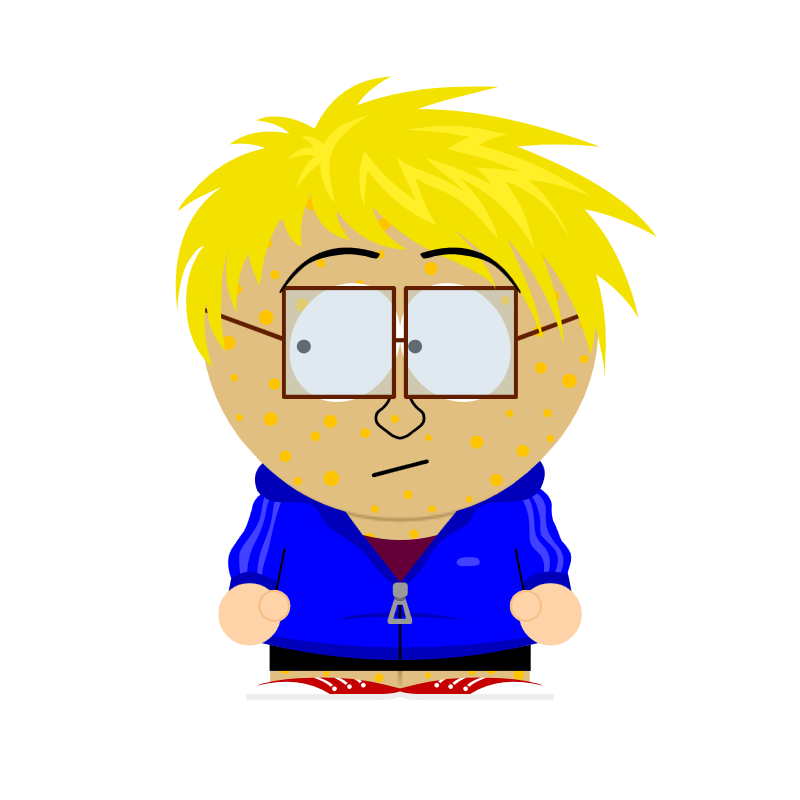
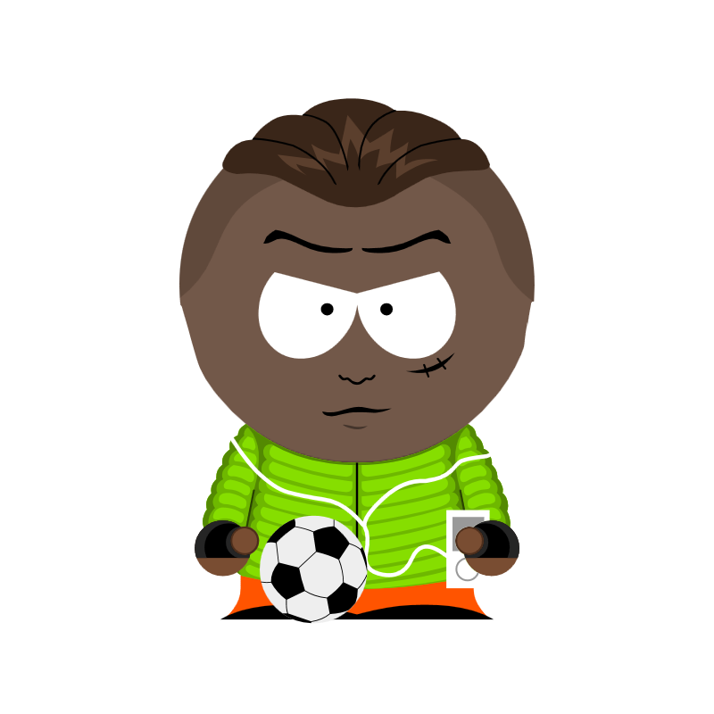

# Séquence : Enquête policière et génétique

!!! note-prof
    si besoin d'infos
### Document d’appel :

    

{: style="width:400px; flex-shrink: 0;  " }

Hier, le chat du collège, Grissette, a disparu ! Elle avait été vue sur le parking du collège, des gouttes de sang et des cheveux ont été trouvés. Qui a kidnappé Grissette ?

{: style="width:400px; flex-shrink: 0;  " }

Une première enquête a limité les suspects à sept personnes.

| Plumo | Alex H. | Amina | Sophia | Kévin | Ismaël | Gaël |
|-|-|-|-|-|-|-|
| | | |||| |
| Plumo, berger allemand, 7 ans | Alex H. Prof d'histoire, 34 ans | Amina, élève en 3ᵉ, 14 ans | Sophia, élève de 4ᵉ, 13 ans | Kevin, élève de 3ᵉ, 14 ans | Ismaël, élève de 4ᵉ, 13 ans | Gaël, élève de 4e, 13 ans | 
| Groupe sanguin inconnu | Groupe sanguin O | Groupe sanguin B | Groupe sanguin A |Groupe sanguin B | Groupe sanguin AB | Groupe sanguin A | 
| Plumo a été vu s'enfuyant à toute vitesse du collège | La concierge a vu Alex quitter le collège particulièrement tard ce soir-là. | Elle a été vue se promenant près du lieu du crime. |Elle a été vue assise devant le collège à 21 h avec un énorme sac. | Il était très énervé contre le collège à cause d'une heure de retenue | Il n'était pas à son entrainement de foot et a été aperçu proche du collège | Il est souvent en train de caresser le chat |
| on sait que les chiens n'aiment pas les chats | Le prof a un tatouage sur les bras | Elle porte des boucles d'oreilles| Elle se teint les cheveux, sa couleur de cheveux naturelle est brun | Il est bronzé depuis son retour de vacances | Il a une cicatrice au visage | Il est atteint du syndrome de Down qui est une maladie génétique |

Qui a kidnappé le chat du collège ?

!!! question Problématique
    
    comment expliquer que nous soyons tous différents, malgré nos caractéristiques communes ?

## Séance 1 : Les caractères héréditaires

Avec le sang et les cheveux, on aura accès à l'ADN. Cet ADN nous permettra de connaitre de caractères (traits caractéristiques) du coupable et donc d'identifier. Mais cela nous donnera que des caractères héréditaires. Il faut donc identifier les caractères héréditaires des suspects

!!! question Problématique
    Quels sont les caractères héréditaires ?

[Activité Les caractères héréditaires](../caractHered)

??? abstract Bilan
    
    <a id="bilan1">
    Les individus d’une même espèce partagent des caractères. Ce sont les caractères spécifiques. 

    Il existe cependant des variations individuelles. Ce qui permet une biodiversité génétique des espèces.

    Des caractères se transmettent de génération en génération, ce sont les caractères héréditaires.

    Le phénotype d'un individu correspond à l'ensemble des caractères d'un individu visible à différentes échelles.
    Ce phénotype dépend des caractères héréditaires et de l'environnement.

    </a>

## Séance 2 : Les caryotypes

Le laboratoire a fait une première analyse des cheveux retrouvés.
Ils ont pu récuperer de l'ADN et voir cet ADN sous la forme de chromosomes. Ils ont réalisé un caryotype.

!!! question Problématique
    Quelle information un caryotype peut-il donner ?
    
[Activité Le caryotype](../caryotype)

??? abstract Bilan

    <a id="bilan2">

    === "De quoi parler dans le bilan ? Quels mots clés ?"

    === Bilan à trous
        L’information génétique permet la réalisation des phénotypes héréditaires et donc des caractères ..........................
        
        L’information génétique se trouve sous la forme d'ADN dans le noyau des cellules. L'ADN compose les ...............…, ce sont le support de l’information génétique. 
        
        On retrouve des chromosomes et donc de l’ADN chez tous les êtres vivants. L’ADN est un caractère partagé par tous les êtres vivants, c’est donc un indice de la parenté des êtres vivants.
        
        Les chromosomes du noyau d’une cellule peuvent être étudiés en réalisant un ............................... (=ensemble des chromosomes d’une cellule rangés par paires et classés par taille décroissante).
        
        Le nombre de chromosomes est variable en fonction de l’espèce. Toutes les cellules d’un individu ont les mêmes chromosomes. Toutes les cellules humaines contiennent les mêmes ....... chromosomes soit ...... paires.
        
        Une paire de chromosomes détermine le sexe de l’individu, ce sont les chromosomes sexuels. (Homme Chromosome ....... et chromosome ...... et Femme .... chromosomes ..... ) Les autres sont appelés des chromosomes homologues.
        
        Un nombre anormal de chromosomes peut empêcher le développement de l’embryon ou entraîne des caractères différents chez l’individu (ex : trisomie 21).

    === Bilan
    
        L’information génétique permet la réalisation des phénotypes héréditaires et donc  des caractères héréditaires. 
        
        L’information génétique se trouve sous la forme d'ADN dans le noyau des cellules.
        L'ADN compose les chromosomes, ce sont le support de l’information génétique. 
        
        On retrouve des chromosomes et donc de l’ADN chez tous les êtres vivants. L’ADN est un caractère partagé par tous les êtres vivants, c’est donc un indice de la parenté des êtres vivants.

        Les chromosomes du noyau d’une cellule peuvent être étudiés en réalisant un caryotype (=ensemble des chromosomes d’une cellule rangés par paires et classés par taille décroissante).
        
        Le nombre de chromosomes est variable en fonction de l’espèce. Toutes les cellules d’un individu ont les mêmes chromosomes. Toutes les cellules humaines contiennent les mêmes 46 chromosomes soit 23 paires.

        Une paire de chromosomes détermine le sexe de l’individu, ce sont les chromosomes sexuels. (Homme Chromosome X et chromosome Y  et Femme 2 chromosomes X ) Les autres sont appelés des chromosomes homologues.

        Un nombre anormal de chromosomes peut empêcher le développement de l’embryon ou entraine des caractères différents chez l’individu (trisomie 21).

    </a>

[Activité Exercices](../exoChromosomes)

## Séance 3 : Les groupes sanguins : gènes 

Grâce aux gouttes de sang, on va pouvoir faire un test, pour connaitre le groupe sanguin du coupable.

L'information génétique présente sur les chromosomes permet de donner les caractères héréditaires. Ces informations composent les gènes. 

!!! question Problématique
    Comment une information, comme le groupe sanguin, est organisée dans les chromosomes ?    

??? abstract Bilan
    
    <a id="bilan3">

    Un gène est une portion de chromosomes (donc d’ADN) située à un emplacement précis.
    Il porte une information génétique qui détermine un caractère héréditaire ou une partie d'un caractère. 

    Lorsque le gène s’exprime, il permet la formation d’une ou plusieurs protéines qui va permettre l’apparition du caractère.

    L’ensemble des gènes d’un être vivant constitue le génome. Chaque chromosome contient de nombreux gènes.

    Chaque chromosome est présent en 2 exemplaires (= paire). Chaque chromosome de la paire comporte les mêmes gènes. Donc chaque gène est présent 2 fois dans une cellule. (sauf la paire XY chez le mâle).

    Le génome humain = ensemble des gènes portés par les chromosomes de l’homme contiendrait 20 000 à 25 000 gènes

    </a>
    

[Activité Le groupe sanguin](../grpSang)

## Séance 4 : Les groupes sanguins : allèles

Un des parents indique que votre raisonnement est incorrect, si tous les humains ont les mêmes gènes, on devrait tous avoir le même groupe sanguin, ce qui n'est pas le cas, les caractéristiques génétiques sont incorrectes d'après lui. Il faudra lui expliquer son erreur

!!! question Problématique
    Comment malgré des gènes identiques, nous pouvons être différents ?

[Activité Le groupe sanguin et les allèles](../grpSangAlleles)

??? abstract Bilan

    <a id="bilan4">

    === "De quoi parler dans le bilan ? Quels mots clés ?"

    === Bilan à trous

        Les différentes versions d'un gène sont appelées ............... Il détermine une version différente du caractère.

        Chaque personne a donc ...... allèles de chaque gène : 

        - Qui peuvent être identiques, l’individu est homozygote pour ce gène. 
        - Qui peuvent être différents, l’individu est hétérozygote pour ce gène. 

        Si les deux allèles sont différents : 

        - Les deux peuvent s’exprimer, ils sont codominants. 
        - Un seul allèle s’exprime, il est dominant et l’autre est récessif.

        Tous les individus ont les mêmes ............. La diversité humaine est possible grâce à l’existence de ces ............ Chaque individu est un assemblage d’allèles différents. Cette diversité est appelée biodiversité allélique. L’ensemble des allèles d’un individu est appelé génotype.

        Le génotype détermine une partie du ..............

        génotype <=> phénotype

        .......  <=>  ........

    === Bilan
        Les différentes versions d'un gène sont appelées "allèles". Il détermine une version différente du caractère.

        Chaque personne a donc deux allèles de chaque gène : 

        - Qui peuvent être identiques, l’individu est homozygote pour ce gène. 
        - Qui peuvent être différents, l’individu est hétérozygote pour ce gène. 

        Si les deux allèles sont différents : 

        - Les deux peuvent s’exprimer, ils sont codominants. 
        - Un seul allèle s’exprime, il est dominant et l’autre est récessif.

        Tous les individus ont les mêmes gènes. La diversité humaine est possible grâce à l’existence de ces allèles. Chaque individu est un assemblage d’allèles différents. Cette diversité est appelée biodiversité allélique. L’ensemble des allèles d’un individu est appelé génotype.

        Le génotype détermine une partie du phénotype.

        génotype <=> phénotype

        A/B <=> [AB]

        [Vidéo bilan ](https://www.youtube.com/watch?%E2%80%A6&v=H9tz0GJNw2c&feature=youtu.be)

    </a>

## Séance 5 : Transmission de l'information génétique à la naissance : méiose et fécondation source de diversité

L'avocat des familles des suspects vous contacte.
Il vous pense que les médecins ont fait une erreur avec groupe sanguin d'Amina. 

En effet, selon lui, Amina ne peut pas être incriminée, car elle ne peut pas être de groupe sanguin B. 

Sa mère étant A et son père AB, il explique qu'elle ne peut être que de groupe sanguin A ou AB.

Vous devez donc lui expliquer comment l'information génétique est transmise des parents aux enfants, pour lui montrer qu'elle peut être de groupe sanguin B.

!!! question Problématique
    Comment l'information génétique est-elle transmise des parents aux enfants ?

[Activité Transmission des gènes](../transmissionGènes)

??? abstract Bilan

    <a id="bilan5">

    Les spermatozoïdes et les ovules sont des gamètes (=cellules reproductrices).

    Lors de la formation des gamètes, la méiose, les chromosomes de chaque paire se séparent et les gamètes reçoivent au hasard un seul des deux chromosomes de chacune des 23 paires, chaque gamète a 23 chromosomes

    Les chromosomes étant génétiquement différents (ils possèdent les mêmes gènes, mais pas les mêmes allèles), la répartition au hasard des chromosomes fait qu'un individu peut fabriquer de très nombreux gamètes génétiquement différents. (8,3 millions de gamètes différents pour un individu).

    Lors de la fécondation, les informations génétiques des deux cellules reproductrices se réunissent au hasard, la cellule-œuf obtenue contient donc 46 chromosomes. (23 du père et 23 de la mère)    Pour chaque gène, un des allèles provient de la mère, l'autre du père.

    Les cellules reproductrices d'un individu étant différentes génétiquement, ses enfants seront différents. Chaque individu issu de la reproduction sexuée est unique. (Dans un couple il peut y avoir  70 mille milliards de cellules-œufs différentes)

    </a>

## Séance 6 transmission conforme de l'information génétique de la cellule-œuf au reste de l'organisme : la mitose 

Au cours de l'enquête, vous vous heurtez aux parents des suspects. Tous ne croient pas à la fiabilité des preuves que vous avancez et plus particulièrement au fait que les cheveux retrouvés sur la scène de crimes puissent réellement fournir l'information génétique du coupable.

La mère d'Amina vous retrouve et vous dit :
" Je suis convaincue que ma fille est innocente. En plus l'information génétique se trouve dans la cellule-œuf donc je ne vois pas comment un cheveu peut vous donner l'ADN du coupable ".

Vous cherchez donc à lui expliquer comment on peut passer d'une unique cellule-œuf dont le noyau contient l'information génétique à un individu contenant des milliards de cellules ayant la même information génétique.

Rédiger un texte accompagne d'un schéma à la mère d'Amina grâce auxquels vous lui expliquerez comment on peut obtenir deux cellules ayant la même information génétique à partir d'une seule.

!!! question Problématique

    Comment expliquer que l'information génétique est conservée au cours de la multiplication cellulaire ?

[Activité Conservation de l'information génétique](../mitose)

??? abstract Bilan

    <a id="bilan6">

    La division cellulaire permet la formation de nouvelles cellules qui vont permettre la formation d'un nouvel être vivant et le renouvellement de ses cellules.

    La division cellulaire (ou multiplication cellulaire ou mitose) d'une cellule-mère donne deux cellules-filles identiques.

    Avant la division, chaque chromosome simple est copié et forme des chromosomes doubles dont les deux parties sont identiques. La quantité d'ADN double, mais le nombre de chromosomes reste le même.

    Lors de la division cellulaire, les deux parties de chaque chromosome double se séparent et se répartissent dans les deux cellules-filles.

    Les deux cellules-filles reçoivent le même nombre de paires de chromosomes identiques à ceux de la cellule-mère. 
    
    </a>

## Séance 7 : Une autre source de diversité les mutations

Les analyses détaillées de l'ADN du coupable viennent d'arriver. Il s'agit du dernier indice de l'enquête.
Les résultats sont surprenants et modifient les conclusions de l'enquête.

!!! question Problématique

    Comment des modifications de l'ADN  peuvent-elles avoir des conséquences ?

[Activité Mutations](../mutations)

??? abstract Bilan

    <a id="bilan7">

    Une mutation est une modification de l’ADN d’un gène. Elles sont rares. Elles peuvent être à l’origine de nouveaux caractères et modifier le phénotype.

  
    Les mutations peuvent arriver naturellement ou être provoquées par des agents mutagènes (UV, virus …) 
    
    Ces mutations se font au hasard et donc le nouveau caractère peut être bénéfique, sans conséquence ou létal.
    Les mutations ne peuvent être transmises à la descendance uniquement lorsqu’elles se font dans les cellules reproductrices.

    Définitions.

    - Mutation : Modification de l’information génétique portée par l’ADN, à l’origine de nouveaux allèles.
    - Cellule somatique : Cellule ne donnant pas de cellules reproductrices
    - Cellule germinale : Cellule donnant des cellules reproductrices.

    </a>
