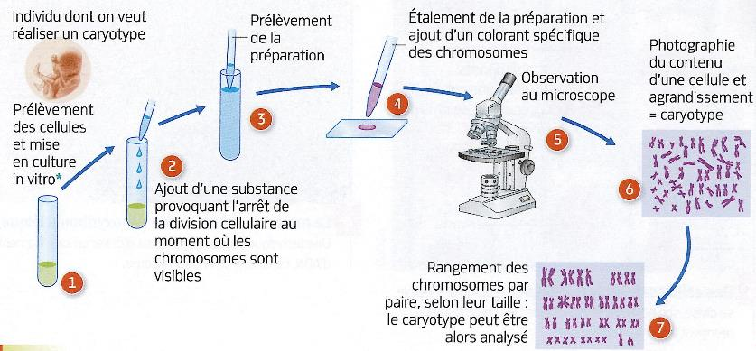
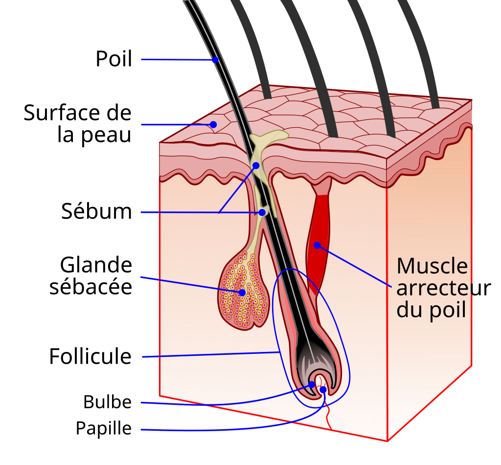
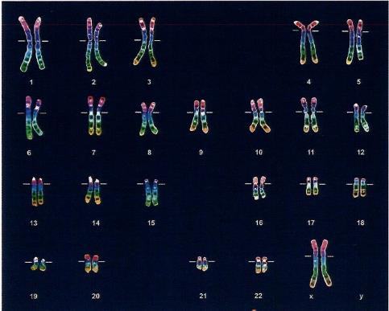

# Activité : le caryotype du coupable

!!! note "Compétences"

    Interpréter 

!!! warning "Consignes"

    1. Expliquer comment on peut obtenir le caryotype à l'aide d'un cheveu.
    2. Indiquer l'espèce et le sexe du coupable, en justifiant la réponse.
    
??? bug "Critères de réussite"
    - 

**Document 1 Le caryotype**

Un caryotype permet de visualiser les chromosomes d'un être vivant. Les chromosomes sont le support de l'information génétique
Le nombre de chromosomes dépend de l'espèce. Par exemple, chez l'espèce humaine, il y a 46 chromosomes organisés en 23 paires. On peut aussi voir des anomalies par exemple, s'il manque un chromosome dans une paire ou si un chromosome est présent en trop.

Les chromosomes peuvent donner une idée du sexe de l'individu, par exemple dans l'espèce humaine, la paire de chromosomes sexuels comprend 2 chromosomes X chez la majorité des femmes et un chromosome X et un chromosome Y chez la majorité des hommes.

**Document 2 Technique de classification des chromosomes d'un noyau pour obtenir un caryotype.**

**Document 3 Les cheveux comme pièces à conviction**

    

    
{: style="height:400px; flex-shrink: 0;  " }

Les cheveux, la peau, les ongles, le sang et autres liquides corporels peuvent être utilisées pour la police scientifique pour identifier un individu.
Ces éléments contiennent des cellules qui renferment l'information génétique d'un individu.
Dans le cas du cheveu, c'est la base du bulbe qui contient des cellules.

**Document 3 Caryotype réalisé à partir des cheveux retrouvés**

**Document 4 Le syndrome de Down.**

Le syndrome de Down, aussi appelé trisomie 21, représente 1 cas pour 700 naissances. Les individus atteints par cette anomalie possèdent des caractéristiques physiques particulières (cou et membres courts, visage rond, yeux bridés, malformation cardiaque, etc.) et un déficit intellectuel plus ou moins important selon les individus.

Ce syndrome est dû à la présence de 3 chromosomes 21, ce qui a donné le nom de trisomie 21.

La plupart du temps, des anomalies du nombre de chromosomes provoquant un arrêt du développement embryonnaire, car les caractères n’arrivent pas à se mettre en place pour constituer un individu fonctionnel.

??? note-prof "correction"

    J'observe dans les docs 1 et 2 que les étapes pour réalliser un caryotype sont :
        - Prélèvement de cellulkes de lk'individu
        - montage de la prépartion entre lame et lamelle
        - observation au microscope optique
        - photographie des chromosomes et agrandissmeent
        - découpade de chacun des chromosomes
        - classificaiton et mise en place
    Les cheveux sont untils come pièceànconviction car le bulbe d'un cheveu est constitué de cellules. les scientifiques cobnt donc analyser l'infomration génétrique portée par ces cellules.

    Nombre de chromosome 46 donc espèce Humaine

    Chromosomes sexuels XX donc sexe probablement : femme

