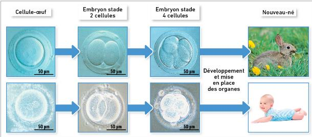

# Activité :Exercices

## Exercice 1 : Localisation de l’information génétique

!!! note "Compétences"

    Extraire et mettre en relations des informations 

!!! warning "Consignes"

    1. Expliquer à l'aide du doc 1, comment on peut être sûr que l'information génétique est dans la cellule.
    2. Indiquer la provenance des différents éléments ayant formé l’embryon de la vache clonée.
    3. Comparer le veau cloné aux deux vaches de départ.
    4. Où se trouve l’information génétique.
    5. faire un schéma d'une cellule en indiquant les différents éléments de celle-ci. 

**Document 1 Localisation de l'information génétique**

L’information génétique se transmet de génération en génération et permet le développement de notre corps. 
Une cellule-œuf d'être humain donnera toujours un individu avec des caractères d'être humain ; une cellule-œuf de lapin donnera toujours un individu avec des caractères de lapin.

**Document 2 Une expérience de clonage.**

## Exercice 2 : Caryotype

!!! note "Compétences"

    Extraire et mettre en relations des informations 

!!! warning "Consignes"

    1. A l'aide du caryotype, que peut-on dire de l'être vivant dont est issu le caryotype ci-dessous

