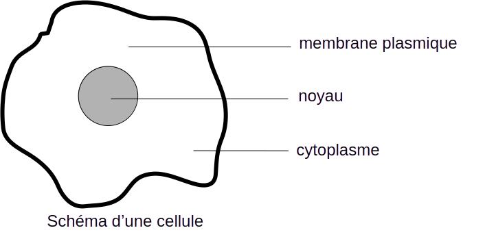
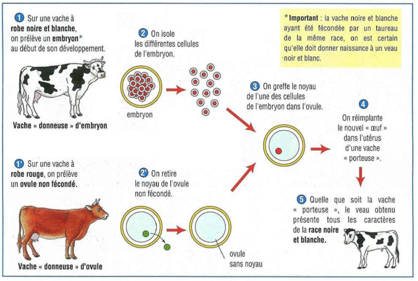
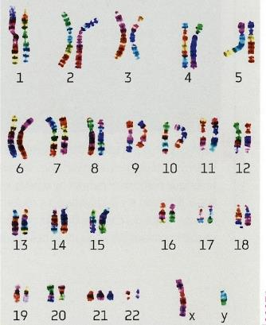

# Activité :Exercices

## Exercice 1 : Localisation de l’information génétique

!!! note Compétences

    Extraire et mettre en relations des informations 

!!! warning Consignes

    1. Expliquer à l'aide du doc 1, comment on peut être sûr que l'information génétique est dans la cellule.
    2. A partir des résultats de l'expérience, indiquer où se trouve l'information génétique en justifiant votre réponse.
    
??? bug "Aides"

    - Indiquer la provenance des différents éléments ayant formé l’embryon de la vache clonée.
    - Comparer le veau cloné aux deux vaches de départ.

**Document 1 Localisation de l'information génétique**

L’information génétique se transmet de génération en génération et permet le développement de notre corps. 
Lors de la reproduction sexuée, un nouvel individu est issu d'une cellule unique.
Une cellule-œuf d'être humain donnera toujours un individu avec des caractères d'être humain ; une cellule-œuf de lapin donnera toujours un individu avec des caractères de lapin.

**Document 2 Une expérience de clonage.**

## Exercice 2 : Caryotype

!!! note Compétences

    Extraire et mettre en relations des informations 

!!! warning Consignes

    1. A l'aide du caryotype, que peut-on dire de l'être vivant dont est issu le caryotype ci-dessous

