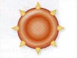
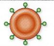
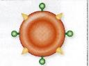

# Activité : Le groupe sanguin

!!! note "Compétences"

    - Mettre en œuvre un protocole expérimental
    - extraire et mettre en relation des informations  

!!! warning "Consignes"

    1. À l’aide des documents proposés, identifier le groupe sanguin du coupable.
    2. Retrouver la défintion de gène et la définition d'allèle.
    3. Représenter sur le schéma du document 5, le gène ABO responsable du groupe sanguin.
    4. 

!!! note-prof "matériel"
    Matériels : 

    - plaque de test des groupes sanguins
    - 2 cure-dents rouges
    -  flacon noté « ? » contenant un mélange eau + colorant rouge + sulfate de zinc à 0,1 mol.L-1 mimant du sang de groupe inconnu.
    - 1 flacon noté « aA » de solution de soude incolore mimant du sérum avec des anticorps anti-A
    - 1 flacon noté « aB » de solution d’eau incolore mimant du sérum avec des anticorps anti-B
    - 3 pipettes plastiques notées « ? », « aA » et « aB »

    
??? bug "Critères de réussite"

??? bug "Coups de pouce"    

    - Placer le gène ABO
  
    Pour représenter un gène sur chromosome il faut :

    1. idebntifier la paire de chromosomes portant ce gène (et la légender sur le schéma)
    2. Repérer la localisaiton de ce gène sur les chromosomes
    3. Placer le gène surle chromosome en le représentant par un trait de couleur.

    Attention : un gène est présent en ..... exemplauire sur les chromosomes d'une même paire (=chromosome ....................)

**Document 1 les groupes sanguins du système ABO**

Les globules rouges (ou hématies) sont des cellules sanguines qui transportent du dioxygène dans le sang. La découverte des groupes sanguins, en 1909, a permis de comprendre pourquoi certaines transfusions sanguines se terminaient par la mort des patients. On sait aujourd’hui qu’il existe 4 groupes sanguins, A, B, AB et O. 
Dans certains mélanges de sang, les globules rouges se rassemblaient en paquet au lieu de rester en suspension. Les groupes sanguins dépendent de la présence de molécules particulières sur les hématies, ces molécules sont des antigènes. Les humains peuvent avoir des antigènes A, des antigènes B ou aucun des deux.

| Groupe sanguin | A | B | AB | O |
|----------------|---|---|----|---|
| Hématies avec les antigènes |||||
| Fréquence dans la population | 45% | 9% | 3% | 43% |

**Document 2 Les anticorps**

Les anticorps sont des molécules qui se lient à des antigènes spécifiquement. Lorsqu’ils se fixent à des antigènes, ils forment une agglutination (des petits paquets). Cette agglutination permet de neutraliser les antigènes et le corps étranger auquel ils sont fixés. S’il y a agglutination, c’est donc que l’anticorps et l’antigène correspondent.

**Document 3 Protocole d’identification du groupe sanguin.**

Pour des raisons sanitaires, vous ne manipulerez pas de vrai sang, mais un mélange de produits chimiques qui montrent le comportement du sang dans le vrai protocole.

Pour identifier le groupe sanguin d’un individu, et donc connaître les molécules présentes à la surface de ses hématies, on utilise des anticorps. 

1. Déposer une goutte de sang dans 2 puits d’une plaque de prélèvement.
2. Ajouter une goutte de solution d’anticorps anti A dans le premier puits.
3. Ajouter une goutte de solution d’anticorps anti B dans le deuxième puits.

**Document 2 Les différentes versions du gène responsable du groupe sanguin ABO.**

Le système ABO est un caractère dépendant du gène ABO présent sur le chromosome 9. Un gène permet de fabriquer un seul type d’antigène. 

Il existe différentes versions du gène ABO, appelées allèles.
Les allèles A, B et O. A donne des antigènes A, B donne des antigènes B et O ne donne aucun antigène. A et B sont codominants et O est récessif.

**Document 4 Protocole d’identification du groupe sanguin.**

Pour des raisons sanitaires, vous ne manipulerez pas de vrai sang, mais un mélange de produits chimiques qui montrent le comportement du sang dans le vrai protocole.

Pour identifier le groupe sanguin d’un individu, et donc connaître les molécules présentes à la surface de ses hématies, on utilise des anticorps. 1 Déposer une goutte de sang dans 2 puits d’une plaque de prélèvement. 2 Ajouter une goutte de solution d’anticorps anti A dans le premier puits. 3 Ajouter une goutte de solution d’anticorps anti B dans le deuxième puits.

??? note-prof "Correction"

    Consigne 1 :
    On voit qu’il y a une agglutination en présence d’anticorps anti A, il y a donc des antigènes A sur les globules rouges. Il n’y a pas d’agglutination en présence d’anticorps anti B, il n’y a donc pas d’antigène B.
    La personne a donc seulement des antigènes A, elle est donc de groupe sanguin A.

    Consigne 2 :
    La personne étant de groupe sanguin A, elle a forcément au moins un allèle A. Elle ne peut pas avoir d’allèle B, car sinon elle serait AB. Le second allèle peut soit être un deuxième 1 ou bien un allèle O, car O est récessif.
    
    
