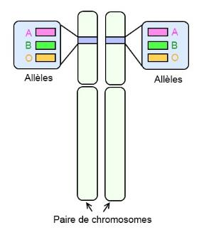

# Activité : Le groupe sanguin

!!! note "Compétences"

    - Mettre en œuvre un protocole expérimental
    - extraire et mettre en relation des informations  

!!! warning "Consignes"

    1. A l'aide du document 4, compléter le tableau du document 2 représentant les hématies en y ajoutant les différents marqueurs en respectant le code donné dans le document 4
    2. À l’aide des documents proposés, identifier le groupe sanguin du coupable.
    3. Représenter la ou les paires de chromosomes 9 pour chaque groupes sanguins.
    4. Indiquer les paires de chromosomes 9 pour le suspect.

!!! note-prof "matériel"
    Matériels : 

    - plaque de test des groupes sanguins
    - 2 cure-dents rouges
    -  flacon noté « ? » contenant un mélange eau + colorant rouge + sulfate de zinc à 0,1 mol.L-1 mimant du sang de groupe inconnu.
    - 1 flacon noté « aA » de solution de soude incolore mimant du sérum avec des anticorps anti-A
    - 1 flacon noté « aB » de solution d’eau incolore mimant du sérum avec des anticorps anti-B
    - 3 pipettes plastiques notées « ? », « aA » et « aB »

    
??? bug "Critères de réussite"

??? bug "Coups de pouce"    

    - Placer le gène ABO
  
    Pour représenter un gène sur chromosome il faut :

    1. identifier la paire de chromosomes portant ce gène (et la légender sur le schéma)
    2. Repérer la localisaiton de ce gène sur les chromosomes
    3. Placer le gène surle chromosome en le représentant par un trait de couleur.

    Attention : un gène est présent en ..... exemplauire sur les chromosomes d'une même paire (=chromosome ....................)

**Document 1 Le sang**

Le sang est un tissu liquide composé de plasma et cellules diverses. Il contient en particulier les globules rouges, dont la fonction principale est le transport de dioxygène dans tout l'organisme. 
Les globules rouges des Mammifères (donc des Humains) n'ont pas de noyau. Les globules rouges des Mammifères sont appelés hématies.

**Document 2 les groupes sanguins du système ABO**

La découverte des groupes sanguins, en 1909, a permis de comprendre pourquoi certaines transfusions sanguines se terminaient par la mort des patients. On sait aujourd’hui qu’il existe 4 groupes sanguins, A, B, AB et O. 
Dans certains mélanges de sang, les globules rouges se rassemblaient en paquet au lieu de rester en suspension. Les groupes sanguins dépendent de la présence de molécules particulières sur les hématies, ces molécules sont des antigènes. Les humains peuvent avoir des antigènes A, des antigènes B ou aucun des deux.

| Groupe sanguin | A | B | AB | O |
|----------------|---|---|----|---|
| Hématies avec les antigènes |||||
| Fréquence dans la population | 45% | 9% | 3% | 43% |

**Document 3 Les anticorps**

Les anticorps sont des molécules qui se lient à des antigènes spécifiquement. Lorsqu’ils se fixent à des antigènes, ils forment une agglutination (des petits paquets). Cette agglutination permet de neutraliser les antigènes et le corps étranger auquel ils sont fixés. S’il y a agglutination, c’est donc que l’anticorps et l’antigène correspondent.

**Document 4 Protocole d’identification du groupe sanguin.**

Pour des raisons sanitaires, vous ne manipulerez pas de vrai sang, mais un mélange de produits chimiques qui montrent le comportement du sang dans le vrai protocole.

Pour identifier le groupe sanguin d’un individu, et donc connaître les molécules présentes à la surface de ses hématies, on utilise des anticorps. 

1. Déposer une goutte de sang dans 2 puits d’une plaque de prélèvement.
2. Ajouter une goutte de solution d’anticorps anti A dans le premier puits.
3. Ajouter une goutte de solution d’anticorps anti B dans le deuxième puits.

**Document 4 Les différentes versions du gène responsable du groupe sanguin ABO.**

[Vidéo sur les groupes sanguins](https://www.sciencesetavenir.fr/videos/2-minutes-pour-comprendre-les-groupes-sanguins_5qmk3u)

Tous les êtres humains possèdent le même gène codant pour les marqueurs du groupe sanguin ABO, situé sur la paire de chromosome 9.

Il existe 3 versions du gène ABO (appelées allèles) :

- Allèle A : il permet la fabrication de la molécule A (symbolisé )
- Allèle B : il permet la fabrication de la molécule B (symbolisé )
- Allèle O : il ne dirige la fabrication d'aucun marqueur.

Les chromosomes allant par paire, chaque individu possède deux versions de chaque gène : soit elles sont identiques, soit elles sont différentes.

Tous les allèles ne s'expriment pas. Dans le cas des groupes sanguins, l'allèle A et l'allèle B s'expriment toujours. On dit qu'ils sont dominants. L'allèle O ne s'exprime pas toujours. On dit qu'il est récessif.

Si on possède par exemple les allèles A et O, l'allèle A entraine la fabrication de marqueur 1, on est de groupe A (et pas AO). Ainsi, pour être de groupe O, il ne faut fabriquer aucun marqueur. Il faut donc posséder deux fous l'allèle O.

**Document 4 Protocole d’identification du groupe sanguin.**

Pour des raisons sanitaires, vous ne manipulerez pas de vrai sang, mais un mélange de produits chimiques qui montrent le comportement du sang dans le vrai protocole.

Pour identifier le groupe sanguin d’un individu, et donc connaître les molécules présentes à la surface de ses hématies, on utilise des anticorps. 1 Déposer une goutte de sang dans 2 puits d’une plaque de prélèvement. 2 Ajouter une goutte de solution d’anticorps anti A dans le premier puits. 3 Ajouter une goutte de solution d’anticorps anti B dans le deuxième puits.

??? note-prof "Correction"

    Consigne 1 :
    On voit qu’il y a une agglutination en présence d’anticorps anti A, il y a donc des antigènes A sur les globules rouges. Il n’y a pas d’agglutination en présence d’anticorps anti B, il n’y a donc pas d’antigène B.
    La personne a donc seulement des antigènes A, elle est donc de groupe sanguin A.

    Consigne 2 :
    La personne étant de groupe sanguin A, elle a forcément au moins un allèle A. Elle ne peut pas avoir d’allèle B, car sinon elle serait AB. Le second allèle peut soit être un deuxième 1 ou bien un allèle O, car O est récessif.
    
    

