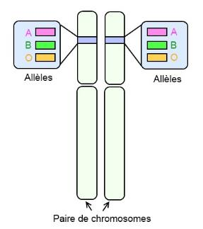

# Activité : Le groupe sanguin

!!! note "Compétences"

    - extraire et mettre en relation des informations  

!!! warning "Consignes"

    1. Représenter la ou les paires de chromosomes 9 pour chaque groupe sanguin.
    2. Indiquer les paires de chromosomes 9 pour le suspect.

    
??? bug "Critères de réussite"

??? bug "Coups de pouce"    

    - Placer le gène ABO
  
    Pour représenter un gène sur chromosome il faut :

    1. identifier la paire de chromosomes portant ce gène (et la légender sur le schéma)
    2. Repérer la localisaiton de ce gène sur les chromosomes
    3. Placer le gène surle chromosome en le représentant par un trait de couleur.

    Attention : un gène est présent en ..... exemplauire sur les chromosomes d'une même paire (=chromosome ....................)

**Document 1 Les différentes versions du gène responsable du groupe sanguin ABO.**

Tous les êtres humains possèdent le même gène codant pour les marqueurs du groupe sanguin ABO, situé sur la paire de chromosome 9.

Il existe 3 versions du gène ABO (appelées allèles) :

- Allèle A : il permet la fabrication de la molécule A 
- Allèle B : il permet la fabrication de la molécule B 
- Allèle O : il ne dirige la fabrication d'aucun marqueur.

Les chromosomes allant par paire, chaque individu possède deux versions de chaque gène : soit elles sont identiques, soit elles sont différentes.

Tous les allèles ne s'expriment pas. Dans le cas des groupes sanguins, l'allèle A et l'allèle B s'expriment toujours. On dit qu'ils sont dominants. L'allèle O ne s'exprime pas toujours. On dit qu'il est récessif.

Si on possède par exemple les allèles A et O, l'allèle A entraine la fabrication de marqueur 1, on est de groupe A (et pas AO). Ainsi, pour être de groupe O, il ne faut fabriquer aucun marqueur. Il faut donc posséder deux fous l'allèle O.

??? note-prof "Correction"

    Consigne 2 :
    La personne étant de groupe sanguin A, elle a forcément au moins un allèle A. Elle ne peut pas avoir d’allèle B, car sinon elle serait AB. Le second allèle peut soit être un deuxième 1 ou bien un allèle O, car O est récessif.
    
    

