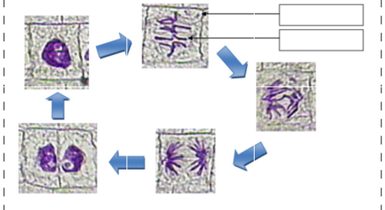

# Activité : 

!!! note "Compétences"

    Interpréter 

!!! warning "Consignes"

    1. Compléter les légende sdu document 2
    2. A l'aide du document 3 , réaliser sur une feuille de papier millimétré le graphique représentant l'évolution de la quanté d'ADN en fonction du temps dans une cellules
    3. Explqiuer en un phrase le processus illustré dans le document 4
    4. Décrire en une phrase ce qui se apsse pour chacune des étapes illustrés dans le doicuyment 2.
    5. Compléter le schéma du document 1 
    6. Rédiger un texte pour répondre à la mère d'Amina
    
??? bug "Critères de réussite"
    - rappeler le nom de la division cellulaire
    - [video mitose](https://www.youtube.com/watch?app=desktop&v=gYAL1vPOCEQ)
    - modéliser  la division cellulaire avec le matériel
        - 2 grands chromsoimes doubles (de la même couleur)
        - 2 petits chromosoomes doubles (de la même couleur)
    - utilise ces chromosomes pour expliquer comment il est possible de passer d'une cellules contenant 4 chromosomes ( 2paires) doubles à deux cellules contenant 4 chromosomes (2 paires) simples

**Document 1 Présentation du cycle cellulaire.**

On eppele cycle celluallire un ensemble de deux phases : la lhase de prepration (interphase) puis la phase de didvision (mitose)

**Document 2 Etapes de la division cellulaire.**

**Document 3 Tableau représentant l'évolution de la quantité d'ADN au cours du temps dans une cellule qui se divise.**

on a museré la masse d'ADN (donc la masse de matériel chjromosomique) contenue dans une cellule au cours du temps. Les résualtats sont donné dans le tableau cid-dessous
.

La cellules réalise une mitose (division cellulaire) entre 10 et 11H
|Temps (h) |0 |1 |2 |3 | 4 |5 |6 |7 |8 |9 |10 | 11|12|13|
|------------------------------------ |---- |---- |----| ----| -----| -----| ---- |----| ----| ----| ---- |----|
|Quantité d'ADN par cellule (en pg) | 6,6 | 6,6 | 6,6 | 6,6 | 8,2 | 

