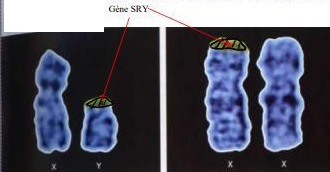
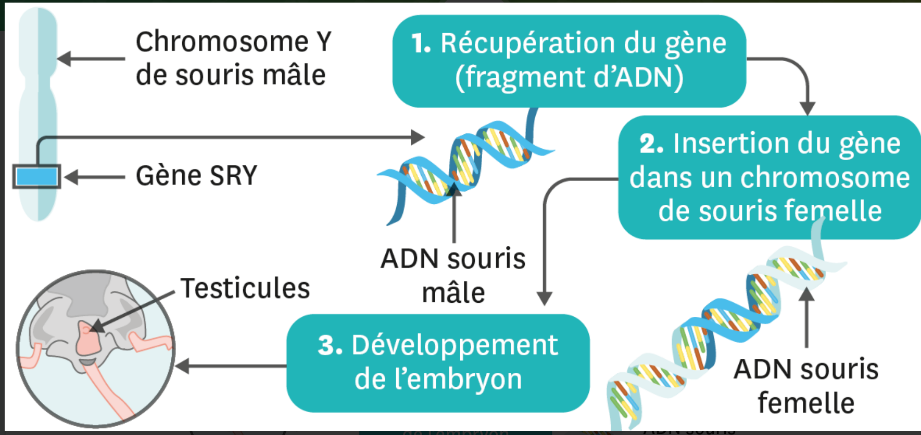
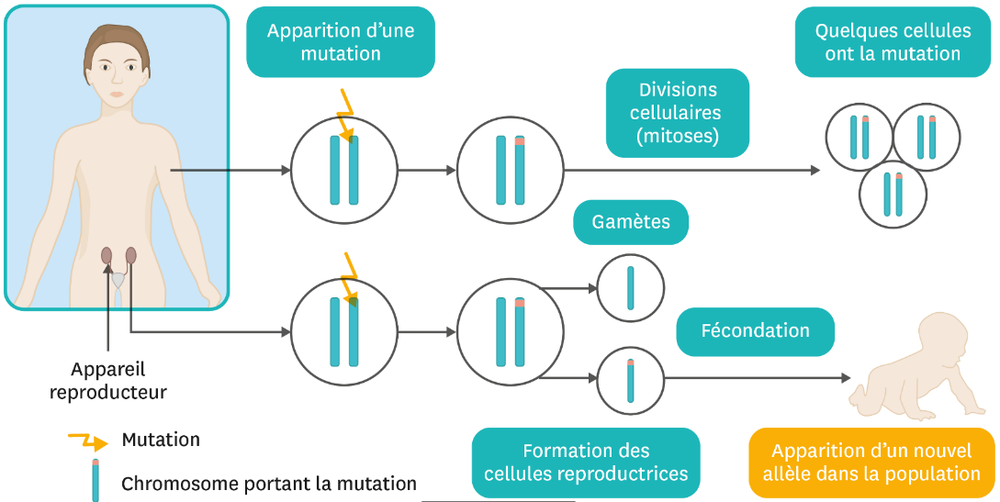

# Activité : Des modifications de l'ADN du coupable

!!! note "Compétences"

    Interpréter 

!!! warning "Consignes"

    1. Indiquer quelle est lma modigfivation de l'information génétique du coupable et en donner les conséquences.
    2. Donner la définition de mutation.
    3. Expliquer es conséuqnces des mutations sur les caractères des individus
    4. En déduire le nom du coupable définitif.
    
??? bug "Critères de réussite"
    - 

**Document 1 Analyse génétique du coupable.**

L'analyse génétique du coupable montre qu'il possède une variation génétique rare (1 naissance sur 20000) appelée " translocation du gène SRY " ou "syndrome du mâle SRY". On appelle cela une mutation.

**Document 2 Test réalisé sur la 23e paire de chromosomes du coupable et d'un homme témoin.**

Dans ce test, on veut repérer un morceau particulier du chromosome Y qui s'appelle le gène SRY. Ce morceau est hachuré sur l'image (SRY = sex-determining region of Y)

23e paire de chromosome d'un homme témoin à gauche et du coupable à droite

**Document 3 Expérience de transgenèse montrant le rôle de SRY**

Les scientifiques ont transféré un gène du chromosome Y sur un chromosome X dans le but de connaitre le rôle du gène SRY. La transgenèse et le fait d'implanter artificiellement un gène, c'est-à-dire un morceau d'ADN porteur d'une information génétique, dans un être vivant, d'une espèce différente ou de la même espèce. L'individu obtenu est appelé Organisme Génétiquement Modifié, ou OGM.

**Document 4 Les mutations et l'apparition de nouveaux caractères.**

Il arrive que l'ADN subisse des modifications naturelles qui affectent certains gènes. Ces modifications se produisent au hasard et sont appelées mutations. De nouveaux allèles sont ainsi créés. Certaines mutations peuvent être à l'origine de caractères héréditaires nouveaux.

Lorsqu'une telle mutation a lieu dans une cellule reproductrice, et que celle-ci réalise la fécondation, le futur individu présentera un caractère nouveau, qu'il transmettra possiblement à son tour aux générations suivantes. 

??? note-prof "correction"

    Consigne 1 : j'observe dans les documents 1 et 2 que le caryotype du coupable possède deux chromosomes X, mais que l'un des chromosome X possède une variation génétique rare appelée " translocation du gène SRY". Le gène SRY n'est normalement pas présent sur les chromosomes X. On le trouve sur le chromsome Y. 
    J'observe dans le document 3 qu'un souriceau femelle possédant un chrolmoisome X possèdant le gène SRY développe des testicules lors de soin développement embryonnaire.
    J'en déduis que le gène SRY intervuient dans la mise en place de certains caractères sexuels primaires masculins.
    J'en conclue que le coupable possède un caryotype féminoin mais avec un chromosome X possédant le gène SRY, donc le coupable possède des caractères masculins.

    Consigne 2 : une mutation est une modification de l'ADN d'une cellule

    Consigne 3 : les mutations peuvent entrainer des modifications durables des caractères héréditaires lorsqu'elles touchent l'ADN des cellules reproductrices.

    Consigne 4 : J'observe que le coupable possède une mutaiton sur le chromosome X. Il a le gène SRY sur ce chromosome entainant la mise en place de castères sexuels primauires mascualin(comme les testicules).
    Je sais que malgré la présence de deux chromosomes X dans son caryotype l'individu est de phénotype masculin. Je saus également qu'il est de groupe sanguin B. 
    J'en déduis que le coupable est Kévin.