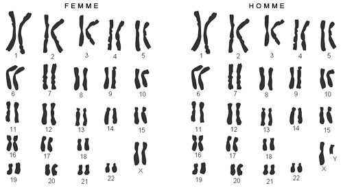
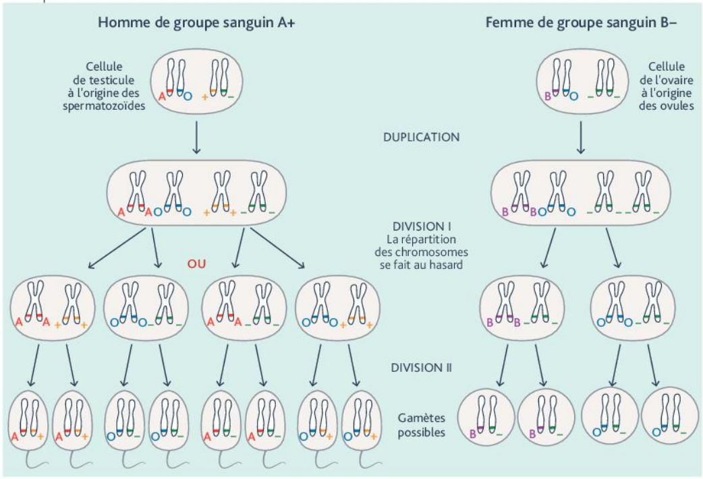
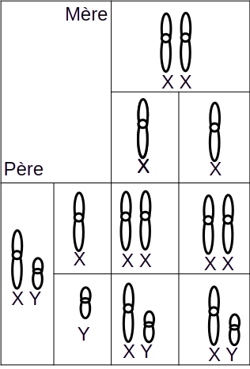
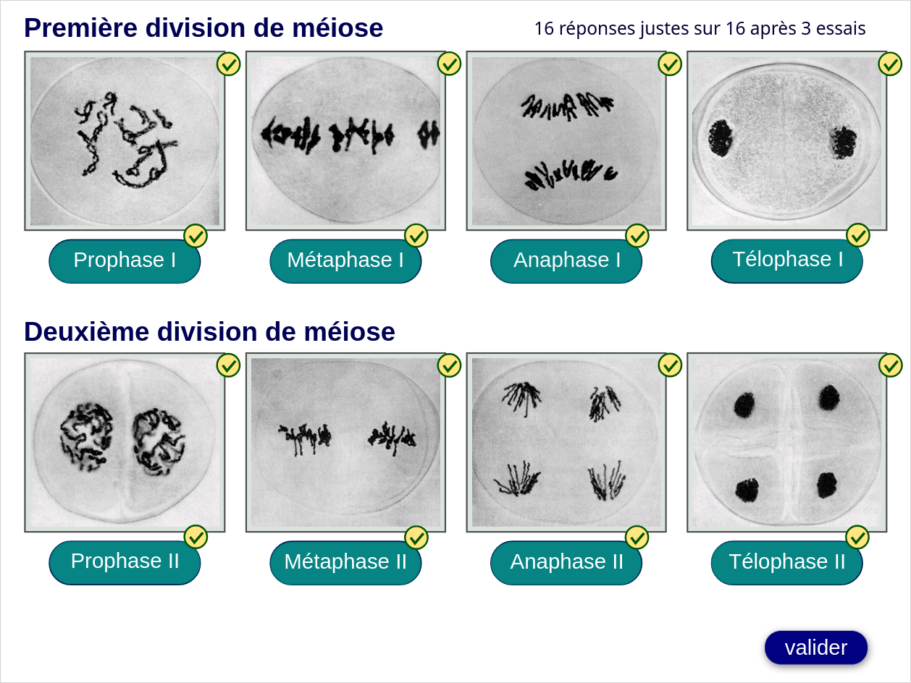

# Activité : Transmission des allèles à la descendance

!!! note "Compétences"

    Argumenter 

!!! warning "Consignes"

    1. Comparer le caryotype des cellules somatiques et des gamètes. 
    2. Indiquer comment s'appelle la formation des cellules reproductrices.
    3. Pour chacun des deux parents d'Amina, compléter le document 6 en répresenter leur chromosomes 9 et leurs chromosomes sexuels.
    4. Faire un tableau de croisement
    5. Répondre à l'avocat
    
??? bug "Critères de réussite"
    
    - Realiser un tableau de croisement, c'est représenter les chromosomes présents dans les gamètes des deux parents et en déduire les combinaisons pouvant se former lors de la fécondation.

    [exercie de croisement 1 ](https://www.viasvt.vivelessvt.com/garcon-fille/fille-garcon.html)
    [Exercice de croisement 2](https://www.viasvt.vivelessvt.com/brassage-fecondation/brassage-fecondation.html)

**Document 1 Caryotypes de gamètes (=cellules reproductrices)**

**Document 2 Caryotypes d'une cellule somatique d'une femme et d'un homme.**

**Document 3 La formation des cellules reproductrices, la méiose**

Lors de la création des gamètes, il existe un phénomène appelé "Méiose" qui permet de passer de 46 chromosomes à 2 chromatides à 23 chromosomes à 1 chromatide.

Pour le représenter, on considère une cellule à 4 chromosomes pour simplifier.

La formation des gamètes permet donc le mélange des informations génétiques. Les chromosomes de chaque paire se répartissent au hasard. Avec 23 paires de chromosomes, il y a plus de 8 millions de gamètes différents pour un individu.

**Document 4 la fécondation et la formation de la cellule-œuf**

Lors de la fécondation un spermatozoïde et un ovule vont fusionner pou former une cellule-œuf. Ces deux gamètes
Chacun des deux gamètes contient 23 chromosomes, un seul de chaque paire. La cellule-œuf va donc avoir un chromosome de chacun des deux parents pour chaque paire.

Avec 8,3 millions de gamètes différents pour un individu, la fécondation peut former 70 mille milliards de cellules-œufs différentes. C'est pour cela qu'un frère et une sœur, bien qu'ayant les mêmes parents, n'ont pas les mêmes caractères. Grâce à ce mélange chaque ovule ou spermatozoïde est unique. 

**Document 5 Réaliser un tableau de croisement**

[Vidéo à regarder](https://www.youtube.com/watch?app=desktop&v=J1hJQd-MD1k&t=1s)

La méiose permet la formation de gamètes (ovules ou spermatozoïdes). La répartition aléatoire des chromosomes permet la fabrication de gamètes différents. Lors de la fécondation les gamètes se rencontrent pour former un nouvel individu.

Pour connaitre les génotypes et le phénotype du nouvel individu formé, il est nécessaire de réaliser un tableau de croisement.

Un tableau de croisement présente les génotype et phénotype possible pour un individu à l'issue d'un croisement

Un génotype s'écrit entre parenthèses : (bleu//marron) La double barre représente les deux chromosomes porteurs du gène.

Un phénotype s'écrit entre crochet [yeux marrons].

Génotype : ensemble de l'information génétique d'un individu.

**Document 6 Génotype et phénotype des parents d'Amina**

| | Groupe sanguin (phénotype) | Allèles (Génotype) | Chromosomes | Gamètes possibles | 
|-|--|--|---|--|
|père| [AB] | (A//B) | |    |
|mère| [A] | (A//O) | |    |

??? note-prof "correction"

    etapes méiose
    