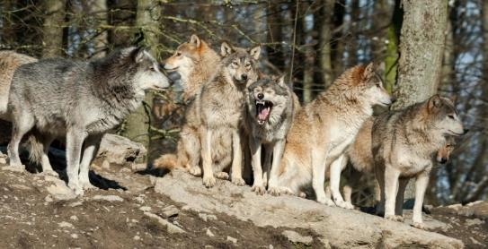
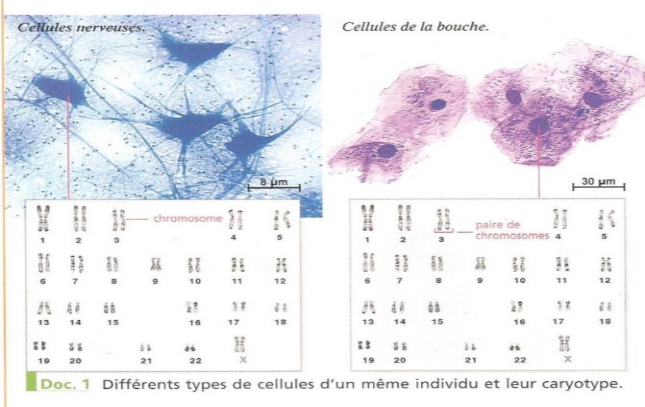

# Séquence : L'information génétique

!!! note-prof
    si besoin d'infos

!!! question Problématique
    Qu'est-ce qui détermine les caractères que l'on possède ?
 
    
### Document d’appel :

## Séance 1 : Le phénotype

!!! question Problématique
    Comment est déterminé le phénotype ? 

[Activité L’origine des caractères](../origineCaract)

??? abstract Bilan

    Les êtres vivants possèdent des caractères spécifiques qui se retrouvent chez tous les individus d’une espèce.
    Les êtres vivants d’une espèce diffèrent entre eux par des variations de caractères. Ces caractères sont des caractères individuels. 
    L’ensemble des caractères d’un individu détermine son phénotype.
    La diversité de ces caractères individuels correspond à la biodiversité génétique.

    Certains caractères sont transmissibles à la descendance, ce sont les caractères héréditaires.
    L’environnement peut modifier certains caractères, ces modifications ne se transmettent pas.
    Le phénotype est donc déterminé par les parents et par l’environnement

    Définitions :

    - Caractère : Trait distinctif à différentes échelles chez un individu, une espèce ou un groupe d’espèces.
    - Phénotype : Ensemble des caractères visibles à différentes échelles d’un individu
    - caractère héréditaire : Caractère présent chez un individu d’une génération et qui provient des individus de la génération précédente.
  
## Séance 2 : La localisation de l'information génétique

!!! question Problématique
    Où est le support de l’information génétique ?

[Activité La localisation de l'information génétique](../localInfoGen)

??? abstract Bilan

    L’information génétique permet la réalisation des phénotypes héréditaires.
    L’information génétique se trouve dans le noyau des cellules

## Séance 3 : Le support de l'information génétique

!!! question Problématique
    Quel est le support de l’information génétique ?

[Activité Les chromosomes et l'ADN](../chromosomesEtADN)

[Activité L'ADN](../adn)

??? abstract Bilan

    Chaque chromosome est constitué d’une molécule filamenteuse nommée ADN (Acide Désoxyribonucléique). 
    Elle peut changer d’état de condensation : 

    - En dehors de la division cellulaire, l’ADN est décondensé (=déroulé), les chromosomes ne sont pas visibles. 
    - Lors de la division cellulaire, l’ADN se condense (s’enroule), les chromosomes deviennent visibles.

    C’est l’ADN et donc les chromosomes qui sont à l’origine des caractères héréditaires. Ce sont le support de l’information génétique.
    On retrouve des chromosomes et donc de l’ADN chez tous les êtres vivants. L’ADN est un caractère partagé par tous les êtres vivants, c’est donc un indice de la parenté des êtres vivants.

## Séance 4 : Les chromosomes

!!! question Problématique
    Comment l’étude des chromosomes permet-elle de déterminer certains caractères ?

[Activité Les chromosomes](../chromosomes)

??? abstract Bilan

    Les chromosomes du noyau d’une cellule peuvent être étudiés en réalisant un caryotype (=ensemble des chromosomes d’une cellule en division rangés par paires et classés par taille décroissante).
    
    Le nombre de chromosomes est variable en fonction de l’espèce. Toutes les cellules d’un individu ont les mêmes chromosomes. 
    Toutes les cellules humaines contiennent les mêmes 46 chromosomes soit 23 paires.

    Une paire de chromosomes détermine le sexe de l’individu, ce sont les chromosomes sexuels. (Homme XY et Femme XX) 
    Les autres sont appelés des chromosomes homologues.
    
    Un nombre anormal de chromosomes peut empêcher le développement de l’embryon ou entraine des caractères différents chez l’individu (trisomie 21). 