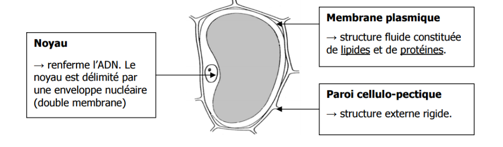
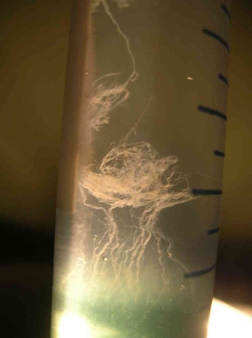
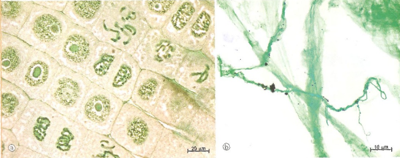

# Activité : L’ADN et les chromosomes

!!! note "Compétences"

    - Mettre en œuvre un protocole d’expérience et 
    - Extraire et mettre en relation des informations

!!! warning "Consignes"

    1. Après avoir remis le protocole dans l’ordre, le réaliser et décrire le résultat obtenu.
    2. À partir des documents, donner des arguments qui permettent de penser que la méduse contient de l’ADN et des arguments montrant que ce n’est pas une unique molécule.
    
??? bug "Critères de réussite"
    - 

**Document 1 Schéma d’une cellule végétale.**

**Document 2 Étape nécessaire pour l’extraction.**

1. Destruction mécanique des cellules (éclatement du tissu végétal et des cellules)
2. Destruction chimique des membranes biologiques
3. Séparation des parties solubles (ADN …) et des parties insolubles (membranes et paroi)
4. Précipitation de l’ADN extrait (apparition sous une forme non soluble)
5. Coloration pour mettre en évidence l’ADN

**Document 3 Protocole détaillé de l’extraction de la molécule d’ADN à remettre dans l’ordre**
    
- Étape A : en l’enroulant autour de l’agitateur, récupérer délicatement la méduse d’ADN et la placer dans le verre de montre. Prélever du vert de méthyle avec la pipette dans le flacon correspondant ; rajouter quelques gouttes de vert de méthyle, colorant spécifique de l’ADN, sur la « méduse ». Au bout d’une minute, ajouter de l’eau dans le verre de montre pour enlever le colorant et observer. 
- Étape B : Dans le tube à essai, ajouter à ce volume de filtrat deux volumes d’alcool froid. Attention, cette opération est délicate : il faut faire couler lentement l’éthanol le long de la paroi du tube. Au bout de quelques dizaines de secondes, une pelote blanche nacrée apparait dans l’éthanol ; les biochimistes l’appellent la « méduse ». C’est l’ADN qui précipite dans l’alcool.
- Étape C : Broyer le végétal pour casser les parois et séparer les cellules dans le mortier avec de l’eau distillée. Ajouter la valeur d’une petite cuillère de gros sel de cuisine et broyer avec le pilon jusqu’à obtenir un mélange homogène. Le sel facilite le broyage et augmente la dissolution de l’ADN. 
- Étape D : Placer la compresse de gaze dans l’entonnoir ; verser le broyat pâteux obtenu et filtrer de façon à recueillir 1 à 2 ml de liquide (appelé filtrat) dans le tube à essai. Si nécessaire : refermer les compresses et presser doucement afin de faciliter la filtration. 
- Étape E : Ajouter quelques gouttes de liquide vaisselle et bien mélanger (toujours avec le pilon). Le liquide vaisselle contient des substances qui détruisent les membranes des structures cellulaires. 

**Document 4 Le résultat du protocole. (Source : http://wiki.scienceamusante.net/)**

La méduse d'ADN obtenue n'est bien sûr pas qu'une seule molécule d'ADN, mais un grand nombre de molécules d'ADN, car au départ, on utilise un grand nombre de cellules. De plus, comme il y a plusieurs paires de chromosomes dans le noyau de chaque cellule, il y aura donc plusieurs molécules d'ADN par noyau. D'autre part, des bactéries peuvent aussi être présentes et elles ont aussi leur molécule d’ADN.

**Document 5 Observation de chromosomes (a) et de la méduse extraite(b), colorée au vert de méthyle.**

**Document 6 Des échelles de tailles.**

À l’œil nu, nous pouvons observer des objets d’une taille minimum de 200 µm (= 0,2 mm). Grâce au microscope optique, on peut observer des objets d’une taille minimum de 200 nm (0,2 µm = 0,0002 mm).
Le diamètre de l’ADN est de 2 nm (=0,002 µm = 0,000002 mm)
Pour une cellule humaine, la longueur de l’ADN d’une cellule est d’environ 1m, soit autant que l’ADN d’une cellule de souris, le double de l’ADN du peuplier, mais la moitié de celui du maïs.

??? note-prof "Correction :"

    Consigne 2 : La méduse que l’on voit est composée de très nombreux morceaux d’ADN, car lors du broyat toutes les molécules d’ADN de toutes les cellules broyées ont été mélangées. De plus, ce ne peut pas être une molécule d’ADN, car la méduse est visible à l’œil ; or la molécule d’ADN a un diamètre de 2nm ce qui est beaucoup trop petit pour être vu à l’œil nu.
