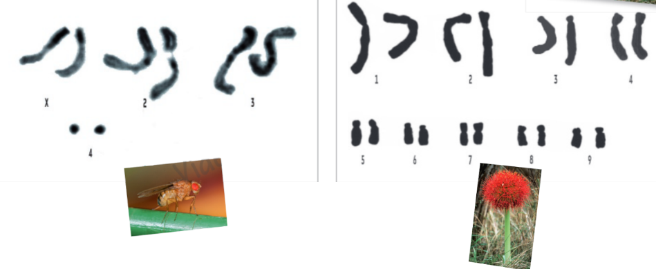

# Activité : Les chromosomes

!!! note "Compétences"

    Trouver et utiliser des informations 

!!! warning "Consignes"

    À partir des documents, déterminer, en justifiant votre réponse, les caractères que l’étude des chromosomes permet de déterminer.
    
??? bug "Critères de réussite"
    - Comparer les caryotypes deux à deux, d’où vient chacun.
    - Que donne la différence donc quel indice donne le caryotype ?

**Document 1 : La réalisation d’un caryotype.**

Un caryotype correspond à l’ensemble des chromosomes présents dans le noyau d’une cellule d’un individu.

**Document 2 Le caryotype d’une espèce animale (Drosophila melanogaster) et d’une espèce végétale (Haemanthus multiflorus).**

Toutes les cellules d’un individu, qu’il soit animal ou végétal, possède le même caryotype.

**Document 3 Caryotypes classés d’un homme et d’une femme sains.**

 

**Document 4 Caryotype classé d’un homme atteint du syndrome de Down.**

Le syndrome de Down, aussi appelé trisomie 21, représente 1 cas pour 700 naissances. Les individus atteints par cette anomalie possèdent des caractéristiques physiques particulières (cou et membres courts, visage rond, yeux bridés, malformation cardiaque, etc.) et un déficit intellectuel plus ou moins important selon les individus.

La plupart du temps, des anomalies du nombre de chromosomes provoquant un arrêt du développement embryonnaire, car les caractères n’arrivent pas à se mettre en place pour constituer un individu fonctionnel.

??? note-prof "Correction"

    le nombre de chromosomes donne un indice sur l’espèce que l’on étudie, en effet le nombre de chromosomes dépend de l’espèce, l’espèce humaine a 46 chromosomes.
    De plus, l’étude des chromosomes permet de connaitre le sexe des individus. Dans l’espèce humaine, les femmes ont deux chromosomes X, alors que les hommes ont un chromosome X et un chromosome Y.
    Enfin, l’étude des chromosomes permet de mettre en évidence des malformations ou des maladies, si le nombre de chromosomes n’est pas de 46 chez l’espèce humaine, alors des malformations peuvent survenir.