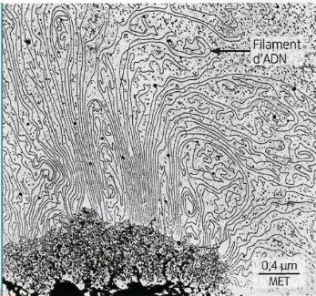
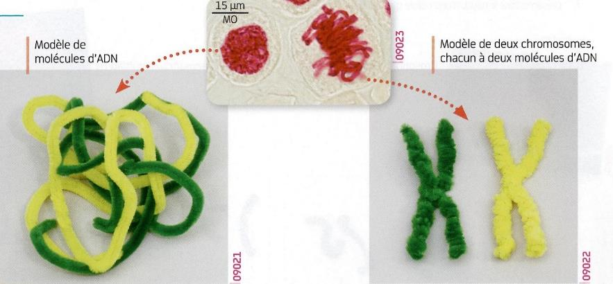
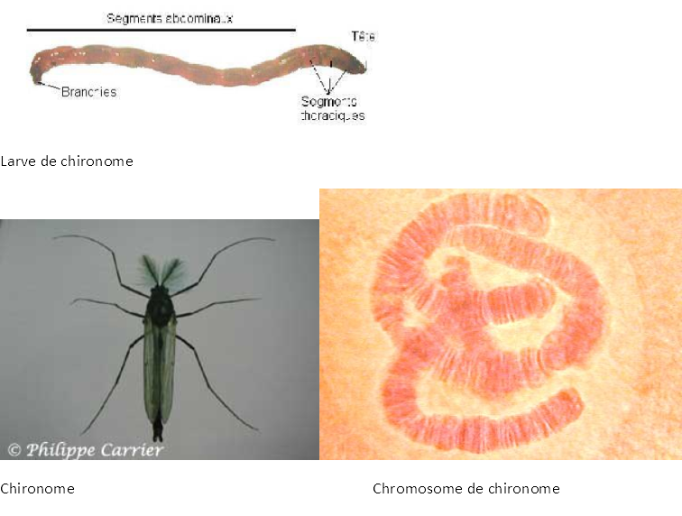

# Activité :  Les chromosomes et l'ADN 2

!!! note "Compétences"

    - Utiliser un microscope
    - Faire un dessin d’observation
    - Extraire et mettre en relations des informations 

!!! warning "Consignes"

    1. Observer au microscope une lame de chromosomes de chironomes et faire le dessin d’observation.
    2. Expliquer le lien entre la molécule d’ADN et les chromosomes.
    
??? bug "Critères de réussite"
    - 

**Document 1 La molécule d’ADN (acide désoxyribonucléique).**

Une technique particulière permet de décondenser (=dérouler) un long filament d’ADN, ce filament est le constituant d’un chromosome. 
Le diamètre du filament d’ADN 2 nm. (nanomètre ou milliardième de mètre).

**Document 2 Relation entre chromosomes et molécules d’ADN.**

Une molécule d’ADN se présente sous la forme d’un long filament capable de s’enrouler sur lui-même.

À gauche, on voit de l'ADN décondensé et à droite de l'ADN condensé.

??? note-prof
    Consigne 2 : La molécule d’ADN est un long filament qui peut soit être déroulé et remplir le noyau, soit être condensé et former des chromosomes.