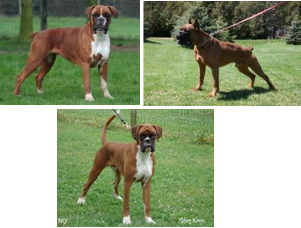

# Activité : L’origine des caractères.

!!! note "Compétences"

    Construire un tableau 

!!! warning "Consignes"

    Retrouve et classe dans un tableau, l’origine des caractères présentés, comme la couleur de la peau, le groupe sanguin, l’aspect des arbres, la présence de la queue chez les chiens, la quantité d’hémoglobine et la capacité à rouler sa langue en U.
    
??? bug "Critères de réussite"
    - 

**Document 1 : une famille**

Un couple et leur enfant. Les parents ont un groupe sanguin A. C’est aussi celui de leur fille.

**Document 2 : Quantité d’hémoglobine pour un individu après un séjour de 4 semaines à différentes altitudes**

| Altitude (en m) | Durée du séjour (en semaine) | Quantité d’hémoglobine (en g/100 ml de sang)|
|--|--|--|
| 0| 4 | 15| 
| 3500 | 4 | 17,5 | 
| 5500 | 4| 20| 

**Document 3 : Le bronzage**

**Document 4  le port des arbres.**

Deux hêtres : le premier est présent dans un milieu avec des vents forts. Le second dans un milieu peu venté. Si l’on récupère des graines des arbres et que l’on sème dans un milieu peu venté alors les arbres obtenus auront des branches droites.

**Document 5 Arbre généalogique de la famille d’Arthur**

**Document 6  Les boxers**

Les deux parents du jeune boxer ont tous les deux eu leur queue coupée lors de leur croissance.

??? note-prof "Correction"

    <table>
    <thead>
    <tr>
        <th> 			Caractères 		</th>
        <th> 			Origine 		</th>
    </tr>
    </thead>
    <tbody>
    <tr>
        <td> 			Couleur 			de peau 		</td>
        <td> 			Environnement ; 			parents 		</td>
    </tr>
    <tr>
        <td> 			Groupe 			sanguin 		</td>
        <td> 			Parents 		</td>
    </tr>
    <tr>
        <td> 			Aspect 			des arbres 		</td>
        <td> 			Environnement 		</td>
    </tr>
    <tr>
        <td> 			Possibilité 			de rouler sa langue en U 		</td>
        <td> 			Parents 		</td>
    </tr>
    <tr>
        <td> 			Présence 			d’une queue chez les chiens 		</td>
        <td> 			Environnement 		</td>
    </tr>
    <tr>
        <td> 			Quantité 			d’hémoglobine 		</td>
        <td> 			Environnement 		</td>
    </tr>
    </tbody>
    </table>
