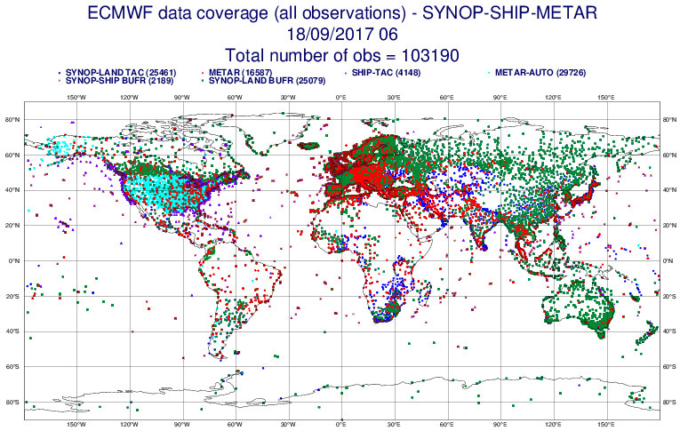
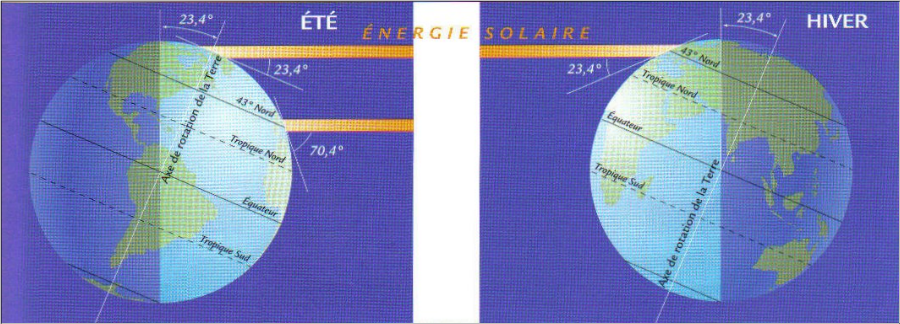

# Séquence : Les phénomènes météorologiques et climatiques

!!! note-prof
    si besoin d'infos

!!! question "Problématique"

    Comment expliquer les phénomènes météorologiques ?

    
### Document d’appel :

## Séance 1 : Différence entre météo et climat

!!! question "Problématique"
    Quelle est la différence entre météorologie et climat ?

[Activité Différence entre météo et climat](../diffmeteoclimat)

??? abstract "Bilan"
    La météo décrit les températures qu’il fait à un instant donné et prévoit les températures qu’il fera dans les prochains jours.  
    Et le climat décrit la moyenne des températures mesurées pendant 30 ans.  

    Définitions :  

    En météorologie :

    - On décrit les paramètres météo (températures, précipitations, vents…) qu’il fait à un instant donné.
  
    - Et l’on prévoit comment les paramètres météo évolueront dans les prochains jours.
  
    En climatologie :  

    - On définit les climats avec la moyenne des paramètres météo mesurés sur des périodes de 30 ans.
  
    - On décrit l’évolution des climats dans le passé.
  
    - Et l’on prévoit l’évolution des climats dans le futur.

[Activité Une vague de froid](../exodiffmeteoclimat)

## Séance 2 : Les stations météos

Pour étudier le climat actuel, il faut étudier la météo

!!! question "Problématique"
    Comment étudier la météo ?

[Activité Utiliser une station météo](../stationMeteo)

??? abstract "Bilan"
    Pour décrire le temps qu’il fait à un instant donné, on peut utiliser des stations météorologiques. Ces instruments mesurent des paramètres météorologiques indispensables pour décrire le temps (température, pression, précipitation, direction, vitesse du vent…).

    Pour prévoir le temps qu’il fera dans les prochains jours, les météorologues utilisent des modèles de prévision numérique du temps. Ce sont des logiciels complexes qui simulent comment le temps va évoluer, à partir des données enregistrées.

    
    

## Séance 3 : Différents climats sur notre planète

!!! question "Problématique"
    Comment expliquer les différents climats de la Terre ?

[Activité La répartition des climats](../repartClimats)

??? abstract "Bilan"
    La Terre est une sphère. Les rayons solaires n’arrivent donc pas avec le même angle partout. À l’équateur, l’angle entre les rayons solaires et le sol est perpendiculaire et donc les rayons se concentrent sur une petite surface, il y a plus d’énergie, il fait donc plus chaud. Tandis qu’aux pôles, l’angle entre les rayons solaires et le sol est plus faible, donc les rayons s’étalent sur une grande surface, il y a moins d’énergie, il fait donc plus froid. L’énergie solaire est inégalement répartie à la surface du globe ce qui explique les différents climats.

??? note
    Un petit mot sur les saisons Différence d’énergie reçue au sol en France (43 ° N), en été et en hiver. Notez l’angle d’incidence en fonction de la saison.
    

