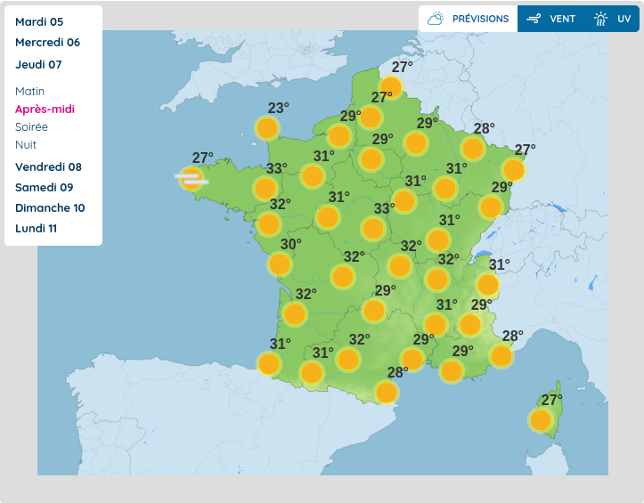

# Activité : Différence entre météo et climat

!!! note "Compétences"
    Trouver et exploiter des informations
 

!!! warning "Consignes"
     En utilisant les documents ci-dessous, expliquer la différence entre « météo » et « climat ».
    
??? bug "Critères de réussite"
    - comparer les deux documents climat et trouver un point commun et une différence
    - comparer les deux documents météo et trouver un point commun et une différence
    - comparer les documents climat et météo et trouver une différence

 

 

**Document 1 Carte du climat en France présentant les températures moyennes sur une période de 30 ans (moyenne des températures annuelles mesurées entre 1985 et 2014).**

{: style="width:300px";}

 

**Document 2 Carte du climat en France présentant les prévisions de températures moyennes sur une période de 30 ans (moyenne des températures annuelles prévues entre 2035 et 2065).**  
{: style="width:300px";}

 

**Document 3 Carte météo présentant le relevé de températures du mercredi 20 septembre 2017 à 18 h Températures mesurées par les stations météorologiques ©Infoclimat**  

{: style="width:300px";}

 

**Document 4 Carte météo présentant les prévisions de températures pour le jeudi 07 septembre 2023 (après-midi) © Météo-France**

{: style="width:300px";}

!!! note-prof "Correction"
    Le document 1 concerne le climat, il représente les moyennes des températures mesurées pendant 30 ans.
    Le document 1 concerne le climat, il représente les prévisions des températures moyennes prévues pour les années 2035 à 2065.
    Le document 3 concerne la météo, il représente les températures mesurées à 11 h le jeudi 15 septembre 2016.
    Le document 4 concerne la météo, il représente les températures prévues pour jeudi après-midi prochain.
    les documents 1et 2 sur le climat présente la moyenne des températures sur une période de 30 ans en France. L'un des documents présente le climat passé, l'autre le climat futur.

    les documents 3 et 4 sur la météo présente les températures sur une journée en France. L'un des documents présente la météo dans une journée passée, l'autre la météo prévue dans une journée future.

    Le climat est sur une longue période alors que la météo est sur une courte période