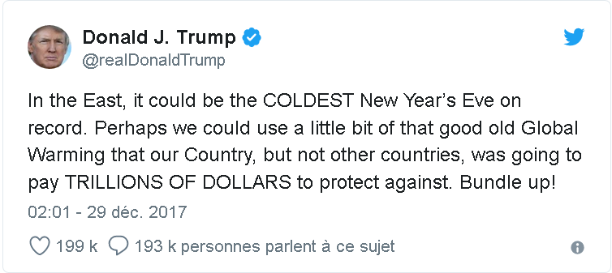

# Activité : Une vague de froid.

!!! note "Compétences"

    - Argumenter 

!!! warning "Consignes"

    À partir de vos connaissances, vous argumenterez pour expliquer l’erreur commise par l'ancien président des États-Unis d’Amérique.
    
??? bug "Critères de réussite"
    - avoir identifié les durées des phénomènes dont parle le tweet
    - avoir utilisé les définitions de météo et climat

**Document 1 Un tweet de Donald J. Trump.**

 

{: style="width:3000px";} 

Traduction :  
« Dans l’est, nous pourrions vivre le réveillon du Nouvel An le plus froid jamais enregistré. Peut-être que nous pourrions utiliser un peu de ce bon vieux Réchauffement Climatique contre lequel notre Pays, mais aucun autre pays ne voulait se prémunir à coups de TRILLIONS DE DOLLARS. Couvrez-vous bien ! »

**Document 2 Température à New-York (source : le parisien**
Météo Contact explique que ce phénomène de grand froid est dû « à une dorsale anticyclonique qui s'est installée du Pacifique à l'ouest du Canada, permettant à de l'air très froid de plonger sur l'Amérique du Nord. »

Celui-ci devrait encore perdurer quelques jours. Le service national de météorologie a ainsi averti d'un « risque de froid excessif » jusqu'au réveillon. Selon France Info, jusqu'à -40 degrés sont attendus à Québec (Canada) et dans le nord des États-Unis.

!!! note-prof "Correction"
    Correction La personne qui parle a tort. Elle utilise la température d’une journée pour nous parler du réchauffement du climat. Or pour parler de climats, on ne peut pas utiliser la température d’une journée, il faut utiliser la moyenne des températures mesurées pendant 30 ans. Donc, on ne peut pas réfuter le réchauffement climatique avec la météo d’une courte période. Si les scientifiques parlent de réchauffement climatique, c’est qu’ils ont utilisé les données durant 30 ans.
    Dans le tweet, Donald Trump parle de vague de froid. Une vague de froid dure peu de temps donc il s'agit de météorologie.

    Le réchauffement climatique est un événement climatique donc il se passe une longue durée.

    Donald Trump a tort car le réchauffement climatique est une moyenne sur 30 ans.

!!! note-prof "grille"
    Restituer des connaissances
    Niveau I : Maitrise insuffisante :rien
    Niveau F : Maitrise fragile : L’erreur du texte est relevée.
    Niveau S : Maitrise satisfaisante : L’erreur est relevée et expliqué à l’aide des éléments de cours.
    Niveau TB : Très bonne maitrise : L’erreur est relevée et expliquée à l’aide des éléments de cours. Autonomie

