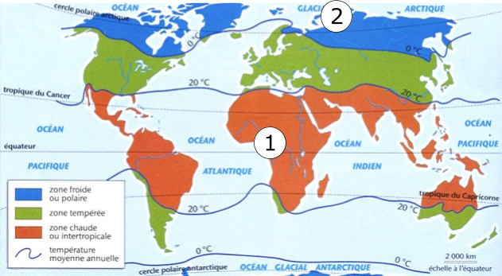

# Activité : Répartition des climats

!!! note "Compétences"

    - Trouver et exploiter des informations
    - Manipuler, expérimenter

!!! warning "Consignes"

    Consigne : À partir de la manipulation et des documents, proposer une explication à la répartition des climats sur Terre.

    
??? bug "Critères de réussite"
    - Compléter le document 3 et document 4
    - Comparer la température au pôle et à l'équateur
    - Faire le lien entre surface éclairée et intensité lumineuse
    - faire le lien entre intensité lumineuse et température.
    - Lier les différents éléments de réponse.

**Document 1 : carte de la répartition des climats**

1 et 2 : emplacement des deux zones étudiées.  
Le climat froid ou polaire correspond à des températures moyennes annuelles inférieures à 0 °C.  
Le climat tempéré correspond à des températures moyennes annuelles comprises entre 0 et 20 °C.  
Le climat chaud ou intertropical correspond à des températures moyennes annuelles supérieures à 20 °C.

**Document 2 : Modélisation de la répartition de l'énergie solaire sur Terre**
L'énergie solaire est une source d'énergie importantes. Plus les rayons solaires sont concentrés plus il fera chaud.

Matériel :
- lampe;
- ballon;
- carton percé;
- feuille petit carreaux.

1. Placer la lampe sur le plateau élévateur et un ballon à un vingtaine de cm ;  
2. Placer le carton percé entre la lampe et le ballon de façon avoir une tache lumineuse nette sur le ballon ;   
3. Régler la hauteur de la lampe afin de placer la tache lumineuse dans la zone 1 (voir doc. 1);
4. Placer une feuille sur la zone éclairée et tracer le contour de la tâche lumineuse
5. Compter le nombre approximatif de petits carreaux à l’intérieur de la tache ;  
6.  Compléter le tableau (voir doc. 4) à l’aide des observations ;  
7.  Répéter les opérations 5 à 10 pour la zone 2 (voir doc. 1).

**Document 3 : du modèle à la réalité (à compléter)**
<table>
<thead>
  <tr>
    <th class="entete_gras">Eléments du modèle</th>
    <th class="entete_gras">Dans la réalité</th>
  </tr>
</thead>
<tbody>
  <tr>
    <td>Projecteur</td>
    <td></td>
  </tr>
  <tr>
    <td>Ballon</td>
    <td></td>
  </tr>
  <tr>
    <td>Diapositive percée</td>
    <td>Ne correspond à rien dans la réalité. Cependant le trou permet de laisser passer toujours la même quantité d’énergie. </td>
  </tr>
  <tr>
    <td>Plateau élévateur</td>
    <td>Ne correspond à rien dans la réalité.Cependant le fait de déplacer la tache lumineuse de haut en bas sur le globe terrestre, permet d’observer la façon dont l’énergie solaire se répartit en fonction de la latitude.</td>
  </tr>
</tbody>
</table>

**Document 4 : tableau des observations (à compléter)**

<table >
<thead>
  <tr>
    <th> 	 		</th>
    <th>Zone 1 		</th>
    <th>Zone 2 		</th>
  </tr>
</thead>
<tbody>
  <tr>
    <td>Quantité d’énergie reçue par la zone 		</td>
    <td colspan="2"> La quantité d’énergie reçue par les deux zones est la même 			car le trou percé dans la diapositive permet de laisser passer 			toujours la même quantité d’énergie. 		</td>
  </tr>
  <tr>
    <td>Surface de la tache lumineuse (indiquez le nombre approximatif de petits carreaux)</td>
    <td></td>
    <td></td>
  </tr>
  <tr>
    <td>Intensité de la tache lumineuse (indiquez si la tache est très lumineuse ou peu lumineuse)</td>
    <td></td>
    <td></td>
  </tr>
</tbody>
</table>

!!! note-prof "Grille"
    Extraire et mettre en relation des informations pour répondre à un problème

    - Niveau I : Maîtrise insuffisante
    - Niveau F : Maîtrise fragile : Comparaison de la température aux pôles et l’équateur
    - Niveau S : Maîtrise satisfaisante : Comparaison de la température aux pôles et l’équateur.
    Lien entre la surface éclairée, l’intensité lumineuse et la température aux deux endroits
    - Niveau TB : Très bonne maîtrise : Comparaison de la température aux pôles et l’équateur.
    Lien entre la surface éclairée, l’intensité lumineuse et la température aux deux endroits.
    Autonomie

