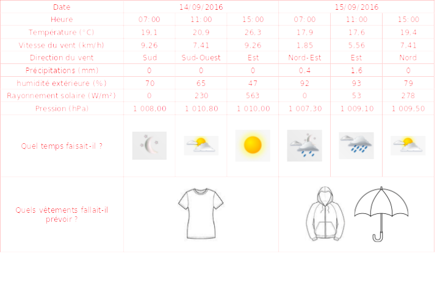

# Activité : Utiliser une station météo

!!! note "Compétences"

    - Faire des recherches 
    - Trouver et utiliser des informations

!!! warning "Consignes"

    1. Indiquer pour chaque capteur de la station météo son utilité.  
    2. À partir des données de la station météorologique, compléter la dernière ligne pour indiquer le temps qu’il faisait à Paris le 14 et le 15 septembre 2016.
    
??? bug "Critères de réussite"
    - Avoir identifié les paramètres permettant de savoir la quantité de nuages et la quantité de pluie.

**Document 1 Photo d'une station météo.**

{: style="width:3000px";} 

**Document 2 Mesure d’une station météo installée à Paris (5e arrondissement) (www.meteoalecole.org).**

<table>
<thead>
  <tr>
    <th>Date</th>
    <th colspan="3">14/09/2016</th>
    <th colspan="3">15/09/2016</th>
  </tr>
</thead>
<tbody>
  <tr>
    <td> 			Heure 		</td>
    <td> 			7 h 		</td>
    <td> 			11 h 		</td>
    <td> 			15 h 		</td>
    <td> 			7 h 		</td>
    <td> 			11 h 		</td>
    <td> 			15 h 		</td>
  </tr>
  <tr>
    <td> 			Température (°C) 		</td>
    <td> 			19,1 		</td>
    <td> 			20,9 		</td>
    <td> 			26,3 		</td>
    <td> 			17,9 		</td>
    <td> 			17,6 		</td>
    <td> 			19,4 		</td>
  </tr>
  <tr>
    <td> 			Vitesse du vent (km/h) 		</td>
    <td> 			9,26 		</td>
    <td> 			7,41 		</td>
    <td> 			9,26 		</td>
    <td> 			1,85 		</td>
    <td> 			5,56 		</td>
    <td> 			7,41 		</td>
  </tr>
  <tr>
    <td> 			Direction du vent 		</td>
    <td> 			Sud 		</td>
    <td> 			Sud-Ouest 		</td>
    <td> 			Est 		</td>
    <td> 			Nord-Est 		</td>
    <td> 			Est 		</td>
    <td> 			Nord 		</td>
  </tr>
  <tr>
    <td> 			Précipitation (mm) 		</td>
    <td> 			0 		</td>
    <td> 			0 		</td>
    <td> 			0 		</td>
    <td> 			0,4 		</td>
    <td> 			1,6 		</td>
    <td> 			0 		</td>
  </tr>
  <tr>
    <td> 			Humidité extérieure (%) 		</td>
    <td> 			70 		</td>
    <td> 			65 		</td>
    <td> 			47 		</td>
    <td> 			92 		</td>
    <td> 			93 		</td>
    <td> 			79 		</td>
  </tr>
  <tr>
    <td> 			Rayonnement solaire (W/m²) 		</td>
    <td> 			0 		</td>
    <td> 			230 		</td>
    <td> 			563 		</td>
    <td> 			0 		</td>
    <td> 			53 		</td>
    <td> 			278 		</td>
  </tr>
  <tr>
    <td> 			Pression (hPa) 		</td>
    <td> 			1008,00 		</td>
    <td> 			1010,80 		</td>
    <td> 			1010,00 		</td>
    <td> 			1007,30 		</td>
    <td> 			1009,10 		</td>
    <td> 			1009,50 		</td>
  </tr>
  <tr>
    <td> 			Quel temps faisait-il ?  (Ensoleillé, Nuageux ou pluvieux) 		</td>
    <td> 	</td>
    <td> 		</td>
    <td> 				</td>
    <td> 					</td>
    <td> 		 		</td>
    <td> 		 		</td>
  </tr>
</tbody>
</table>

!!! note-prof "correction"
    
