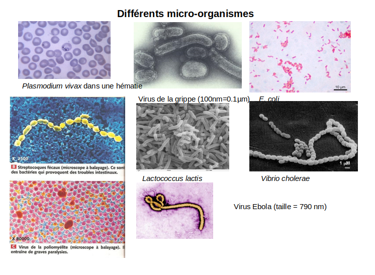
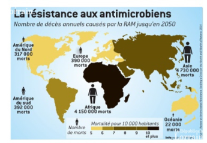
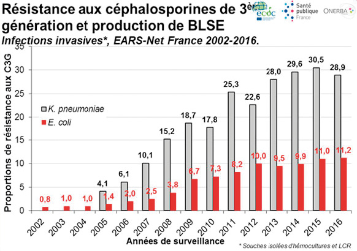
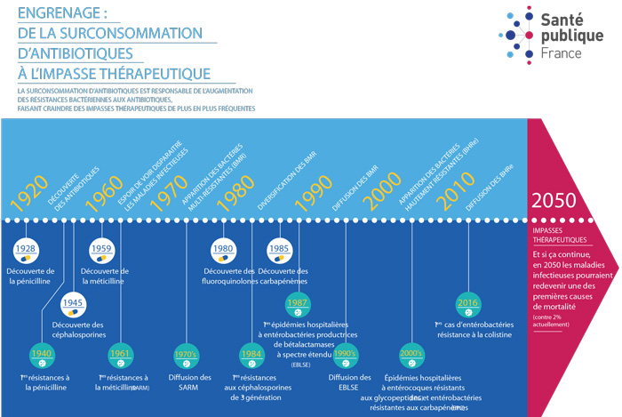

# Séquence : Le monde microbien

!!! note-prof
    si besoin d'infos

### Document d’appel :

Le téléphone portable, plus sale que la cuvette des w.c.
Le combiné contiendrait cinq cents fois plus de bactéries qu’un siège de toilette. Et vous, lavez-vous votre téléphone portable ?
Par Laura Thouny, L’express, publié le 16/07/2010 

!!! question Problématique
    Quel est l'impact des micro-organismes sur notre vie ?
    

## Séance 1 : Les micro-organismes

!!! question Problématique
    Que sont les micro-organismes ?

[Activité Les micro-organismes](../microbes)

??? note 
    
    

??? abstract Bilan
    === "De quoi parler dans le bilan ? Quels mots clés ?"

    === Bilan à trous

        Les micro-organismes sont des êtres vivants microscopiques. Les micro-organismes sont présents dans tous les milieux de l’environnement. 

        Il y a trois grands groupes de micro-organismes :
        
        - ........................;
        - ........................;
        - .........................

        Il existe beaucoup de micro-organismes différents. Certains sont utiles pour l’être humain, d’autres sont pathogènes (= responsable de maladies). 

    === Bilan

        Les micro-organismes sont des êtres vivants microscopiques. Les micro-organismes sont présents dans tous les milieux de l’environnement. 

        Il y a trois grands groupes de micro-organismes :
        - champignons ;
        - bactéries ;
        - virus.

        Il existe beaucoup de micro-organismes différents. Certains sont utiles pour l’être humain, d’autres sont pathogènes (= responsable de maladies). 

## Séance 2 Le microbiote.

!!! question Problématique
    Quel est l’impact du microbiote sur notre santé ?

[Activité Le rôle du microbiote](../microbiote)

??? abstract Bilan
    === "De quoi parler dans le bilan ? Quels mots clés ?"

    === Bilan à trous
        La plupart des micro-organismes hébergés par l’être humain ne sont pas dangereux et contribuent à nous maintenir en bonne santé. L’ensemble de ces bactéries forme le ..................
        On retrouve des micro-organismes dans différents organes : tube digestif, peau, vagin…

        Ce microbiote nous aide à ....................., à nous ..................... des micro-organismes pathogènes.
        Un déséquilibre de notre microbiote peut entraîner des .................

        Certaines bactéries du microbiote pourraient influencer notre comportement, notre mode d’alimentation.

    === Bilan

        La plupart des micro-organismes hébergés par l’être humain ne sont pas dangereux et contribuent à nous maintenir en bonne santé. L’ensemble de ces bactéries forme le microbiote.
        On retrouve des micro-organismes dans différents organes : tube digestif, peau, vagin…

        Ce microbiote nous aide à digérer, à nous défendre contre des micro-organismes pathogènes.
        Un déséquilibre de notre microbiote peut entraîner des maladies.

        Certaines bactéries du microbiote pourraient influencer notre comportement, notre mode d’alimentation.

## Séance 3 : Limiter les risques de contamination

!!! question Problématique
    Comment limiter les risques de contamination ?

[Activité Les risques de contamination](../asepsieAntisepsie)

??? abstract Bilan
    === "De quoi parler dans le bilan ? Quels mots clés ?"

    === Bilan à trous

        La transmission des micro-organismes peut se faire d’un individu à l’autre (toux, rapports sexuels…) ou par l’intermédiaire de l’eau, des aliments ou de contacts avec des objets contaminés.

        La ...................... et les ........................ sont des barrières empêchant la contamination, c’est-à-dire .......... des micro-organismes dans le corps.

        Pour empêcher la contamination, deux méthodes sont possibles :
        
        - L’.......................... qui est l’ensemble des mesures prises pour éliminer les micro-organismes sur un objet, cela empêche la transmission.
        - L’.......................... qui est l’ensemble des mesures prises pour éliminer les micro-organismes présents au niveau de la peau ou des muqueuses, cela empêche la contamination.

        Définition : muqueuses : ce sont des tissus recouvrant les parties ................... du corps en contact avec ..................

    === Bilan

        La transmission des micro-organismes peut se faire d’un individu à l’autre (toux, rapports sexuels…) ou par l’intermédiaire de l’eau, des aliments ou de contacts avec des objets contaminés.

        La peau et les muqueuses sont des barrières empêchant la contamination, c’est-à-dire l’entrée des micro-organismes dans le corps.

        Pour empêcher la contamination, deux méthodes sont possibles :
        
        - L’asepsie qui est l’ensemble des mesures prises pour éliminer les micro-organismes sur un objet, cela empêche la transmission.
        - L’antisepsie qui est l’ensemble des mesures prises pour éliminer les micro-organismes présents au niveau de la peau ou des muqueuses, cela empêche la contamination.

        Définition : muqueuses : ce sont des tissus recouvrant les parties intérieures du corps en contact avec l’extérieur.

## Séance 4 : Les antibiotiques

!!! question Problématique
    Comment les antibiotiques aident-ils à lutter contre certaines maladies ? 

[Activité Les antibiotiques](../antibio)

[Activité Combattre une infection : une angine](../tpAngine)

??? abstract Bilan
    === "De quoi parler dans le bilan ? Quels mots clés ?"

    === Bilan à trous

        Les antibiotiques sont des substances qui permettent ........................ Ils sont donc un moyen efficace de lutter contre .......................
        Les antibiotiques n’ont aucun effet sur les .........................
        
        Une mauvaise utilisation des antibiotiques peut entraîner une résistance des ................... aux antibiotiques, ceux-ci peuvent donc devenir moins efficaces. De plus ces antibiotiques peuvent ................. le microbiote intestinal de l’être humain.

    === Bilan à trous
        Les antibiotiques sont des substances qui permettent l’élimination des bactéries. Ils sont donc un moyen efficace de lutter contre l’infection.
        Les antibiotiques n’ont aucun effet sur les virus.
        
        Une mauvaise utilisation des antibiotiques peut entraîner une résistance des bactéries aux antibiotiques, ceux-ci peuvent donc devenir moins efficaces. De plus ces antibiotiques peuvent tuer le microbiote intestinal de l’être humain.

??? abstract "Infos Supplémentaires"

    
    
    