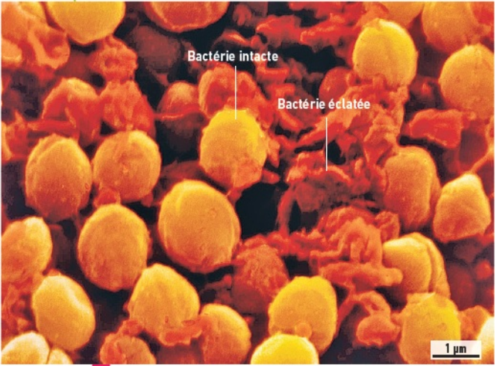
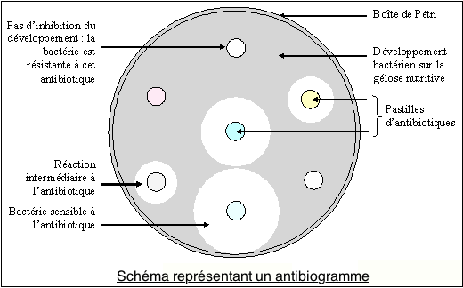
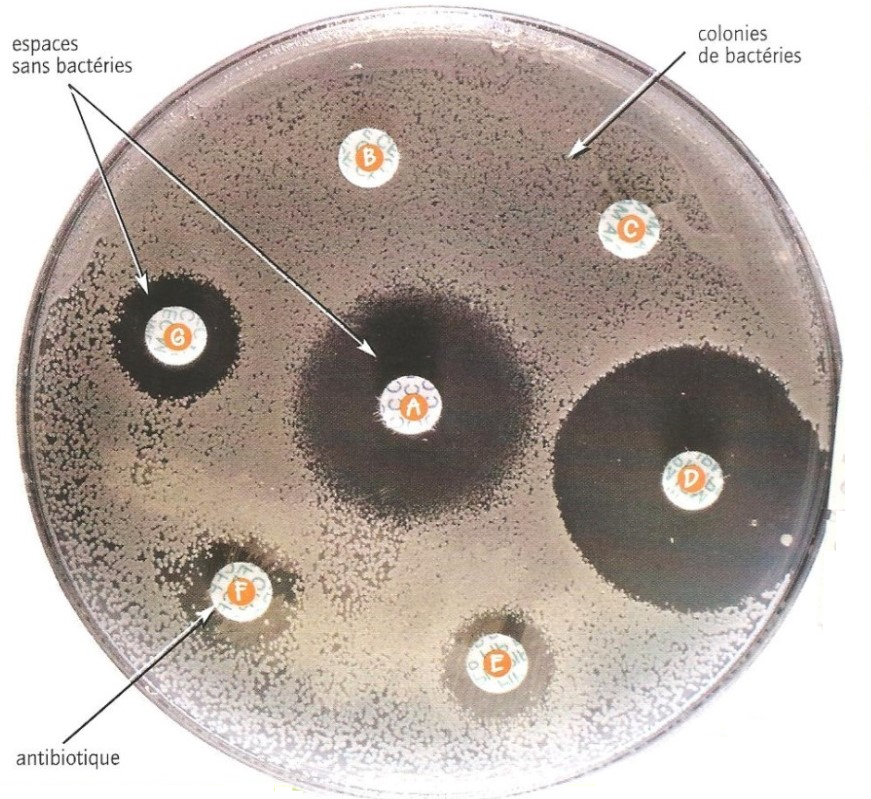

# Activité : Les antibiotiques

!!! note "Compétences"

    - Trouver et utiliser des informations 
    - Argumenter
 

!!! warning "Consignes"

    1. À l’aide du document 1 et 2, expliquer le rôle des antibiotiques.
    2. À l’aide des documents 3, 4 et 5, expliquer les deux phrases des campagnes de sensibilisation à l’usage des antibiotiques.
    3. À l’aide des documents 6 et 7, indiquer en justifiant, quel antibiotique il faut prescrire dans le cas du patient de document 3.
    
??? bug "Critères de réussite"
    - 

**Document 1 : Une découverte historique.**

En 1928, le médecin anglais Alexander Fleming cultive pour les étudier des bactéries pathogènes. Un jour, il constate que des cultures ont été contaminées par un champignon microscopique (*Penicillium notatum*) et que des bactéries à proximité du champignon ont disparu. Avant de jeter ces cultures devenues inutilisables, il les observe et il émet l’hypothèse que le Penicillium produit une substance qui empêche le développement de la bactérie. Cette hypothèse se vérifiera. C’est la découverte du premier antibiotique : la pénicilline.

**Document 2 : Effet de pénicilline sur les staphylocoques (bactéries)**

Les antibiotiques vont tuer les bactéries

{: style="height:300px;"}

**Document 3 : La résistance aux antibiotiques**

Dans une population de bactéries, en présence d’antibiotique, seules les bactéries ayant un mécanisme de résistance se reproduisent. Les autres meurent (bactéries sensibles). Ce faisant, la totalité de la population bactérienne devient résistante. En Europe, on estime que 25 000 décès par an sont liés à des infections dues à des résistances bactériennes et que 1,5 milliards d’euros sont dépensés à cause d’infections par des bactéries multirésistantes.

Par ailleurs, un antibiotique peut tuer des bactéries constituant le microbiote digestif qui nous protège de certaines contaminations et qui participe à une bonne digestion.

**Document 4 : Entretien avec Nadia Baron, médecin généraliste**

Entant que médecin, quel message souhaitez-vous faire passer ?

Les antibiotiques sont efficaces contre les bactéries, mais pas contre les virus. Le problème aujourd’hui, c’est le développement des résistances bactériennes. Il y a 15 ans, pour guérir une otite, on prescrivait une dose d’antibiotiques de 60 à 70 mg/kg/jour, aujourd’hui la dose est de 90. les bactéries résistantes nous obligent à augmenter des doses, on se rapproche des limites où apparaissent des effets secondaires. A plus long terme, c’est la menace de pandémies.

**Document 5 : Deux campagnes de sensibilisation à l’usage des antibiotiques.**

**Document 6 : Un antibiogramme.**

Un antibiogramme consiste à mettre en contact plusieurs antibiotiques avec des colonies de bactéries. Il permet de mesurer la capacité d’un antibiotique à empêcher la croissance bactérienne.
Tous les antibiotiques ne sont pas efficaces contre toutes les bactéries. L’antibiogramme permet de déterminer l’antibiotique le plus efficace en cas d’infection bactérienne.
L’efficacité de l’antibiotique est révélée par la réaction de la population bactérienne à son contact :

- si la population ne se développe pas autour de la pastille d’antibiotique, cela signifie que l’antibiotique est efficace ;
- si la population se développe autour de la pastille d’antibiotique, cela signifie que l’antibiotique est inefficace.

**Document 7 : Un antibiogramme d’un patient.**

Un antibiogramme est fait pour connaître l’antibiotique à utiliser dans le cas d’un patient souffrant d’une infection bactérienne.

{: style="height:300px;"}

??? note-prof "correction"

    Consigne 1 : À l’aide du document 1 et 2, expliquer le rôle des antibiotiques.

    Dans le document 1, on apprend que le champignon Penicillium notatum produit un antibiotique qui empêche le développement des bactéries.
    Dans le document 2, on voit l’effet de l’antibiotique sur les bactéries, il provoque l’éclatement de celle-ci.
    Donc les antibiotiques empêchent le développement des bactéries en les tuant.

    Consigne 2 : À l’aide des documents 3, 4 et 5, expliquer les deux phrases des campagnes de sensibilisation à l’usage des antibiotiques.

    La première phrase est « les antibiotiques c’est pas automatique ». Dans le document 4, on apprend que les antibiotiques n’ont aucun effet sur les virus. La phrase de la campagne de sensibilisation indique donc que ce n’est pas parce qu’on est malade qu’il faut forcément prendre des antibiotiques. Si on est malade à cause d’un virus, la prise d’antibiotiques ne servira à rien. De plus dans le document 3, on apprend que les antibiotiques peuvent détruire le microbiote intestinal ce qui peut poser des problèmes de digestion ou de santé.
    La seconde phrase indique « Les antibiotiques utilisés à tort, ils deviendront moins forts ». Dans le document 4 et 5, on apprend que les bactéries peuvent devenir résistantes aux antibiotiques, les antibiotiques deviennent moins efficaces et les bactéries deviennent donc plus difficiles à tuer. Cela entraîne des milliers de morts et des coûts supplémentaires dans les soins.

    Consigne 3 : À l’aide des documents 6 et 7, indiquer en justifiant, quel antibiotique il faut prescrire dans le cas du patient de document 3.
    
    Sur l‘antibiogramme du patient on voit que c’est autour de la pastille D qu’il y a le moins de bactéries, c’est donc cet antibiotique qui est le plus efficace.