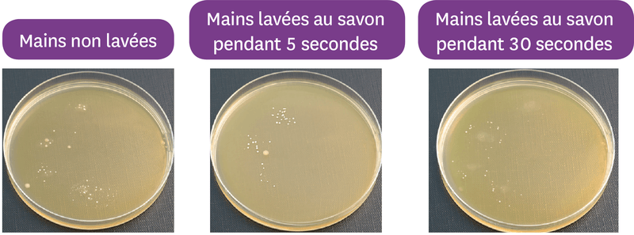
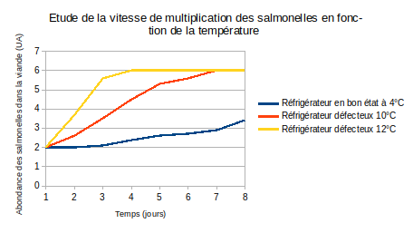
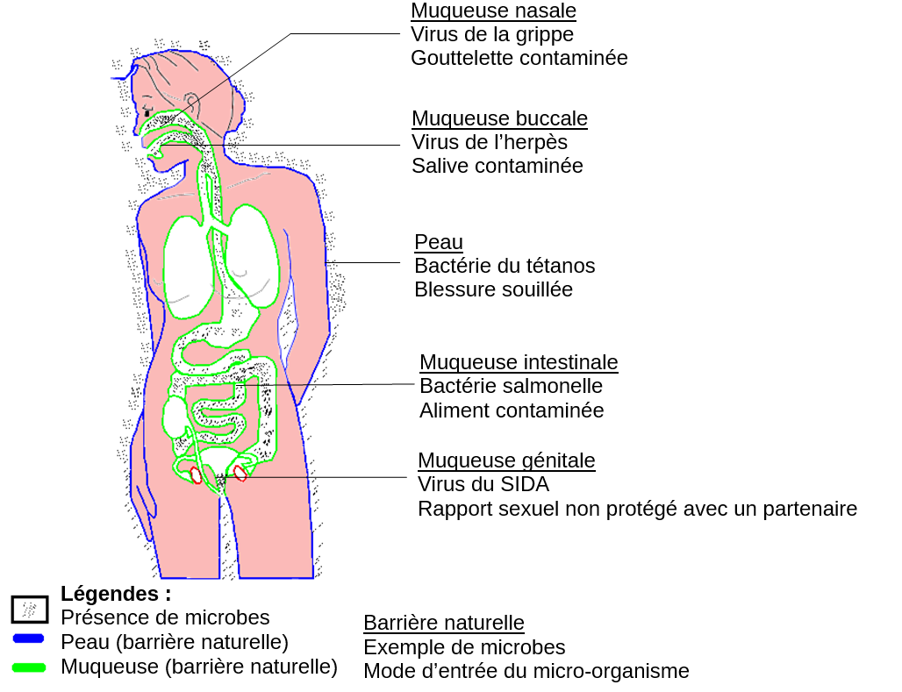

# Activité : Les risques de contamination

!!! note "Compétences"

    Trouver et utiliser des informations 

!!! warning "Consignes"

    À partir des documents, expliquer comment notre corps permet une protection contre la contamination et comment l’on peut limiter le risque par nos actions.
    
??? bug "Critères de réussite"
    - 

**Document 1 La peau et les muqueuses, des barrières naturelles**

Nous vivons au contact de microbes dont certains sont pathogènes. Notre corps est recouvert par la peau à l’extérieur et par les muqueuses sur les parties intérieures qui sont en contact avec l’extérieur (voies digestives, respiratoires, urinaires et génitales). Ces deux barrières constituent un premier rempart s’opposant à la contamination, c’est-à-dire l’entrée des microbes dans l’organisme.
En effet, l’épiderme et les muqueuses sont recouverts de substances chimiques qui peuvent détruire les microbes. Toutefois, ces derniers peuvent franchir cette barrière au niveau de la moindre égratignure, la désinfection, avec un produit antiseptique, d’une plaie permet de réduire le risque de contamination.

**Document 2 Effet du lavage des mains sur les micro-organismes cutanés**

On met une main sur un milieu de culture de bactéries. Après quelques jours de culture, on observe des points blancs, ce sont des colonies de bactéries.

    
**Document 3 Les salmonelles**

Les salmonelles sont naturellement présentes dans l’intestin humain. Suite à un mauvais lavage des mains, elles peuvent souiller les aliments. La consommation d’aliments contenant au moins 100 000 de ces bactéries peut provoquer, la salmonellose, caractérisée par des vomissements et des diarrhées.
Les salmonelles comme beaucoup de bactéries se développent rapidement à 37 °C, mais sont détruites lorsque la température atteint 65 °C.

    
**Document 4 Schéma des barrières naturelles de l’organisme humain**

{: style="height:600px;"}

??? note-prof "correction"

    Dans le document 1, on apprend que la peau et les muqueuses sont des barrières naturelles qui empêchent l’entrée des micro-organismes.
    Pour empêcher l’entrée des micro-organismes :
    Comme on le voit dans le doc 1, on peut utiliser des produits antiseptiques sur les plaies.
    Dans le document 2, on apprend que le lavage des mains réduit le nombre de microbes donc se laver les mains empêche la contamination.
    Nos aliments peuvent contenir des bactéries et dans ce cas favoriser la contamination (doc 4). Pour éviter cela, on doit faire chauffer les aliments correctement (doc 3) et les stocker dans un réfrigérateur à 4 °C, car s’il est mal réglé alors le nombre de bactéries augmente plus vite comme on le voit dans le graphique du doc 3,
    De plus, le document 4 indique que le port du préservatif, lors de relations sexuelles, empêche la contamination par certains microbes.

