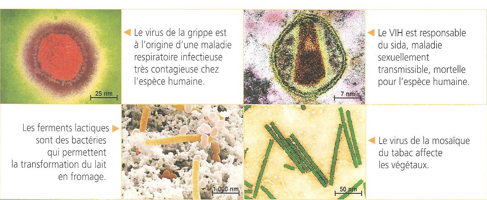
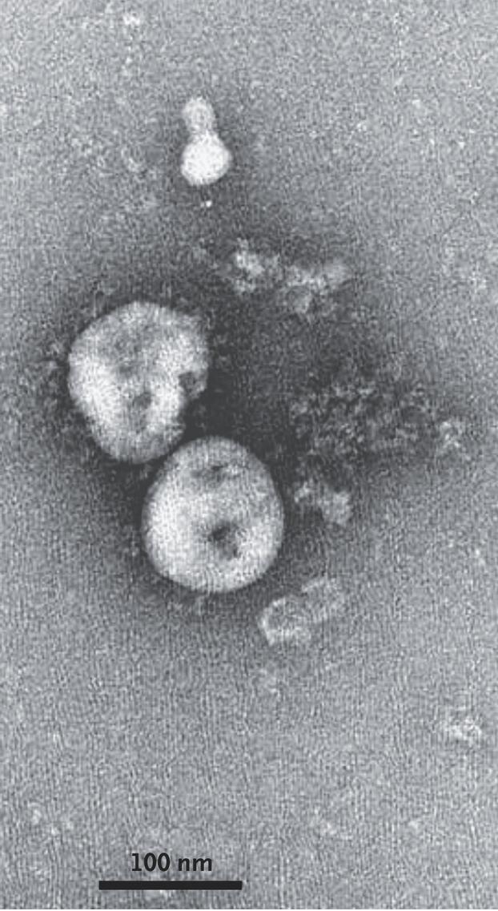
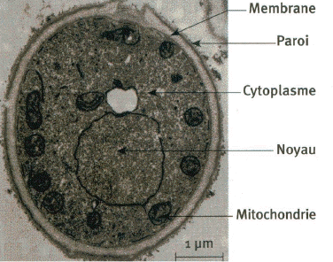

# Activité : Les micro-organismes 

!!! note Compétences

    - Construire un tableau 
    - utiliser l'outil mathématique

!!! warning Consignes

    1. Construire un tableau présentant les différents micro-organismes, en indiquant leur hôte ou milieu de vie, leur taille, leur action et leur type (virus, champignons ou bactéries)
    
??? bug Critères de réussite
    - 

**Document 1 Quelques exemples illustrant la diversité des micro-organismes.**

{: style="height:400px;"}

**Document 2 Virus du SARS-CoV2.**

Le virus SARS-CoV-2, responsable chez l'Homme de la maladie COVID-19, est issu de l'évolution de virus initialement présents chez d’autres espèces animales. Ce virus fait environ 140nm.

Les signes cliniques de la COVID-19 sont :

- la fièvre (sauf chez l'enfant) chez 77 % à 98 % des patients, qui peut parfois apparaître après la toux ;
- la toux, le plus souvent sèche, chez 57 % à 82 % des patients ;
- une anosmie (perte totale de l'odorat) chez 70 % à 86 % des patients (d'autres études ont obtenu des taux différents) ;
- une agueusie (perte du goût) chez 54 % à 88 % des patients (d'autres études ont obtenu des taux différents) ;
- la dyspnée (gêne respiratoire) chez 18 % à 57 % des patients ;

{: style="height:400px;"}

**Document 3 Levures**

Les levures, comme *Saccharomyces cerevisiae*, sont des champignons unicellulaires. Elles sont d'une taille de 5µm environ. Ces levures sont beaucoup utilisées dans l’agroalimentaire et sont par exemple utile dans la fabrication du pain, des alcools. À l’état naturel, elles se trouvent principalement sur les fruits et les écorces.

{: style="height:300px;"}

??? note-prof "Correction"
    <table>
    <thead>
    <tr>
        <th> 			Nom 		</th>
        <th> 			Milieu de vie / Hôte 		</th>
        <th> 			Taille   &nbsp;&nbsp; </th>
        <th> 			Action 		</th>
        <th> 			Type  (Virus / Bactéries)   &nbsp;&nbsp; </th>
    </tr>
    </thead>
    <tbody>
    <tr>
        <td> 			Virus de la grippe 		</td>
        <td> 			Être humain 		</td>
        <td> 			75 nm 		</td>
        <td> 			Cause une maladie respiratoire, la grippe 		</td>
        <td> 			virus 		</td>
    </tr>
    <tr>
        <td> 			VIH 		</td>
        <td> 			Être humain 		</td>
        <td> 			23 nm 		</td>
        <td> 			Cause le SIDA 		</td>
        <td> 			virus 		</td>
    </tr>
    <tr>
        <td> 			Ferments lactiques 		</td>
        <td> 			Lait 		</td>
        <td> 			2545 nm 		</td>
        <td> 			Transforment le lait en fromage 		</td>
        <td> 			Bactéries 		</td>
    </tr>
    <tr>
        <td> 			Virus de la mosaïque du tabac 		</td>
        <td> 			Plantes 		</td>
        <td> 			114 nm 		</td>
        <td> 			Causent des maladies aux végétaux 		</td>
        <td> 			Virus 		</td>
    </tr>
    <tr>
        <td> 			SARS-CoV2 		</td>
        <td> 			Être humain 		</td>
        <td> 			140 nm 		</td>
        <td> 			Cause la COVID 19 		</td>
        <td> 			Virus 		</td>
    </tr>
    <tr>
        <td> 			Levures 		</td>
        <td> 			fruits/écorces 		</td>
        <td> 			5 µm 		</td>
        <td> 			Permettent la fabrication du pain 		</td>
        <td> 			Champignons 		</td>
    </tr>
    </tbody>
    </table>

    Pour calculer la taille d’un micro-organisme
    il faut faire un calcul de proportionnalité
    Exemple pour le VIH

    <table>
    <thead>
    <tr>
        <th> 			 &nbsp;&nbsp;			 		</th>
        <th> 			Micro-organisme 		</th>
        <th> 			Échelle 		</th>
        <th></th>
        <th></th>
    </tr>
    </thead>
    <tbody>
    <tr>
        <td> 			Taille sur la photo (attention sur votre feuille vous n’aurez 			pas forcément mesuré la même taille, ce n’est pas grave)  			 Les deux valeurs de cette ligne doivent être de la même unité 		</td>
        <td> 			3,6cm 		</td>
        <td> 			1,1 cm 		</td>
        <td></td>
        <td></td>
    </tr>
    <tr>
        <td> 			Taille réelle 		</td>
        <td> 			  ? 		</td>
        <td> 			7nm 		</td>
        <td></td>
        <td></td>
    </tr>
    </tbody>
    </table>

    3,6 * 7 / 11 = 23
     la taille du VIH est donc de 23nm