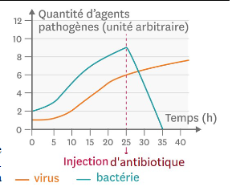
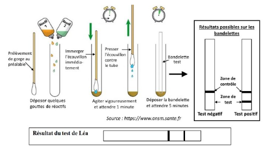
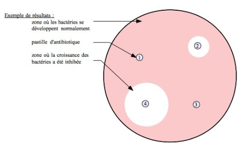
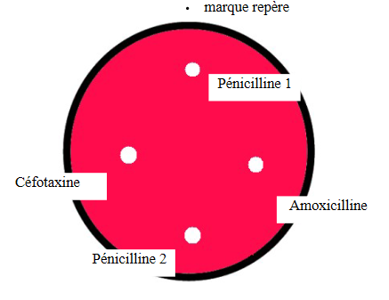

# Activité : Combattre une infection : une angine

!!! note "Compétences"

    Interpréter 

!!! warning "Consignes"

    1. analyser le document 1 et justifier le choix du médecin de ne pas prescrire d’antibiotique automatiquement. (1 point)
    2. à l’aide du document 2, déterminer l’origine de l’angine de Léa en justifiant.(1 point)
    3. réaliser l’antibiogramme (1,5 points) et rédiger l’ordonnance qui conviendra à Léa en incluant la description et les explications de l’antibiogramme. (1,5 points)
    
??? bug "Critères de réussite"
    - 

Léa est une élève de 3ᵉ. Depuis quelques jours, elle a très mal à la gorge et a du mal à avaler. Sa mère décide de consulter un médecin pour obtenir des antibiotiques. Après inspection du fond de sa gorge, le médecin hésite entre une angine rouge d’origine virale ou une angine blanche bactérienne due au streptocoque A. Si une angine bactérienne n’est pas soignée, elle peut être à l’origine de maladies graves comme le rhumatisme articulaire aigu. Il lui indique qu’il doit effectuer des examens complémentaires, car les antibiotiques ne sont pas donnés automatiquement.

**Problèmes à résoudre : De quel type d’angine Léa est-elle atteinte ? Quel médicament sera efficace ?**

**Document 1 graphique montrant l’évolution du nombre de bactéries et virus avant et après l’administration d’un antibiotique.**

Agent pathogène = micro-organisme provoquant une maladie.

{: style="height:400px;"}

**Document 2 principe du test de dépistage du streptocoque A et résultat pour Léa.**

Un test de diagnostic rapide de l'angine permet de déterminer si l’origine de l’angine est virale ou bactérienne. Il est indolore et ne prend que quelques minutes. Pour réaliser ce test, le médecin fait un prélèvement au niveau de la gorge de Léa avec un écouvillon (sorte de grand coton-tige).L’écouvillon est placé dans un tube qui contient quelques gouttes de réactif (=substance mettant en évidence la présence d’un élément chimique). Une bandelette de papier sensible à ce réactif est ensuite placée dans ce tube. L’apparition de traits sur la bandelette permet de déterminer l’origine d’une angine.

- Si le test est positif, il s’agira bien d’une angine bactérienne.
- Si le test est négatif, l’angine sera d’origine virale. Le médecin pourra alors prescrire du paracétamol contre la fièvre et la douleur et un anti-inflammatoire local.

**Document 3 protocole et principe d’un antibiogramme.**

<u> Principe d’un antibiogramme : </u> 

Un antibiogramme est une technique de laboratoire visant à tester la sensibilité d’une espèce de bactéries vis-à-vis de plusieurs antibiotiques. En effet, un antibiotique efficace sur une espèce de bactérie ne le sera pas forcément sur une autre espèce.

Le principe consiste à placer la culture de bactéries sur une gélose en présence de pastilles imbibées d’antibiotiques dans une boite de Pétri.
Ici, les bactéries ne sont pas sensibles aux antibiotiques 1 et 3, pas d’auréole d’inhibition autour de la pastille. Mais elles sont un peu sensibles à l’antibiotique 2 (petite auréole) et très sensibles à l’antibiotique 4 (large auréole). Inhiber = empêcher/ freiner.

<u> Matériel : </u> 

- 1 boite de Pétri contenant de la gélose rouge orangé correspondant à la présence de nombreuses bactéries ;
- un marqueur ;
- 4 tubes à essai contenant des antibiotiques :
    - Pé 1= Pénicilline de génération 1
    - Pé 2 = Pénicilline de génération 2
    - Am = Amoxicilline
    - Cé = Céfotaxine
- 1 pince fine ;
- des pastilles de papier-filtre ;
- 1 boite témoin pour toute la salle, au bureau sans bactéries.

<u> Réalisation :</u> 

Mettre une marque sur le couvercle et le socle de la boite pour pouvoir se repérer.
À l’aide des pinces, imbiber une pastille en la trempant dans un tube d’antibiotique.
Puis la disposer en vous aidant du gabarit (ci-contre).

??? note-prof "correction"
    protocole 

    1.      -"bactérie" : rouge de crésol (10 mL)
            -"antibiotiques" :
            Pastille 1 : HCl 1 mol/L positif
            Pastille 2 : HCl 3 mol/L positif
                Pastille 3 : NaOH 1 mol/L
    2. -"bactérie" : rouge neutre (5 mL à 10g/L)

        -"antibiotiques" :
        Pastille 1 : HCl 1 mol/L
        Pastille 2 : HCl 3 mol/L
        Pastille 3 : NaOH 1 mol/L positif
        
    3. -"bactérie" : permanganate de potassium (0,0125 mol/L)

        -"antibiotiques" : sels de Mohr en concentration décroissante au 1/2 à chaque fois, la plus concentrée (pastille 0) étant à 0.5 mol/L
    
    Corrigé : combattre une infection : une angine

    Consigne 1: Sur le graphique du document 1, on observe qu’en absence d’antibiotique, les quantités de virus et de bactéries augmentent, de 1 à 6 ua pour les virus et de 2 à 9 ua pour les bactéries en 25 heures. Après l’injection d’antibiotique, la quantité de bactéries diminue (de 9 à 0 u. a. en 10 h) alors que la quantité de virus continue d’augmenter. On en conclut que les antibiotiques ne sont efficaces que sur les bactéries et pas sur les virus. Il ne sert donc à rien de prescrire des antibiotiques en cas d’angine virale.

    Consigne 2 : On observe que le test de Laura (document 2) est positif (présence de deux bandes sur la bandelette test). Son angine est donc due à des bactéries, des streptocoques A. 

    Consigne 3:L’antibiogramme montre que l’auréole décolorée autour de la pastille contenant l’antibiotique « Pénicilline 2 » est plus grande que celle autour de l’Amoxicilline. Autour des pastilles de Pénicilline 1 et de Céfotaxine, il n’y a pas d’auréole. Par conséquent, seuls les antibiotiques Amoxicilline et Pénicilline 2 empêchent le développement des bactéries streptocoques A et Pénicilline 2 est plus efficace. Je lui prescris donc de la Pénicilline 2 pour soigner son angine. Dr ....

??? note-prof "grille"

    <table>
    <thead>
    <tr>
        <th colspan="4"> 			Compétences 			évaluées 		</th>
        <th> 			MAÎTRISE 			INSUFFISANTE 		</th>
    </tr>
    </thead>
    <tbody>
    <tr>
        <td rowspan="2"> 			Mettre 			en œuvre un protocole expérimental 		</td>
        <td> 			Résultats 			exploitables de l’antibiogramme et consignes suivies. Matériel 			rangé. Travail en autonomie. 		</td>
        <td> 			Résultats 			exploitables. Aide pour suivre les consignes et/ou ranger le 			matériel. 		</td>
        <td> 			Résultats 			non exploitables malgré le suivi des consignes. Matériel rangé. 		</td>
        <td> 			Résultats 			non exploitables. Consignes non suivies. 		</td>
    </tr>
    <tr>
        <td> 			3 		</td>
        <td> 			2 		</td>
        <td> 			1 		</td>
        <td> 			0 		</td>
    </tr>
    <tr>
        <td rowspan="2"> 			Rechercher, 			extraire et organiser l’information utile 		</td>
        <td> 			Doc.1 : 			origine de l’angine identifiée et expliquée.  			 Doc.2 : 			description du graphique et rôle des antibiotiques identifié. 		</td>
        <td> 			Besoin 			d’aide orale du professeur pour comprendre les documents. 		</td>
        <td> 			Document 			1 ou document 2non compris. 		</td>
        <td> 			Document 			1 et document 2 non compris. 		</td>
    </tr>
    <tr>
        <td> 			4 		</td>
        <td> 			3 		</td>
        <td> 			2 		</td>
        <td> 			1 		</td>
    </tr>
    <tr>
        <td rowspan="2"> 			Interpréter 			des résultats et en tirer des conclusions 		</td>
        <td> 			Antibiogramme 			bien exploité. Traitement identifié. 		</td>
        <td> 			Besoin 			d’aide pour comprendre l’antibiogramme ou identifier le 			traitement. 		</td>
        <td> 			Besoin 			d’aide pour comprendre l’antibiogramme et identifier le 			traitement. 		</td>
        <td> 			Antibiogramme 			non compris. Traitement non identifié. 		</td>
    </tr>
    <tr>
        <td> 			3 		</td>
        <td> 			2 		</td>
        <td> 			1 		</td>
        <td> 			0 		</td>
    </tr>
    </tbody>
    </table>
