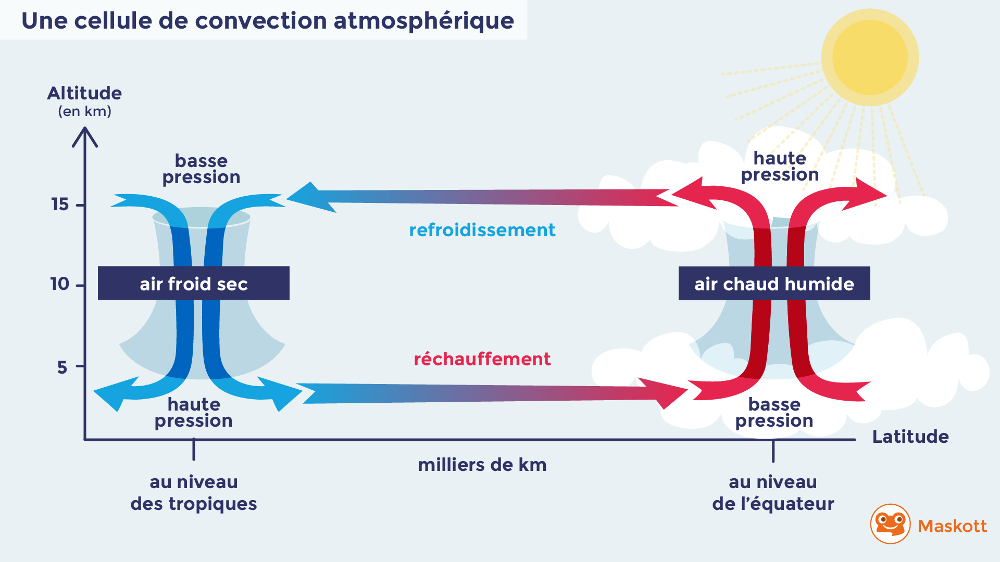

# Séquence : Dynamiques des masses d'air et des masses d'eau 

!!! note-prof
    si besoin d'infos

### Document d’appel :

<iframe width="560" height="315" src="https://www.youtube-nocookie.com/embed/iMmBUm0HiMg?si=J3n3Zvtl9WxpEgsl" title="YouTube video player" frameborder="0" allow="accelerometer; autoplay; clipboard-write; encrypted-media; gyroscope; picture-in-picture; web-share" allowfullscreen></iframe>

!!! question "Problématique"

    comment expliquer les déplacements de l'eau et de l'air ?

## Séance 1 : Les courants océaniques

!!! question "Problématique"

    comment expliquer les déplacements des masses d'eau ?

[Activité Dynamique des masses d'eau](../dynEau)

??? abstract "Bilan"
    === "De quoi parler dans le bilan ? Quels mots clés ?"

    === "Bilan à trous"
        L’inégale répartition de l’énergie solaire fait que certaines zones sont plus ____________ que d’autres.
        Les eaux froides et/ou salées sont plus __________________ que les eaux __________________________, elles vont donc ___________________ ce qui entraîne de courants au fond et à la surface des océans.
        En profondeur, un mouvement d’eaux froides va des pôles vers l’équateur et à la surface un mouvement d’eaux chaudes va de l’équateur vers les pôles. 
        Les ______________________________________ peuvent entraîner les courants marins de surface.
    === "Bilan"
        L’inégale répartition de l’énergie solaire fait que certaines zones sont plus chaudes que d’autres.
        Les eaux froides et/ou salées sont plus denses que les eaux chaudes et/ou douces, elles vont donc plonger vers le fond ce qui entraîne de courants au fond et à la surface des océans.
        En profondeur, un mouvement d’eaux froides va des pôles vers l’équateur et à la surface un mouvement d’eaux chaudes va de l’équateur vers les pôles. 
        Les vents peuvent entraîner les courants marins de surface.

## Séance 2 : Les courants atmosphériques

!!! question "Problématique"

    Comment les météorologues peuvent-ils prévoir les vents ?

[Activité Dynamiques des masses d'air](../dynAir)

??? abstract "Bilan"
    L’inégale répartition de l’énergie solaire fait que certaines zones sont plus chaudes que d’autres.

    L’air froid est plus dense que l’air chaud, il va donc descendre vers la surface, la pression va augmenter. L’air chaud est moins dense et va donc monter en altitude. Une dépression est une zone de basse pression, un anticyclone, une zone de haute pression. *
    
    Des mouvements d’air latéraux se mettent en place des anticyclones vers les dépressions, ce sont les vents. 
    
    Ils sont d'autant plus fort que la différence de pression est importante.

https://classic.nullschool.net/fr/#2020/02/27/1500Z/wind/surface/level/overlay=mean_sea_level_pressure/orthographic=8.86,46.81,328/loc=6.011,49.920

## Séance 3 : Le climat et les dynamiques des masses d'air et d'eaux

!!! question "Problématique"

    Quel est l’impact des courants océaniques sur les climats ?

[Activité Impact sur le climat des dynamiques de masses d'air et d'eau](../courantsClimat)
[Activité Impact sur le climat des dynamiques de masses d'air et d'eauV2](../courantsClimatV2)

??? abstract "Bilan"
    === "De quoi parler dans le bilan ? Quels mots clés ?"

    === "Bilan à trous"
        L’inégale répartition de l’énergie solaire crée des mouvements de ____________________ et dans ______________________________. Cela entraîne un transfert d’énergie (chaleur) de ____________ aux ____________________ ce qui permet d’équilibrer l’excès d’énergie reçue à l’équateur. Les mouvements d'air et d'eaux vont avoir un effet sur le _____________. 

    === "Bilan"

        L’inégale répartition de l’énergie solaire crée des mouvements de l’hydrosphère et dans l’atmosphère. Cela entraîne un transfert d’énergie (chaleur) de l’équateur aux pôles ce qui permet d’équilibrer l’excès d’énergie reçue à l’équateur. Les mouvements d'air et d'eaux vont avoir un effet sur le climat. 

## Séance 4 : Exercices

[Activité Exercices](../exos)