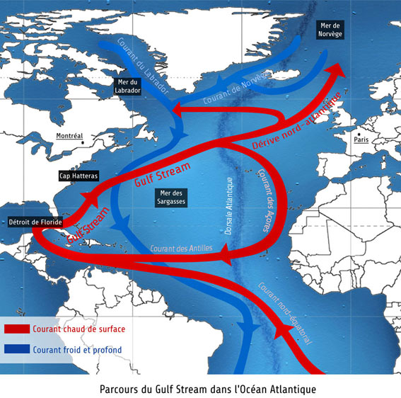

# Activité : L'impact des courants océaniques sur le climat

!!! note Compétences
    trouver et utiliser des informations

!!! warning Consigne
    À partir des deux documents, propose une explication à la différence de climat entre Montréal et Paris.

??? bug Critères de réussite
    - comparer le climat des deux villes
    - trouver des éléments expliquant le climat de Paris
    - trouver des éléments expliquant le climat de Montréal

**Document 1 : Deux villes, deux climats différents**

|  |  Montréal      |          Paris|
|---|----|----|
| Latitude         |       43° Nord              |  45° Nord |
| Climat           |       Continental   |          Océanique | 
| Température moyenne en Janvier | -6°C | 6°C |

 
**Document 2 : Un couplage entre les vents et les courants océaniques dans l'Atlantique Nord**

Dans l'Atlantique Nord, les vents d'ouest dominent au niveau du tropique du Cancer alors que les vents d'est dominent au niveau du cercle polaire.
Deux types de courants océaniques se distinguent dans l'Atlantique Nord :
- un courant froid le long des côtes canadiennes, le courant du Labrador
- un courant chaud le long des côtes françaises, le Gulf Stream.

??? note-prof "Correction"

    Montréal est situé plus bas que Paris, il devrait donc y faire plus chaud, mais on observe que la température moyenne est plus importante à Paris. 
    Un courant océanique chaud passe au niveau de la France ce qui pourrait expliquer cette différence