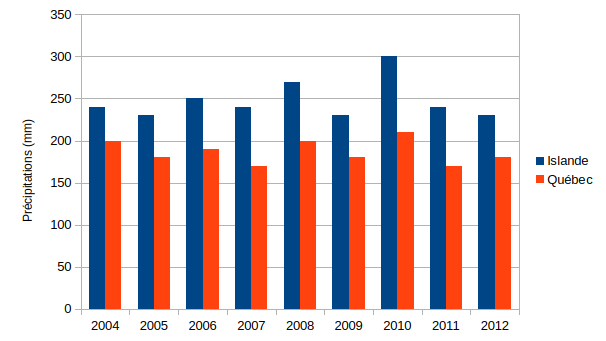

# Activité : L’impact des courants atmosphériques sur le climat

!!! note "Compétences"
    - trouver et utiliser des informations

!!! warning "Consigne"
    À partir des documents, montrer que le climat au Québec et en Islande dépend des courants atmosphériques

??? bug "Critères de réussite"
    - à quoi correspond l’indice ONA
    - identifier les années à indice négatif et positif
    - comparer ces années entre elles 

**Document 1 L’oscillation Nord-Atlantique**

La circulation atmosphérique au-dessus de l’Atlantique nord montre une alternance rapide de dépressions et d’anticyclones.
L'oscillation Nord-Atlantique est donc un courant atmosphérique qui change en fonction des années.

L’indice de l’oscillation nord-atlantique est donc calculé chaque année avec les différences de pression.

Un indice ONA très positif est relié à une circulation zonale (d’ouest en est) plus prononcée, entre les deux entités, car la différence de pression causant les vents est plus grande. De plus, l’anticyclone plus important sur les Açores fait remonter la circulation vers le nord.

Par contre, quand l’indice est négatif, la circulation d’ouest est plus faible ou plus au sud.

2004, 2006, 2008 et 2010 : année avec un indice négatif.
2005, 2007, 2009, 2011 et 2012 : année avec un indice positif.

**Document 2 Graphique des températures moyennes hivernales au Québec et en Islande**

**Document 3 Graphique des précipitations au Québec et en Islande**

