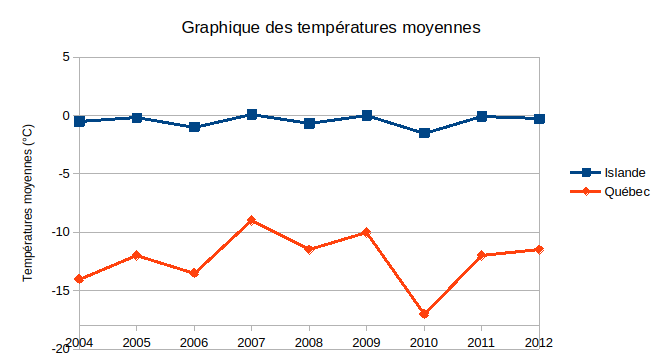

# Activité : L’impact des courants atmosphériques sur le climat

!!! note Compétences
    - trouver et utiliser des informations

!!! warning Consigne
    À partir des documents, montrer que le climat au Québec et en Islande dépend des courants atmosphériques

??? bug critères de réussite
    - à quoi correspond l’indice ONA
    - identifier les années à indice négatif et positif
    - comparer ces années entre elles 

**Document 1 Tableau des températures et précipitations**

<table border="1">

  <thead>
    <tr>
      <th rowspan="2">Pays</th> 
      <th colspan="2">Islande</th>
      <th colspan="2">Québec</th>
      <th rowspan="2">indice ONA</th>
    </tr>
    <tr>
      <th>Température Moyenne (°C)</th>
      <th>Précipitations Moyennes (mm)</th>
      <th>Température Moyenne (°C)</th>
      <th>Précipitations Moyennes (mm)</th>
    </tr>
  </thead>
  <tbody>
    <tr>
      <td>2004</td>
      <td>-0,5</td>
      <td>240</td>
      <td>-14,0</td>
      <td>200</td>
      <td>Negative</td>
    </tr>
    <tr>
      <td>2005</td>
      <td>-0,2</td>
      <td>230</td>
      <td>-12,0</td>
      <td>180</td>
      <td>Positive</td>
    </tr>
    <tr> 
      <td>2006</td>
      <td>-1,0</td>
      <td>250</td>
      <td>-13,5</td>
      <td>190</td>
      <td>Negative</td>
    </tr>
    <tr>
      <td>2007</td>
      <td>0,1</td>
      <td>240</td>
      <td>-9,0</td>
      <td>170</td>
      <td>Positive</td>
    </tr>
    <tr>
      <td>2008</td>
      <td>-0,7</td>
      <td>270</td>
      <td>-11,5</td>
      <td>200</td>
      <td>Negative</td>
    </tr>
    <tr>
      <td>2009</td>
      <td>0,0</td>
      <td>230</td>
      <td>-10,0</td>
      <td>180</td>
      <td>Positive</td>
    </tr>
    <tr>
      <td>2010</td>
      <td>-1,5</td>
      <td>300</td>
      <td>-17,0</td>
      <td>210</td>
      <td>Negative</td>
    </tr>
    <tr>
      <td>2011</td>
      <td>-0,1</td>
      <td>240</td>
      <td>-12,0</td>
      <td>170</td>
      <td>Positive</td>
    </tr>
    <tr>
      <td>2012</td>
      <td>-0,3</td>
      <td>230</td>
      <td>-11,5</td>
      <td>180</td>
      <td>Positive</td>
    </tr>
  </tbody>
</table>

**Document 2 Graphique des températures moyennes hivernales au Québec et en Islande**

**Document 3 Graphique des précipitations au Québec et en Islande**indice ONA

**Document 4 L’oscillation Nord-Atlantique**

La circulation atmosphérique au-dessus de l’Atlantique nord montre une alternance rapide de dépressions et d’anticyclones.

L’indice de l’oscillation nord-atlantique est donc calculé chaque année avec les différences de pression.

Un indice ONA très positif est relié à une circulation zonale (d’ouest en est) plus prononcée, entre les deux entités, car la différence de pression causant les vents est plus grande. De plus, l’anticyclone plus important sur les Açores fait remonter la circulation vers le nord.

Par contre, quand l’indice est négatif, la circulation d’ouest est plus faible ou plus au sud.
