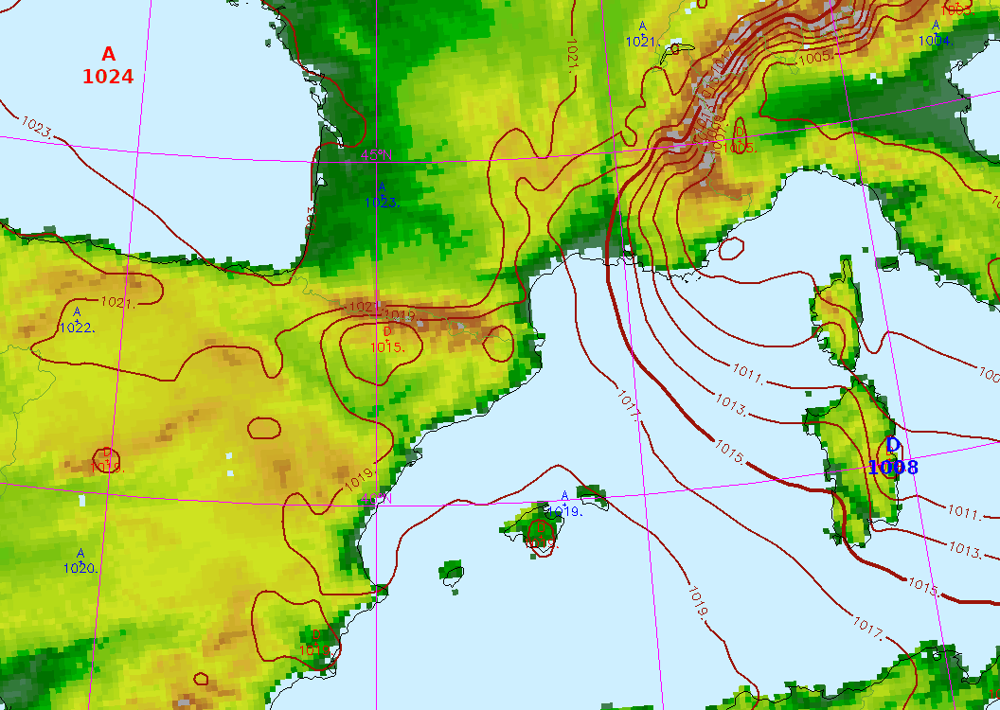
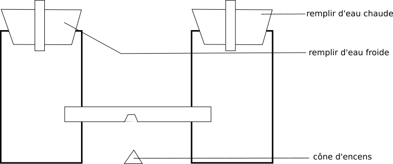

# Activité : La dynamique des masses d'air

!!! note "compétences"
    trouver et extraire des informations
    Manipuler

!!! warning "Consignes"
    - faire un schéma des mouvements d'air dans la modélisation.
    - expliquer dans quel direction va aller le vent sur le document 1.

??? bug "critères de réussite"
    - indiquer les mouvements verticaux dans le modèle
    - dans le modèle indiquer ou est la dépression et où est l'anticyclone
    - indiquer dans quel direction se déplace les vents dans le modèle
    - indiquer comment se déplace les vents sur la carte des pressions.

**Document 1 : Carte des pressions atmosphériques du 28 avril 2015**

A = Anticyclone
D = Dépression

**Document 2 : Définition anticyclone et dépression**

A la surface de la terre circulent des masses d'air froid et des masses d'air chaud. 
L'air froid, plus dense, est plus lourd que l'air chaud. L'air froid descend et forme une zone de haute pression appelée anticyclone. L'air chaud monte et forme une zone de basse pression appelée dépression. 

**Document 3 : Modélisation des mouvements atmosphériques**

1. Remplir d'eau chaude un des goulot et d'eau froide le second.

2. Allumer le cône d'encens.

