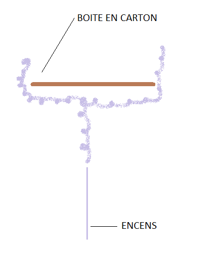
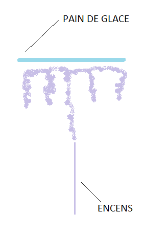
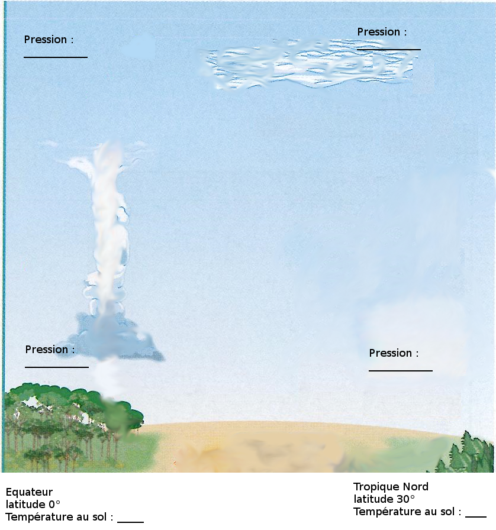

# Activité : La dynamique des masses d'air

!!! note "compétences"
    trouver et extraire des informations

!!! warning "Consignes"
    À partir de l'analyse des différents documents, complète le schéma en complétant les températures, les pressions et en traçant 4 flèches indiquant le mouvement des masses d'air.

!!! bug "critères de réussite"
    -

**Document 1 : Tableau des températures annuelles moyennes**

| | | | | |
|---|---|---|---|---|
| Latitude   |      Équateur 0°   |  Tropique Nord 30° N  |      45° N |   70° N | 
|  Température  |    30 °C    |       25 °C      |                10 °C |   0 °C| 

**Document 2 : Qu'est-ce que le vent ?**

Le vent naît sous l'effet des différences de températures et de pression. La pression à la surface est haute si de l'air dense descend.
Par contre, la pression est basse si de l'air peu dense monte.

Entre deux zones de pression différentes, des masses d'air sont mises en mouvements horizontalement, ce sont les vents. Ces vents vont de la zone de haute pression vers la zone de basse pression.

**Document 3 : Expérience montrant les déplacements verticaux des masses d'air**

On cherche à comparer le mouvement de l'air chaud et le mouvement de l'air froid. La fumée d'encens permet de visualiser ce mouvement

Protocole :

Allumer de l'encens l'air chaud en plaçant un carton au-dessus, regarder le déplacement de l'air chaud

Après un instant, placer au-dessus de l'encens un pain de glace, regarder le déplacement de l'air froid

Résultats :

 | Mouvement de l'air froid   |         Mouvement de l'air chaud |
 |---|---|     
 | | |                         

