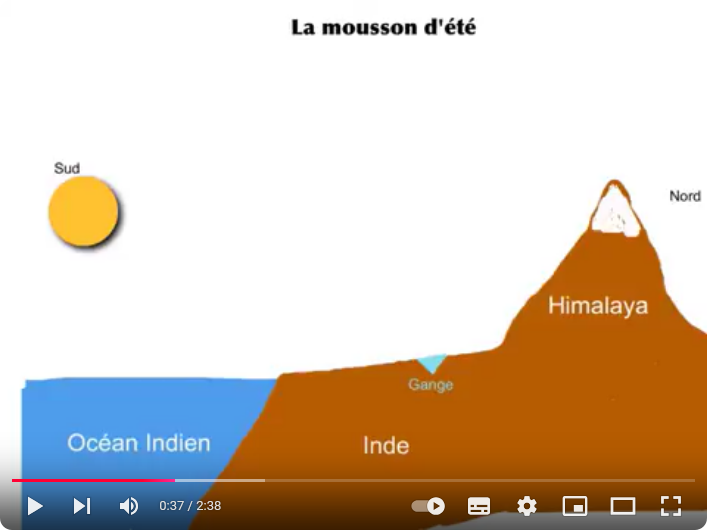
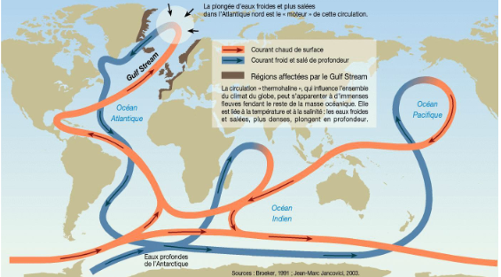

# Activité : Exercices.

    
## Exercice 1 : L'impact des courants océaniques sur le climat

!!! note "Compétences"
    trouver et utiliser des informations

!!! warning Consigne
    À partir des deux documents, propose une explication à la différence de climat entre Montréal et Paris.

??? bug "Critères de réussite"
    - comparer le climat des deux villes
    - trouver des éléments expliquant le climat de Paris
    - trouver des éléments expliquant le climat de Montréal

**Document 1 : Deux villes, deux climats différents**

|  |  Montréal      |          Paris|
|---|----|----|
| Latitude         |       43° Nord              |  45° Nord |
| Climat           |       Continental   |          Océanique | 
| Température moyenne en Janvier | -6°C | 6°C |

 
**Document 2 : Un couplage entre les vents et les courants océaniques dans l'Atlantique Nord**

Dans l'Atlantique Nord, les vents d'ouest dominent au niveau du tropique du Cancer alors que les vents d'est dominent au niveau du cercle polaire.
Deux types de courants océaniques se distinguent dans l'Atlantique Nord :
- un courant froid le long des côtes canadiennes, le courant du Labrador
- un courant chaud le long des côtes françaises, le Gulf Stream.

??? note-prof "Correction"

    Montréal est situé plus bas que Paris, il devrait donc y faire plus chaud, mais on observe que la température moyenne est plus importante à Paris. 
    Un courant océanique chaud passe au niveau de la France ce qui pourrait expliquer cette différence

    

    
## Exercice 2 : Quelques questions

!!! note "Compétences"

    - Retenir et utiliser ses connaissances

!!! warning "Consignes"

    1. Qu’est-ce qui entraîne les courants marins de surface ?
       
    2. Qu’est-ce qui fait que l’air chaud monte en altitude ?
       
    3. Qu’est-ce qu’un anticyclone ?
       
    4. Qu’est-ce qui crée des différences de pressions ?
       
    5. Qu’est-ce qui permet d’équilibrer l’excès d’énergie reçue à l’équateur ?
       
    6. Qu’est-ce qui est créé par des différences de pressions ?
    
??? bug "Critères de réussite"

    
## Exercice 3 : Les moussons indiennes

!!! note "Compétences"

    - Retenir et utiliser ses connaissances

!!! warning "Consignes"

    1. Indiquez si la mousson est un phénomène local à l’échelle d’une ville, d’une région, d’un pays, d’un continent ou à l’échelle mondiale.
    2. Repérez à l’échelle de l’Inde d’où viennent les vents en été et en hiver et si ces derniers sont sources ou non de précipitations.
    3. Utilisez vos connaissances sur les mouvements des masses d’air pour schématiser les courants atmosphériques en été et en hiver.
    4. À partir du texte et de vos connaissances, compléter les 2 schémas du document 2 expliquant les moussons d’été et d’hiver en Inde.
    
??? bug "Critères de réussite"

**Document 1 Les moussons indiennes : origine et conséquences**

Les moussons sont des régimes réguliers de vents dans certaines régions du monde comme l’Inde. La mousson d’été est un régime de vents en provenance du sud qui s’accompagne de pluies très abondantes (80 % des précipitations de l’année) sur L’Inde. À l’inverse, la mousson d’hiver entraîne des vents très secs en provenance de l’Himalaya. 

Ces mouvements des masses d’air sont liés aux différences de température entre le continent et l’océan Indien. Les océans chauffent et se refroidissent plus lentement que les continents. L’été, l’air est très chaud au-dessus du continent, du fait d’un fort ensoleillement. Il s’élève alors, entraînant un flux d’air chaud chargé d’humidité depuis l’équateur. En suivant les reliefs, l’air se refroidit et l’eau se liquéfie (passage de l’état gazeux à l’état liquide), d’où les pluies abondantes. L’hiver, c’est le phénomène inverse, car l’océan équatorial est plus chaud que le continent. 

**Document 2 Schéma des moussons**

<table markdown>
<thead>
<tr>
<td> Mousson d’été</td>
<td> Mousson d’hiver </td>
</tr>
</thead>
<tbody markdown>

<tr markdown>
<td markdown>  </td>
<td markdown>   </td>
</tr>
</tbody>
</table>

    
## Exercice 4 : L’origine des courants marins

!!! note "Compétences"

    - Retenir et utiliser ses connaissances

!!! warning "Consignes"

    1. À l’aide du texte situé en début d’activité, réponds à la question suivante : pourquoi les eaux de surface de l’Antarctique sont-elles très salées ? 
    2. Pourquoi les eaux froides et salées de l’Atlantique Nord plongent-elles en profondeur ?
    3. Comment expliquer la circulation océanique globale ?
    
??? bug "Critères de réussite"

**Document 1 La circulation océanique**

Les eaux profondes des océans, comme les eaux de surface, se déplacent et créent de puissants courants océaniques. Ces courants sont dus aux écarts de température et de salinité des masses d’eau : on parle de circulation thermohaline. Le Gulf Stream est le courant océanique le plus connu. Il s’agit d’un courant d’eau chaude de surface qui prend sa source dans le Golfe du Mexique (chauffé par le soleil) et se déplace vers l’Europe principalement grâce aux vents. Puis, les eaux du Gulf Stream montent vers les régions polaires et se mélangent avec les eaux froides de l’Atlantique Nord. Les eaux de surface de l’Arctique et de l’Antarctique sont très salées. En effet, le sel, non piégé par la glace, se concentre dans l’eau. Ainsi les eaux froides et salées de l’Atlantique Nord plongent au fond de l’océan et alimentent les courants froids profonds. Elles rejoignent les eaux froides et salées de l’Antarctique. Réchauffés sous les tropiques, ces courants froids profonds refont surface au niveau des océans Indien et Pacifique.

**Document 2 Carte de la circulation océanique**

