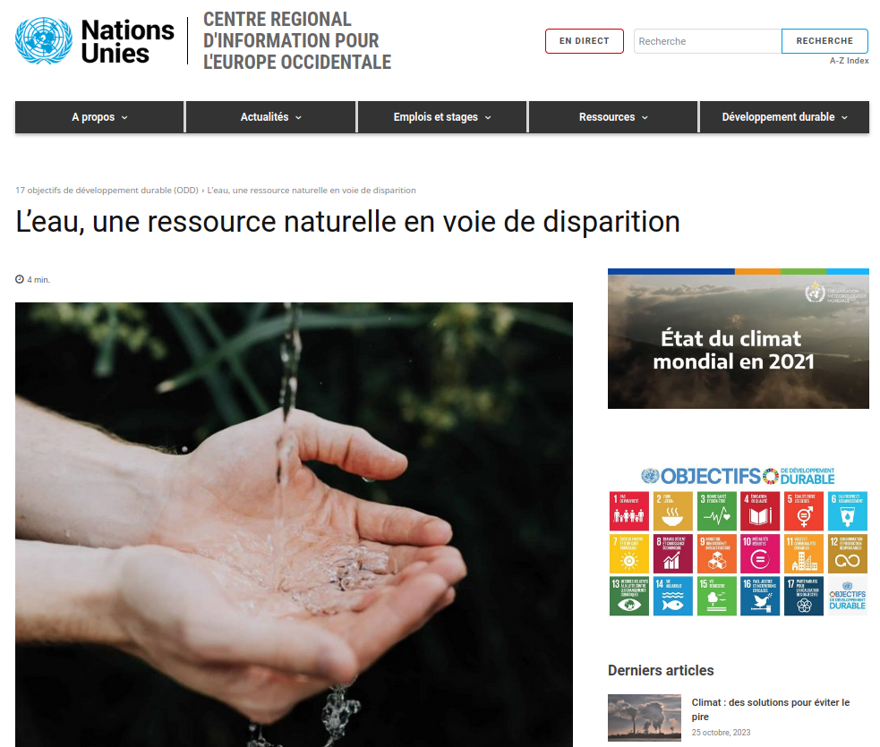
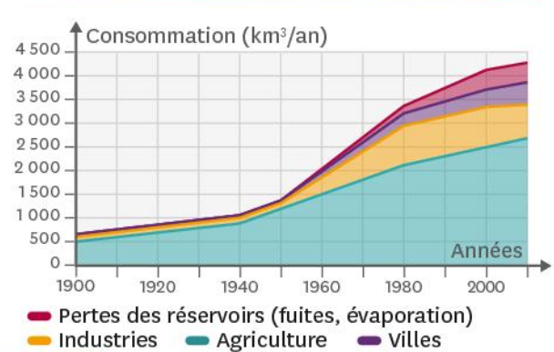

# Séquence : Une ressource naturelle, l’eau

!!! note-prof
    si besoin d'infos

!!! question "Problématique"
    Comment expliquer que l’eau soit une ressource essentielle pour l’humanité ?
        
### Document d’appel :

[lien video Arthus Bertrand](https://www.youtube.com/watch?v=JjPsNoCWSLE&ab_channel=YannARTHUS-BERTRAND)

## Séance 1 : l'eau une ressource rare sur la planète bleue

!!! question "Problématique"
    Quelle est l'eau que nous consommons ?

[Activité Reservoirs et utilisation de l'eau](../reservoiretutilisationEau)

## Séance 2 : Une ressource naturelle indispensable, l'eau

!!! question "Problématique"
    Comment expliquer que l’eau soit une ressource essentielle pour l’humanité ?

[Activité L'eau, une ressource précieuse](../eauRessourcePrecieuse)

??? note-prof "Bilan"

    À l’échelle de l’individu, en plus d’être une boisson vitale pour l’organisme, l’eau participe grandement à l’hygiène et donc à la bonne santé.
    
    À l’échelle de la société, l’eau est essentielle pour les activités humaines. L’eau est utilisée pour les activités industrielles, mais surtout pour l’agriculture en permettant d’arroser les cultures qui permettent de nourrir l’humanité.
    
    L’augmentation importante du nombre d’habitants sur notre planète a participé à une augmentation énorme de la consommation d’eau.
    
    Il existe d’importantes inégalités dans la répartition des ressources en eau. Certains pays possèdent des ressources en eau extrêmement faibles.
       
    L’être humain n’utilise que de l’eau douce à l’état liquide pour ses différents usages (domestiques, industriels et agricoles). Par conséquent, l’être humain ne peut exploiter que les eaux douces souterraines, les lacs d’eau douce et les rivières.

    Le volume total d’eau sur Terre est estimé à 1,386 milliard de km3, 97,5 % est de l’eau salée et 2,5 % de l’eau douce. Seulement 0,8 % de l’eau douce est disponible sous forme liquide à la surface de la Terre.

    En réalité une partie de ces eaux douces ne sont pas exploitables par l’être humain, l’eau douce liquide que l’être humain peut exploiter ne représente qu’environ 0,03 %.

