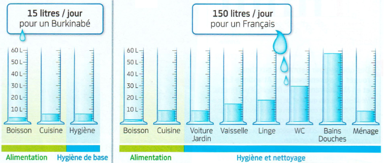
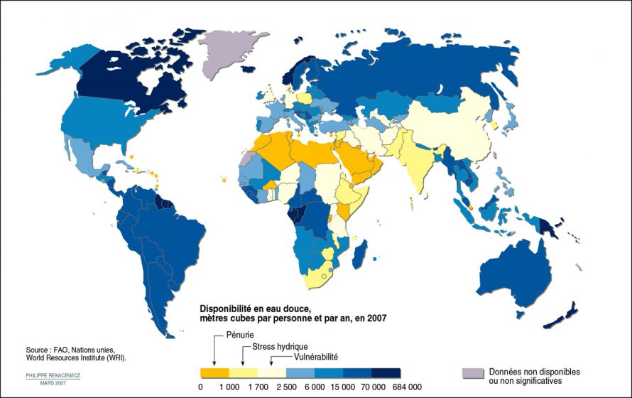
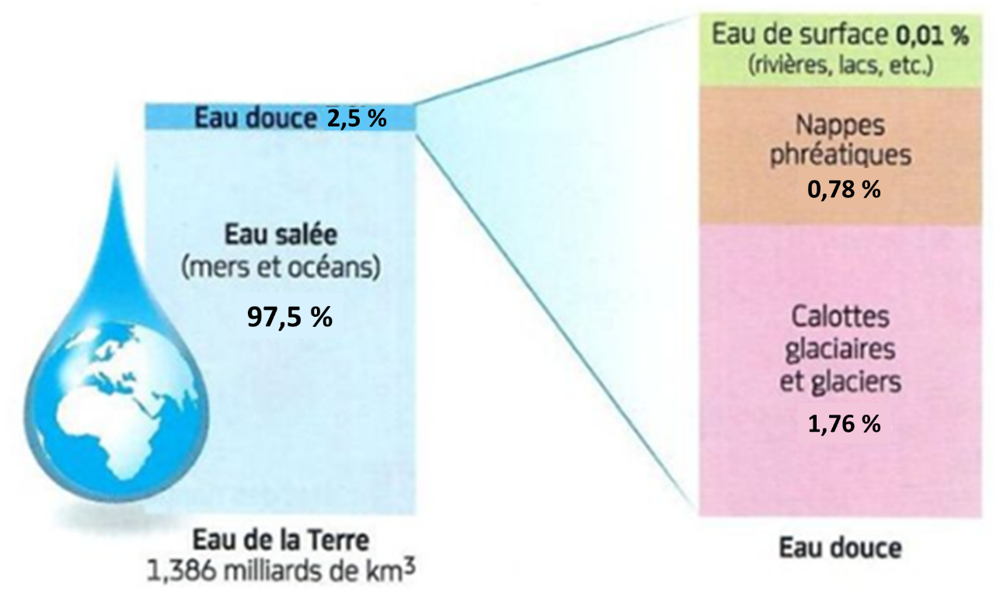

# Activité : L'eau, une ressource précieuse

!!! note "Compétences"

    Communiquer à l'oral
    Trouver et utiliser des informations 

!!! warning "Consignes"

    A partir des documents, présenter dans un audio, en quoi l'eau est importante, quel est l'état actuel de nos ressources en eau. Finir par une présentation de 2 solutions possibles pour l'avenir.
    
??? bug "Critères de réussite"
    - Indiquer l'utilité de l'eau
    - expliquer comment est répartie l'eau sur Terre
    - Comparer la répartition de l'eau douce sur Terre
    - Présenter 2 solutions possibles

??? bug "grille d'évaluation"

    <table>
    <thead><tr><th colspan = 4>
    Qualité de l’oral 0.5point
    </th></tr></thead>
    <tbody>
    <tr>
    <td>Très satisfaisant</td>
    <td>Satisfaisant</td>
    <td>Fragile</td>
    <td>Insuffisant</td>
    </tr>
    <tr>
    <td>
L’élève est pleinement engagé dans sa parole.

    
La voix est assez forte et claire et la parole n’est ni trop lente ni
    trop rapide.
</td>
    <td>
L’élève parvient à susciter l’intérêt.

    
La prise de parole est affirmée, cependant quelques variations dans
    l’utilisation de la voix.
</td>
    <td>
L’élève a des difficultés à capter l’attention, la prise de
    parole est monocorde.

    
La voix n’est plus très audible au fil de l’oral.
</td>
    <td>
L’élève n’arrive pas à capter l’attention.

    
La voix n’est pas audible sur l’ensemble de l’oral.
</td>
    </tr>
    </tbody>
    </table>

    <table>
    <thead>
    <tr>
    <th colspan = 4>
    Qualité de la prise de parole en continu 1 point
    </th>
    </tr>
    </thead>
    <tbody>
    <tr>
    <td>Très satisfaisant</td>
    <td>Satisfaisant</td>
    <td>Fragile</td>
    <td>Insuffisant</td>
    </tr>
    <tr >
    <td>
Utilisation d’un vocabulaire riche et précis.

    
Discours fluide, efficace, tirant pleinement profit du temps.

    
Le temps est respecté.
</td>
    <td>
Le lexique est adapté.

    
Discours articulé et pertinent, énoncés bien construits.

    
Le temps est respecté.
</td>
    <td>
Discours assez clair mais vocabulaire limité, approximatif et
    énoncés schématiques.

    
Et/ou, le temps n’est pas totalement respecté.
</td>
    <td>
Le vocabulaire est insuffisant.

    
Énoncés courts, ponctués de pauses et de faux démarrages ou énoncés
    longs à la syntaxe mal maîtrisée.

    
Et/ou le temps n’est pas maîtrisé.
</td>
    </tr>
    </tbody>
    </table>

    <table>

    <thead>
        <thead>
        <tr>
        <th colspan = 4> Qualité de la pertinence des informations utiles extraites 2 points
        </th>
    </thead>

    </tr>
    </thead>
    <tbody>
    <tr>
        <td>Très satisfaisant</td>
        <td>Satisfaisant</td>
        <td>Fragile</td>
        <td>Insuffisant</td>
    </tr>
    <tr>
        <td>Toutes les informations sont extraites et permettent de répondre complètement à la consigne.</td>
        <td>La majorité des informations sont extraites et permettent de répondre globalement à la consigne.</td>
        <td>Quelques informations sont extraites cependant, ne permettent pas de répondre complètement à la consigne.</td>
        <td>Réponse très incomplète avec des informations erronées et confuses.</td>
    </tr>
    </tbody>
    </table>

    <table>
    <thead>
        <thead>
        <tr>
        <th colspan = 4> Qualité et construction du résumé 1,5 points
        </th>
    </thead>
    <tbody>
    <tr>
        <td>Très satisfaisant</td>
        <td>Satisfaisant</td>
        <td>Fragile</td>
        <td>Insuffisant</td>
    </tr>
    <tr>
        <td>Maîtrise des enjeux du sujet, capacité à conduire un résumé complet, bien construit et raisonné.</td>
        <td>Résumé construit qui s’appuie sur des informations précises et pertinentes du dossier.</td>
        <td>Réponse lacunaire et discours insuffisamment structuré.</td>
        <td>Pas ou peu de compréhension du sujet et discours décousu.</td>
    </tr>
    </tbody>
    </table>

**Document 1 Les utilisation quotidiennes de l'eau d'un burkinabé et d'un français.**

{:style="height:300px;"}

Pour vivre décemment,l'OMS(Organisation mondiale de la Santé) préconise 50 litres d'eau par jour et par personne. Un confort réel est toutefois atteint à partir de 100 litres par personne et par jour

**Document 2 Carte de la disponibilité des ressources en eau douce dans le monde (en m3 d’eau douce par personne et par an).**

{:style="height:500px;"}

**Document 3 L'eau disponible sur Terre pour les besoins des humains**

{:style="height:500px;"}

Pour ses usages, l'être humain n'utilise que les eaux douces issues des eaux de surface et des nappes phréatiques. A l'échelle mondiale, l'obtention d'eau douce à partir du dessalement d'eau de mer reste marginale car les techniques utilisées sont onéreuses et consommatrices de grandes quantités d'énergie.

**Document 4 Irrigation**

L'irrigation est indispensable à beaucoup de cultures, les plantes ont besoin d'eau pour se développer. Le coton nécessite plus de 5000L par kilo de coton produit, le blé environ 600L.

Il existe différentes techniques d'irrigation, elles n'ont pas toutes le même coût, la même facilité d'utilisation et la même efficacité.
- l'irrigation par aspersion est utilisée en agriculture intensive, elle est simple à mettre en place. Mais en cas de climat chaud, une grande partie de l'eau s'évapore avant d'atteindre le sol, et est donc perdue.
- l'irrigation au goutte-à-goutte apporte aux plantes uniquement l'eau dont elles ont besoin, directement à la base de la plante ou au niveau des racines. Des tuyaux doivent être déployés au pied de chaque plante. Mais il y a peu d'évaporation.

