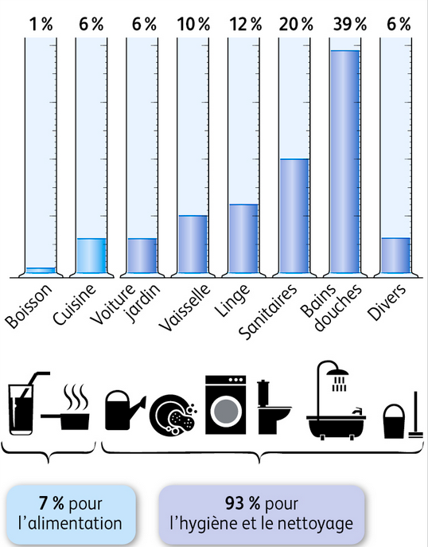

# Activité : Reservoirs et utilisation de l'eau

!!! note "Compétences"

    Utiliser l'outil mathématique

!!! warning "Consignes"

    1. Calculer le volume d’eau utilisée par l’alimentation en France et par les bains et les douches. (documents 1 et 2)
    2. Calculer combien d'eau peut être économiser en France par an en limitant l'utilisation d'eau lors du brossage de dents (document 3)
    3. Indiquer dans quels réservoirs l’être humain peut récupérer dont il a besoin. (document 4)
    4. Calculer le volume d’eau douce disponible pour l’être humain (document 4)
    5. Déterminer la proportion d’eau douce disponible sur le volume d’eau total. Exprimer cette proportion en pourcentage. (documents 4 et 5)

??? bug "critères de réussite"
    Quantité d'eau consommée par une personne qui coupe le robinet à chaque brossage : 
    Quantité d'eau consommée par une personne qui ne coupe pas le robinet à chaque brossage : 

    Quantité d'eau consommée par une personne qui coupe le robinet par an : 
    Quantité d'eau consommée par une personne qui ne coupe pas le robinet par an : 

    Quantité d'eau consommée par toute la France si tout le monde  coupe le robinet par an : 
    Quantité d'eau consommée par par toute la France si personne ne coupe le robinet par an : 

**Document 1 les usages de l’eau en France.**

{:style="height:500px;"}

Chaque Français utilise en moyenne 137L d’eau par jour.

**Document 2 Utiliser les pourcentages.**

On peut à partir des pourcentages retrouver une quantité.

Quantité = pourcentage de la quantité * Total /100.

Par exemple dans le document 2, si on veut la quantité d’eau utilisée par la vaisselle.

Le pourcentage correspondant est 10 %.

Le total est de 137L

Donc la quantité = 10 * 137 / 100 = 13,7L

On utilise donc 13,7L par jour pour la vaisselle.

**Document 3 Exemple de consommation d'eau**

Un robinet avec un économiseur d'eau a un débit de 3L/min 

Le brossage de dents doit durer 2 min, pendant ce brossage on a besoin d'eau pendant au maximum 30 secondes. 

**Document 4 l’eau à la surface de la Terre**

Parce que les océans, qui couvrent plus des ¾ de la surface de la Terre, la Terre apparaît bleue depuis l’espace et est souvent appelée la planète bleue.

La surface de la Terre possède un volume de 1 386 000 000 de km3 d’eau. On retrouve l’eau dans différents « réservoirs » :

- Les océans (1 338 000 000 km3 d’eau liquide salée)

- Les calottes polaires Arctique et Antarctique (24 023 500km3 d’eau douce solide)

- Les neiges et les glaces des glaciers dans les chaînes de montagnes (40 600km3 d’eau douce solide)

- Les sols gelés des hautes latitudes (300 000 km3 d’eau douce solide)

- Les eaux souterraines (12 870 000 km3 d’eau liquide salée et 10 530 000 km3 d’eau douce liquide)

- Les lacs (85 400 km3 d’eau liquide salée et 91 000 km3 d’eau douce liquide)

- Les rivières (2 120 km3 d’eau douce liquide)

L’humain n’utilise que l’eau douce liquide pour ses différents usages (domestiques, industriels et agricoles).

**Document 5 proportions et pourcentages**

La proportion de « quelque chose dans un tout » (quantité d’un sous ensemble dans l’ensemble total) correspond au rapport entre la « quantité de quelque chose » (quantité du sous-ensemble) sur la « quantité du tout » (quantité totale).

Exemple de calcul de proportion :

Dans une classe de 30 élèves (quantité totale), 12 sont des filles (quantité du sous ensemble). Quelle est la proportion de filles ?

$proportion de filles = \frac{12}{30}$

La proportion de fille est de $\frac{12}{30}$  On peut exprimer cette proportion en pourcentage. On exprime alors le quotient, en choisissant comme dénominateur 100.

$proportion de filles = \frac{12}{30} = \frac{40}{100} = 40%$

Avec la calculatrice, pour déterminer un pourcentage :

Il suffit de faire le calcul de la division, puis de lire le nombre de centièmes (les deux chiffres après la virgule) :

$proportion de filles = 12/30 = 0,40 = 40%$

??? note-prof "correction"
        Consigne 1 : Indiquer dans quels réservoirs l’être humain peut récupérer dont il a besoin. Justifier
    L’être humain ne peut utiliser que l’eau douce liquide, il ne peut donc utiliser que les certaines eaux souterraines, certaines eaux des lacs et l’eau des rivières.

        Consigne 2 : Calculer le volume d’eau douce disponible pour l’être humain.
        L’eau douce liquide constitue un volume de 10530000 + 91000 + 2120 = 10623120km3
        Consigne 3 : Déterminer la proportion d’eau douce disponible sur le volume d’eau total. Exprimer cette proportion en pourcentage.

    Le pourcentage du volume d’eau utile à l’humain sur le volume total d’eau à la surface de la Terre est donc :

??? note-prof "Correction"
    
    Consigne 1 : Décrire l’utilisation de l’eau du document1. (document 1)
    Ce graphique décrit l’évolution l’utilisation de l’eau dans le monde de 1900 à 2010.
    De 1900 à 2010, l’utilisation de l’eau a augmenté de 500 km3/ an à 4250km3/an.
    Consigne 2 : Calculer le volume d’eau utilisée par l’alimentation en France et par les bains et les douches. (document 2 et 3)
    Le pourcentage d’eau utilisé par l’alimentation est de 7 %, donc le volume d’eau utilisé est de 7*137/100 = 9,59L
    le pourcentage d’eau utilisé par les bains et les douches est de 39 %, donc le volume d’eau utilisé est de 39*137/100 = 53,43L
    Consigne 3 : tous les pays ont-ils la même facilité d’accès à l’eau douce, justifier. (document 4)
    Non tous les pays n’ont pas le même accès à l’eau car sur la carte, on voit que certains ont des disponibilité en eau plus faible que les autres par exemple, les pays du Maghreb ont peu d’eau disponible, ils sont en pénurie, alors que le Canada a beaucoup d’eau disponible

